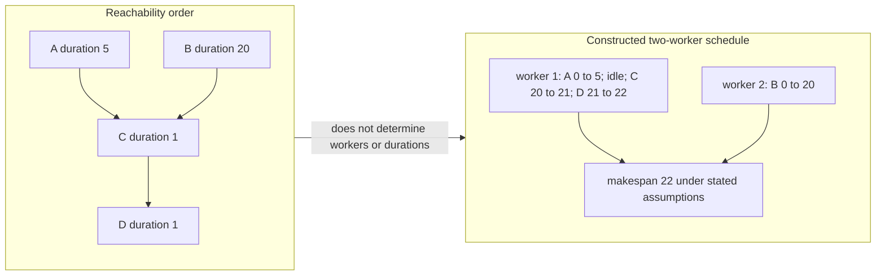

# Order cover is separate from a weighted processor schedule

The chains `[A,C,D]` and `[B]` form an order cover. This schedule is a constructed calculation with two identical workers, no setup/preemption/communication delay, and fixed durations. The chain cover and the schedule optimize different objectives.
