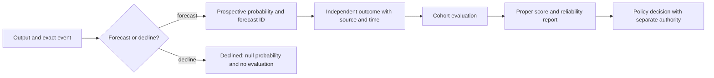
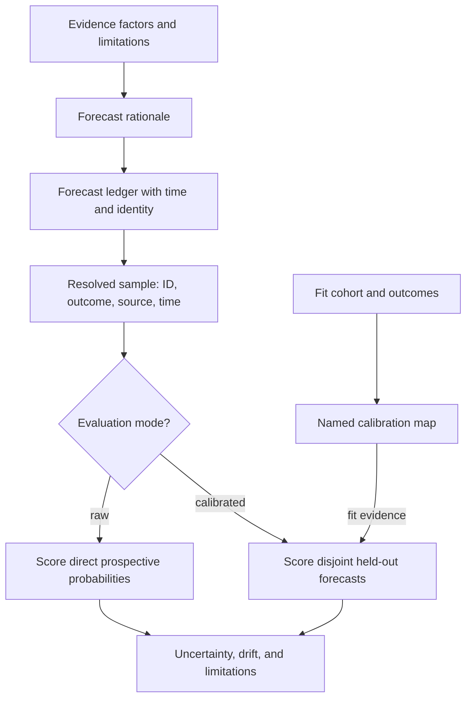

# DAG confidence scorer

Confidence is meaningful as a forecast about a named event, made before the event resolves. A prose rubric about sources, reasoning, or consistency may support a forecast but is not itself a calibrated probability. Never invent universal accept/review thresholds; downstream policy decides actions using its own authority and risk contract.

## 1. Define a resolvable forecast

Capture a nonblank forecast ID, artifact ID/digest/version, exact event predicate, evaluator/version, forecast time, resolution deadline, cohort key, and prospective probability in `[0,1]`. Examples are “this artifact passes verifier V” and “an independent reviewer confirms claim C.” “Is this good?” is not resolvable until operationalized. A resolved evaluation sample additionally records its forecast ID, event ID, original probability, binary outcome, resolution time, and resolution source. This binds a score to a prospective prediction rather than a rewritten aggregate.

If a forecaster declines to estimate, record `status=declined` and a null probability. It retains the task and artifact identity but carries no fitting or evaluation evidence. An `uncalibrated` forecast is an unscored record; it does not assert that comparable outcomes do or do not exist elsewhere.

## 2. Separate evidence, validation, and calibration

Evidence review can identify missing sources, contradictions, or unsupported reasoning. An independent evaluator resolves the stated event. Calibration is an empirical conditional claim: among comparable forecasts near probability `p`, observed event frequency should be assessed against `p`, with uncertainty and a held-out time/task split. Model, task family, evaluator, and distribution shift can invalidate a prior fit.

A raw evaluation scores prospective probabilities directly and must not include a fit or calibration map. Its cohort must equal the current forecast’s cohort; mixed-cohort scoring needs a separate per-sample selection contract. A calibrated evaluation must name a fit cohort, model, and map, then evaluate on disjoint forecast IDs. In this compact contract the calibration map is the fitted model: `calibrationMap.id` must equal `fitEvidence.modelId`, and their fit-cohort IDs must agree. A `calibration-fitted` record holds that fit evidence and map but no evaluation. These record states prevent a fitting set from being presented as an independent evaluation.

## 3. Score resolved forecasts

For binary outcome `y` and forecast `p`, Brier loss is `(p-y)^2`; lower mean loss is better. When supplied samples contain their probabilities and outcomes, calculate the displayed mean from those samples and make the declared denominator equal the sample count. Reliability diagrams and score decompositions assess calibration and sharpness, but small cohorts need uncertainty reporting. A three-case calculation is a teaching example, not a calibration guarantee.

### Worked positive case

Forecasts `(0.8, 0.8, 0.2)` resolve as `(1, 0, 0)`. Losses are `(0.04, 0.64, 0.04)`, mean Brier loss `0.24`, and denominator `3`. Each resolved sample must carry its forecast ID, event ID, resolution source, and resolution time; the sample for the current forecast must repeat the original prospective probability. With three examples, report the score but label calibration unknown; fit nothing and do not claim the 0.8 bucket is calibrated.

### Worked negative case

An agent assigns 0.91 because it cited four sources, then a validator finds a schema failure. Preserve the forecast, rationale, and resolved `false` label. Do not alter the forecast after resolution, use a blank outcome source, or call an evidence score a calibration correction. A raw evaluation may be reported without a fitted map; a calibrated evaluation must keep the fit IDs out of the scored set.

## 4. Output and source limits

Return the forecast record, rationale, and one of four states: `uncalibrated`, `calibration-fitted`, `evaluated` (with `raw` or `calibrated` evaluation mode), or `declined`. An evaluated record includes its scored samples, resolution bindings, denominator, and mean Brier. A calibrated evaluation additionally includes disjoint fit evidence and a named calibration map.

Read [forecast calibration](references/forecast-calibration.md). Cite [Gneiting and Raftery (2007)](https://sites.stat.washington.edu/people/raftery/Research/PDF/Gneiting2007jasa.pdf) for proper scoring and [Dimitriadis et al. (2020)](https://arxiv.org/abs/2008.03033) for reliability evaluation. These sources do not calibrate LLM judgments automatically or guarantee calibration at any sample size.

The accompanying [validator](scripts/validate-forecast.mjs) is a portable static check. A consumer can install the declared dependencies with `npm install --save-dev ajv@^8.20.0 ajv-formats@^3.0.1` in this bundle, then run `npm test`; [the fixture](tests/forecast.test.mjs) covers positive and negative cases. It checks declared payload shape, nonblank identities, ISO date-time syntax, chronology, status consistency, fit/evaluation separation, sample arithmetic, and the binding of the current forecast to one resolved sample. It cannot establish that an evaluator, source, outcome, artifact digest, authority, or effect is genuine.

The portable validator requires timestamps representable by JavaScript `Date.parse`; leap-second timestamps are unsupported and rejected even when RFC 3339 syntax validation accepts them. Map identity and fit-cohort agreement apply to both fit-only and calibrated-evaluation records.

A [raw evaluated teaching record](examples/raw-evaluated.json) supplies the positive test fixture. Its short digest and receipt names are illustrative, not authentic artifacts.
