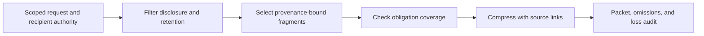
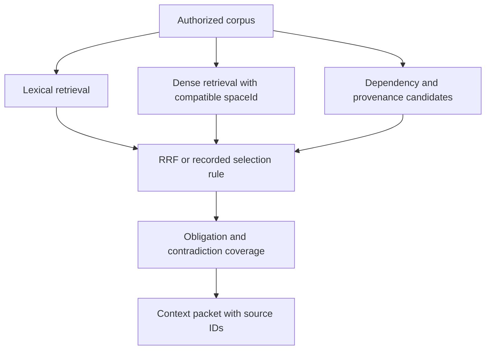

# DAG context bridger

Build a context packet for one downstream task, preserving what it is, where it came from, what authority permits, and what was omitted. Compression saves tokens; it cannot make a source true, authorize disclosure, or repair a missing prerequisite.

## 1. Bound the packet

State the downstream question, artifact/version requirements, recipient authority, retention/redaction policy, token or byte budget, and non-negotiable obligations such as counterexamples, caveats, approval constraints, and exact quotations. Assign each fragment a stable ID, source URI or artifact digest, time/version, producer activity, responsible agent, disclosure class, and derivation relation. PROV-O supplies useful entity/activity/agent and derivation vocabulary; it does not prove truth or authorization.

## 2. Retrieve only eligible evidence

Filter authority before ranking. For a hybrid search, retain lexical and dense lists only when dense vectors have compatible `spaceId`; fuse ranks with RRF only after that gate. RRF's `sum 1/(k + rank)` is a rank vote, not relevance probability. Include dependency and provenance rankings when they illuminate input lineage, but make their role visible.

## 3. Choose a packet mode and preserve evidence through compression

Choose full-forward, selective plus summary, output-only, progressive loading, or hierarchical summaries according to recipient need and authority. Use the manifest procedure in the reference to calculate the recipient tokenizer budget plus response reserve; fixed token thresholds are not portable. Cache keys include artifact/version, recipient scope, model/tokenizer, policy revision, and summary method. Expiry, contradiction, or policy change invalidates the cache and holds work that depends on the invalidated packet.

Use extractive snippets for exact claims, constraints, numbers, and caveats that cannot safely be paraphrased; use generated summaries only with links to their source fragments. A budget is task-specific: do not apply fixed token cutoffs or a generic relevance threshold. Deduplicate only after comparing provenance and version: equal text can carry different authority or time meaning. Record each omitted fragment and whether it was excluded for authority, budget, irrelevance, incompatibility, or uncertainty.

### Worked positive case

A reviewer needs a deployment recommendation. The packet includes the signed approval record, the tested artifact digest, a source caveat, and an extract of the failed negative test. A duplicate prose summary is omitted with its source IDs. The output says the packet is decision support, not an approval itself.

### Worked negative case

Two fragments say the same thing, but one is from an expired policy revision. Do not deduplicate them as interchangeable. Retain the current fragment, report the stale one and its version, and avoid silently presenting the claim as timeless.

## 4. Audit and hand off

Before sending, check every stated obligation against included fragment IDs. Return the recipient/scope, source and derivation records, filters, compatible vector-space evidence, summary method, omissions, unresolved contradictions, and a request for additional evidence where coverage fails. Read [provenance context and loss audit](references/provenance-context-and-loss-audit.md). Cite [W3C PROV-O](https://www.w3.org/TR/prov-o/) for provenance concepts and [Cormack et al., 2009](https://cormack.uwaterloo.ca/cormacksigir09-rrf.pdf) for rank fusion. Neither source guarantees safe disclosure, correctness, or adequate context.

## Scope and handoff checks

This is a completed-node, single-DAG information handoff. It does not spawn
agents, combine final results, alter topology, implement real-time streaming,
or establish durable cross-run memory. Route those needs to the executor,
result aggregator, graph builder or storage owner. Before release, verify
recipient scope, required-obligation coverage, measured packet budget, source
version/lineage, omission reasons, contradiction status and recipient readback.
The reference gives cache/cycle recovery and a concrete packet worksheet.
