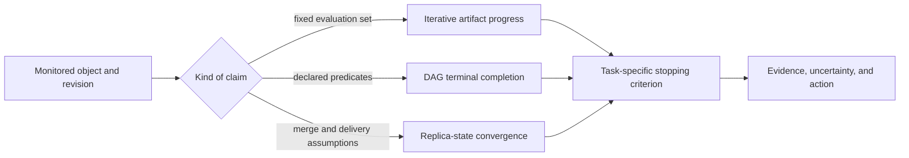
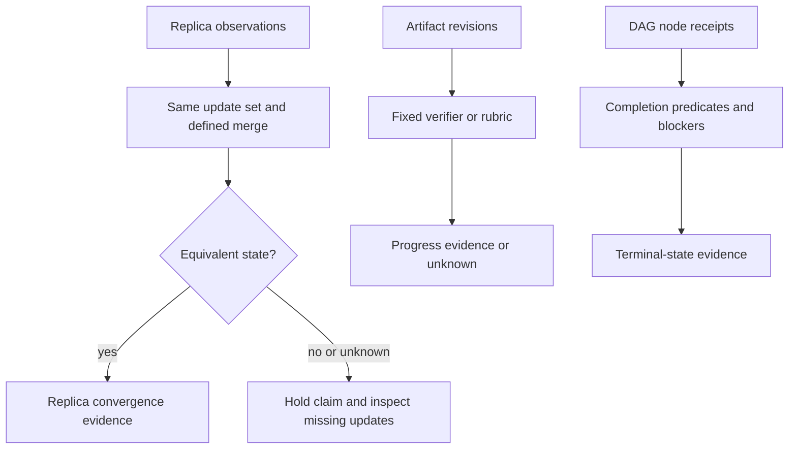

# DAG convergence monitor

First state what is converging. Replica-state convergence, numerical or editorial iteration progress, and DAG terminal completion are different claims with different evidence. A stable-looking score, a quiet replica, or a completed node does not establish the other two.

## 1. Declare the monitored object and stopping rule

Record the object identity/version, observations and clock source, goal or invariant, criterion, window, owner, resource budget, and action authority. For an iterative artifact, use a task-defined verifier or rubric and compare changes on a fixed evaluation set. For a DAG run, inspect declared completion predicates and blockers. For replicated data, identify merge semantics, delivery assumptions, and the validity invariant.

## 2. Evaluate the right evidence

An iterative monitor may report improvement, regression, oscillation, or insufficient observations without using arbitrary iteration counts or universal slopes. A changed evaluation set, goal, or artifact contract starts a new monitored revision; do not compare it as a continuous trend. A DAG monitor traces blockers, retries, cancellation confirmation, and effect receipts rather than assuming nodes “converge.”

Strong eventual convergence for a CRDT is a claim about replicas with the same updates reaching equivalent state under the CRDT's merge semantics; it does not show agent consensus, quality improvement, or terminal workflow success. CALM-style coordination results also concern particular formal program properties, not a generic rule to stop agents.

## 3. Stop, continue, or escalate by criterion

Stop only when the declared criterion is met and the responsible authority permits closure. Continue when a specified experiment or remediation is still justified by budget and policy. Escalate when evidence conflicts, the criterion is impossible to evaluate, the budget/authority boundary is reached, or the object has changed. State the alternative actions and what observation would resolve uncertainty.

### Worked positive case

An editorial DAG run `r7` produces artifact versions `v1`, `v2`, then `v3`. Its fixed lint-and-review verifier shows improvement, and `v3` passes the declared criteria with all required approvals present. Report success for `r7/output-v3` only; the failure of `v1` remains recorded. Repeated tuning used the development verifier; any final generalization claim needs fresh evaluation. Do not call this CRDT convergence.

### Worked negative case

Two CRDT replicas are quiet for ten minutes but their update-set digests differ. The monitor reports insufficient convergence evidence and requests reconciliation. It must not infer agreement from elapsed time, nor recommend a quality acceptance decision.

## 4. Limits and sources

Return object identity, claim kind, observations, criterion, decision, authority, known gaps, and next observation. Read [convergence claim types](references/convergence-claim-types.md). Cite [Jagadeesan and Riely (2018)](https://link.springer.com/chapter/10.1007/978-3-319-89884-1_34) for CRDT convergence scope and [Hellerstein and Alvaro (2020)](https://doi.org/10.1145/3369736) for coordination context. These sources do not supply a universal iteration budget, quality metric, or agent-consensus guarantee.

Monitoring neither starts iterations nor synthesizes their feedback. Use
`dag-iteration-detector` to decide when a loop is needed,
`dag-feedback-synthesizer` for feedback measures, `dag-dynamic-replanner` for
strategy changes, and `dag-pattern-learner` for historical analysis. Return a
recommendation and evidence; the executor/owner retains action authority.
