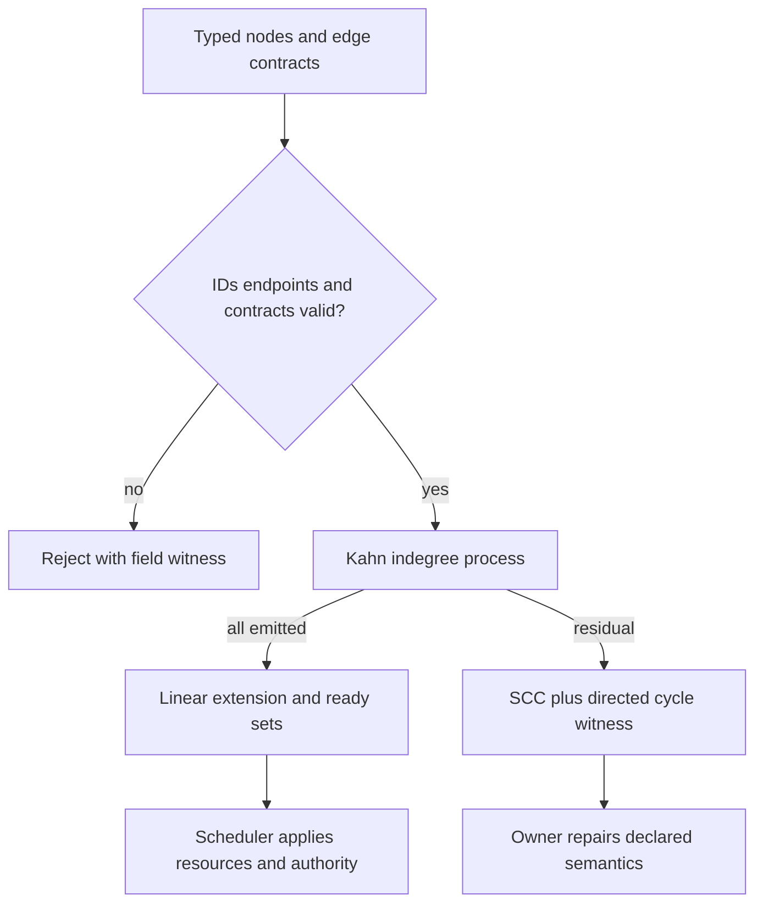
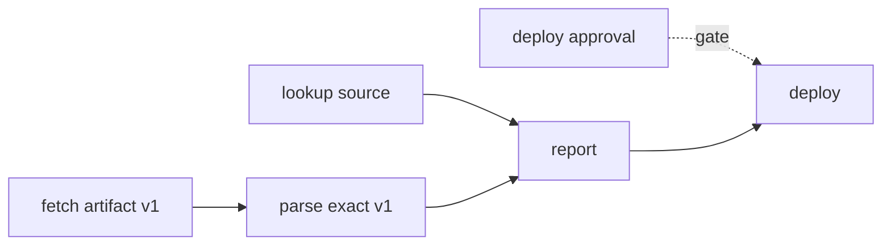

# DAG Dependency Resolver

A dependency resolver checks a declared graph. It does not repair its semantics,
schedule capacity, delete safety/authority edges, or prove that a node ran. See
[the worked resolution procedure](references/source-and-hand-checks.md) for the
edge contract, Kahn hand trace, residual witness, and versioned invalidation method.
Direction is `producer → consumer`.

## Method 1 — validate typed contracts before ordering

For each node, record an ID and declared output contract. For each edge record
its type and evidence: artifact/data prerequisite (producer artifact digest,
schema and completion predicate), authority/approval gate, decision, resource
exclusion, or soft preference/order. Reject duplicate IDs, missing endpoints,
unknown edge types, and an artifact edge with no exact producer/version contract.
Only prerequisite-like edges determine readiness. Authority and resource facts
remain separate gates; a test receipt does not satisfy deployment approval.

## Method 2 — run Kahn and preserve residuals

Initialize indegree from prerequisite-like edges. Emit any zero-indegree node,
decrement its consumers, and retain both the emitted linear extension and each
ready set. A ready set is an antichain of this declared relation; it is not a
resource-safe execution batch. If the process leaves nodes, return the residual
subgraph plus an SCC and a concrete directed witness. Ask the named graph owner
to interpret or repair it; never silently merge nodes, remove self-edges, add a
buffer, or insert serialization.

## Method 3 — distinguish generations from a streaming queue

For `fetch→parse→report` and `lookup→report`, synchronous generations are
`{fetch, lookup}`, `{parse}`, `{report}`. A streaming Kahn implementation may
emit `fetch`, then enqueue `parse` while `lookup` remains ready. That queue
state is not a generation barrier. Choose one representation and label it.

For changed producer `P`, traverse its consumer closure in the
producer→consumer graph (or use a reverse-dependency index). Revalidate only
consumers whose declared input/version changed. This is a static invalidation
set, not permission to restart or cancel work.

## Worked repair boundary

Given `transform-A→summarize→transform-A`, return the witness and hold the
plan. The former example's GPU contention between `analyze-A` and `analyze-B`
is a scheduler input, not a reason to add `analyze-A→analyze-B`. A proposed
`report→parse` edge likewise requires semantic review; dropping it only to make
Kahn finish can change the contract.

## Sources and limits

[Bazel Skyframe](https://bazel.googlesource.com/bazel/%2B/3b9ed6e9d3570a0c67e0d59e65b3785bbc1fad99/site/en/reference/skyframe.md)
documents incremental reverse-dependency invalidation. [Bazel query
docs](https://docs.bazel.build/versions/main/query.html) describe graph order
and warn cycle handling is unspecified. These build-graph sources do not prove
agent scheduling, authority, or external-effect safety. See
[reference note](references/source-and-hand-checks.md).

## Related skills

- `dag-graph-builder` creates graph structures; this skill checks declared ones.
- `dag-task-scheduler` applies resource capacity and schedule policy after dependency validation.
- `dag-dynamic-replanner` owns runtime graph changes; this skill reports static invalidation scope.
