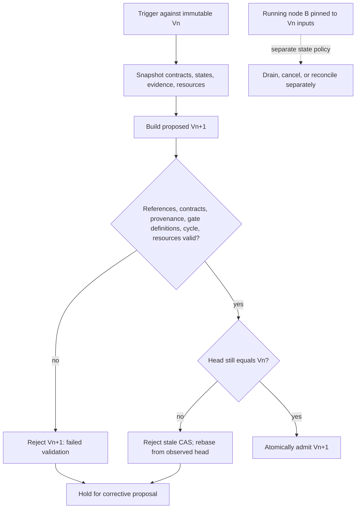
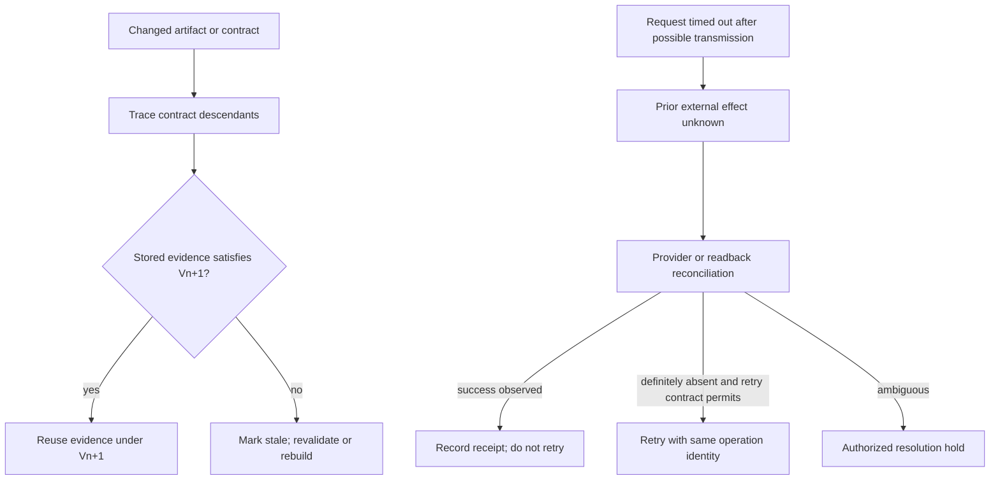

# DAG Dynamic Replanner

Use after requirements, contracts, resources, or observed outcomes change. It proposes Vn+1 against an immutable Vn snapshot; it does not mutate running Vn work, execute retries, or compensate an external effect.

## Revision-admission procedure

1. Record the trigger, Vn identity, artifact digests, consumer contracts, resource snapshot, execution states, and last external response. A pre-dispatch failure can be definite; a timeout after possible transmission leaves the prior effect **unknown**.
2. Choose a proposal shape: retry only under a documented idempotency contract; insert a prerequisite for a new blocking requirement; defer or serialize for a capacity constraint; replace a failed producer only with equivalent evidence; or propose an alternative path after tracing affected consumers.
3. Build Vn+1 without editing Vn. For each changed output or contract, trace descendants and classify their old evidence as reusable, stale, or unresolved. Reachability alone does not establish input validity.
4. Validate references, typed producer/consumer contracts, digest provenance, freshness, scope, meaning, required approval/action-authority gate definitions, cycle freedom, resource feasibility, and running-node state. A failed definition or claimed-existing-evidence check rejects the proposal before CAS. Outputs and approvals that Vn+1 is intended to produce may remain pending; their consumers stay blocked until actual evidence and current authority pass execution admission.
5. Compare-and-swap admit Vn+1 only when the current head is still Vn. If it moved, reject the stale proposal and rebase from the observed head. Running work remains pinned to its original plan and inputs until an explicitly defined drain, cancel, or reconciliation action completes.
6. For a possibly transmitted external request, retain stable operation identity, request digest, and response evidence; reconcile by provider/readback. Plan rollback does not undo an effect. Compensation requires its own authority and evidence.

## Trigger and modification decisions

**Node failure.** A missing producer blocks a consumer until an equivalent producer satisfies the full contract. A retry needs an explicit identity, budget, and idempotency/effect contract; increasing a timeout alone is not a retry policy. Repeated failure may justify an alternate producer or path, but only after the failure evidence and affected contracts are recorded.

**New requirement.** If a requirement changes a protected consumer’s input, gate, authority, or meaning, insert it as a Vn+1 prerequisite before that consumer. A non-blocking request can remain outside the current plan or be proposed as separate work; it does not become semantically harmless merely because it is queued. A conflict requires explicit rewiring and descendant invalidation.

**Resource constraint.** Capture units, capacity, current reservations, compatibility, and the requested reservation. Defer or serialize work when the existing graph remains semantically valid. Split a node only when its intermediate outputs and recombination contract have been demonstrated; an arbitrary training split does not preserve semantics automatically.

**Cascading failure.** Trace actual descendants by edge, contract, and state. A small set may permit targeted repair; broad impact can justify an alternative plan or reverting an unadmitted proposal. Do not select the response from an affected-node count, and do not treat reverting a plan revision as compensation for an external effect.

**Modification strategy map.** Retry maps to a stable operation identity and documented retry contract. Fallback maps to a replacement producer with matching source, freshness, scope, completeness, meaning, and consumer contract. Skip maps only to a consumer contract that permits absence. Defer maps to a resource reservation policy. Insert maps to a required artifact before the protected consumer or gate.

## Five diagnostic procedures

**Schema drift.** Compare schema version *and* producer digest, provenance, freshness, scope, completeness, and meaning with each consumer requirement. Add an adapter only when it produces a validated replacement contract; equal field names do not prove equivalent evidence.

**Cycle introduction.** Run topological validation on Vn+1 before admission. Return a closed witness with edge types, retain Vn, and reject the proposed edit. Do not delete a supposedly weak edge automatically.

**Orphan creation.** Find dangling producer references and consumers whose required input disappeared. A bridge is valid only if its new producer is authorized and satisfies the full consumer contract; connecting a graph does not repair invalid data.

**Resource cascade.** Recompute the declared capacity, reservations, compatibility, and peak demand for Vn+1. Reject, defer, or propose a semantically valid staging change when demand exceeds capacity. Capacity contention is not automatically a hard precedence edge.

**State corruption or unknown prior effect.** Keep a running node’s version and inputs immutable. A request that may have reached an external provider but timed out is unknown, not success or failure: reconcile via provider/readback, retry only when the documented contract says it is definitely absent and safe, and hold ambiguous outcomes for authorized resolution.

## Three worked replanning fixtures

### Example 1: mid-workflow security requirement

V1 is `build@b1 -> test@t1 -> deploy@d1`. `build` and `test` are complete; `deploy` is pending. A security requirement adds `security-scan@scan1`, which consumes `test@t1` and produces a receipt bound to the candidate deploy digest. V2 rewires `deploy@d2` to require that receipt and an approval/action-authority record. V2 validates `t1` provenance and scan/deploy contracts, marks V1’s unstarted `d1` stale, and CAS-admits only if head is V1. A graph edit does not authorize deployment; a missing receipt, approval, or authority keeps `d2` blocked.

### Example 2: connector failure and candidate fallback

V1 has `db-connect@db1 -> {analyse-users, analyse-products, analyse-orders} -> report@r1`. The connector fails before producing `db1`. A candidate `file-reader@fr1` is proposed for V2. Each consumer must check source identity, freshness, scope, completeness, meaning, and its own contract. If `analyse-orders` requires transaction-time ordering that `fr1` lacks, V2 is rejected for that contract mismatch; the fan-out is not rewired and `report@r1` remains blocked. If all consumers validate an equivalent artifact, V2 can replace the producer and mark dependent V1 evidence stale.

### Example 3: capacity conflict without invented training semantics

V1 is `data-prep@p1 -> model-training@mt1 -> evaluation@e1`. The plan’s memory pool is 8 GiB. After `data-prep`, its in-memory artifact reserves 4 GiB; `model-training` needs 6 GiB, so the requested peak is 10 GiB and cannot start. V2 proposes `stage-prep@sp1` after `p1`: it writes a digest-bound read-only artifact, releases the 4 GiB reservation, and makes `mt2` consume `sp1` using 1 GiB staging plus 6 GiB training demand. The V2 peak is 7 GiB. Admit only if staging preserves the documented training input contract and the reservation proof holds; otherwise leave training blocked or hand the valid unchanged graph to scheduling for deferral/serialization.

For complete node contracts and hand checks, see [worked replanning fixtures](references/worked-replanning-fixtures.md).

## Quality gates and boundaries

Before plan admission, prove acyclicity, valid references, required producer contracts, resource feasibility, version/head identity, descendant status, and protected-effect gate definitions. Recheck actual reservations, required receipts, artifact-bound approval, and current action authority before starting each protected effect. Record trigger evidence, Vn/Vn+1 identities, invalidations, rejected proposals, and reconciliation evidence. A graph revision rollback differs from external compensation.

Do not use this skill for initial graph construction, static scheduling, runtime execution, root-cause analysis, performance monitoring, or autonomous external-effect recovery. Those surfaces can provide evidence or carry out separately authorized work; this skill only proposes and admits a validated plan revision.

Artifact labels such as `b1`, `scan1`, and `req-9` are symbolic identifiers, not literal cryptographic digests. A runtime implementation must bind them to actual content and provenance.

See [revision method and source scope](references/revision-methods-and-sources.md) for the primary/product boundaries and [source ledger](references/sources.md) for the original source inventory.
