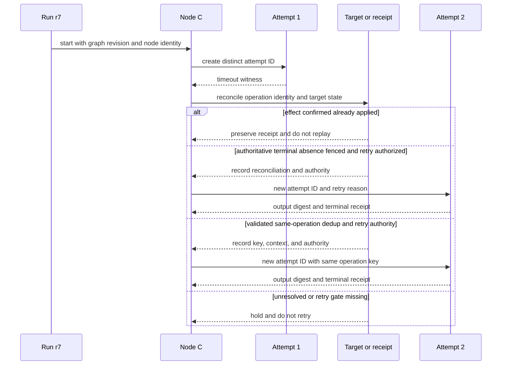
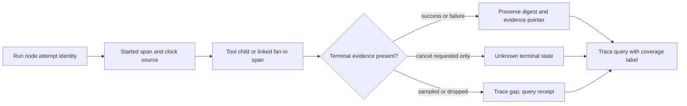

# DAG Execution Tracer

A trace is an instrumentation record, not proof that every node ran, an external
effect occurred, or a missing span implies success. Sampling and export loss
must be recorded as coverage limits.

## Method 1 — model run, node, and attempt separately

Create immutable run ID and graph revision; node ID; attempt ID; trace/span ID;
parent or span links; lifecycle state (`scheduled`, `started`, `yielded`,
`retry`, `success`, `failed`, `cancel-requested`, `cancellation-confirmed`, or
`unknown`). Attach input/output digest plus schema, a redacted evidence pointer,
actor/tool/model/config version, clock source, and sampling/export/drop counters.
Use parent spans for nested work and links for fan-in, scatter/gather, and
cross-trace causes. Attempt to end spans in `finally` for handled exits; this is best-effort and cannot record a terminal event after process loss. Preserve failed attempts and expose missing coverage.

## Method 2 — gate timeout and cancellation recovery

On a timeout, capture the last known state and query the receipt or target for
the exact operation identity. If effect state is unknown, hold a repeat unless either (a) an authoritative
terminal-absence receipt is bound to the exact operation and a fence excludes a
late first commit, with current retry authority, or (b) a validated
idempotency/deduplication contract covers the same operation and context, with
current retry authority. Compensation requires a confirmed effect, applicable
postconditions, and its own authority; afterward, separately authorize any
retry under a fence or same-operation deduplication rule. A cancellation request without acknowledgement
remains `unknown`, not cancelled. Trace absence is a query gap, not success or
a skipped node.

## Method 3 — query causality honestly

A wall-clock order across machines is not causal order. Use parent IDs, links,
event sequencing, and clock uncertainty. Query an expected dependency path and
report complete, partial, sampled, dropped, or unknown coverage. Measure capture
overhead on representative workloads; retention and sampling are local policy,
not universal byte, node-count, or percentage thresholds.

## Hand check

`r7/C/attempt-1` times out at 12:04Z. Reconciliation remains unknown, so it is
held. `attempt-2` may start at 12:06Z only if an authoritative absence receipt
binds to this operation and a fence excludes a late first commit, with current
retry authority, or a validated idempotency/deduplication key covers the same
operation and context with current retry authority. The aggregator links the accepted
digest to attempt 2 and retains attempt 1. A sampled missing span does not prove
C was skipped.

## Sources and limits

[OpenTelemetry Trace API](https://opentelemetry.io/docs/specs/otel/trace/api/)
supports context, spans and links; its [overview](https://opentelemetry.io/docs/specs/otel/overview/)
covers scatter/gather links. [CloudEvents v1.0.2](https://github.com/cloudevents/spec/blob/v1.0.2/cloudevents/spec.md)
defines event identity using source plus ID. They define representation
conventions, not execution receipts or completeness guarantees. See
[reference note](references/source-and-hand-checks.md).

## Related skills

- `dag-failure-analyzer` investigates incidents using trace and other evidence.
- `dag-performance-profiler` measures performance; this skill supplies trace observations only.
- `dag-task-scheduler` provides execution context, and `dag-pattern-learner` analyzes repeated patterns.
