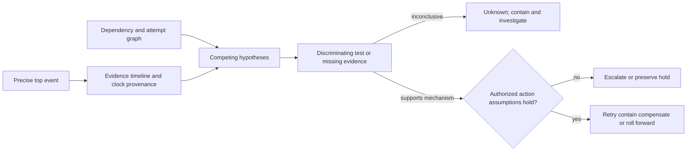
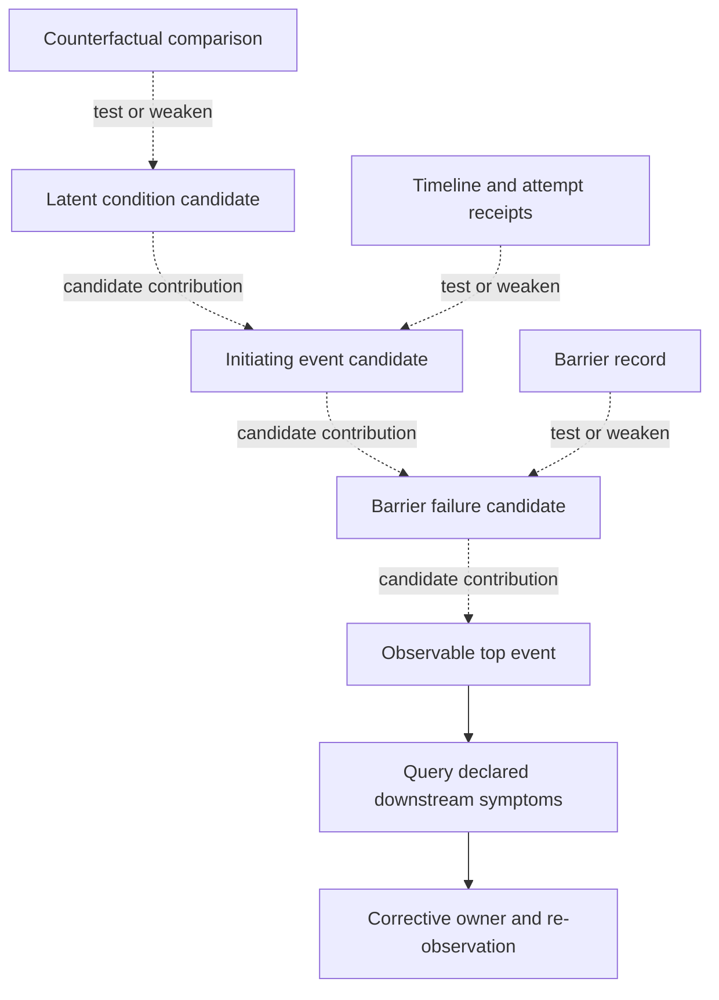

# DAG Failure Analyzer

Error text and dependency reachability generate hypotheses; neither establishes
cause. Preserve uncertainty when evidence cannot discriminate mechanisms. The
[incident method reference](references/source-and-hand-checks.md) contains three
worked incidents, discriminating checks, barrier analysis, and recovery gates.

## Method 1 — establish an investigation record

Freeze the execution revision and incident window. State a precise top event,
then build an evidence timeline with timestamp source and uncertainty. Collect attempt
records, dependency contracts, external status, resource measurements, recent
changes, and barrier/control records. Separate initiating event, latent
condition, contributing factor, barrier failure, downstream propagation, and
symptom.

## Method 2 — test competing causes

For each candidate cause, create a causal-factor edge with evidence pointer,
assumption, and a discriminating counterfactual test. DAG reachability can show
which consumers could propagate a prerequisite failure; it cannot show that the
prerequisite caused a temporal neighbor. Regexes may label a candidate signal but
must not choose the cause.

## Method 3 — choose recovery only under its preconditions

Classify a proposed action as retry, contain, compensate, roll forward/back, or
escalate. Retry requires an explicit reason another attempt is useful, a safe budget,
and current retry authority. For a possibly effectful operation it also needs
either an authoritative operation-bound terminal-absence receipt with a fence
against late commit, or a validated same-operation/context idempotency contract. Compensation requires a
confirmed effect, applicable postconditions, and its own authority; separately
reauthorize a retry afterward under a fence or same-operation deduplication
rule. Permission or policy denial is not transient by
default. Finish with a falsifiable corrective action, owner, and re-observation
predicate.

## Hand check

C times out after 80 seconds queued; B completed in 3 seconds; the service
reports throttling; a configuration rollout preceded the incident. Rate limit,
queue saturation, and rollout regression are competing hypotheses. Queue metrics
and unaffected-worker comparisons discriminate. Do not call it resource
exhaustion from a timeout string. A permission denial gets no blind retry even
if few descendants failed.

## Sources and limits

[NASA's Fault Tree Handbook v1.1](https://extapps.ksc.nasa.gov/reliability/Documents/Fault_Tree_Handbook_with_Aerospace_Applications_August_2002.pdf),
[NASA RCAT](https://software.nasa.gov/software/LEW-19737-1), and the [NASA mishap
investigation overview](https://sma.nasa.gov/sma-disciplines/mishap-investigation)
support timelines, causal-factor trees, barriers, and disciplined alternatives.
The source access is aerospace-method scope; it does not validate a regex table,
automatic root-cause finding, or portable probability estimate.

## Related skills

- `dag-execution-tracer` supplies attempt and coverage evidence.
- `dag-performance-profiler` supplies performance measurements; timing alone does not establish cause.
- `dag-pattern-learner` can surface prior cases as hypotheses, and `dag-dynamic-replanner` owns runtime graph changes.
