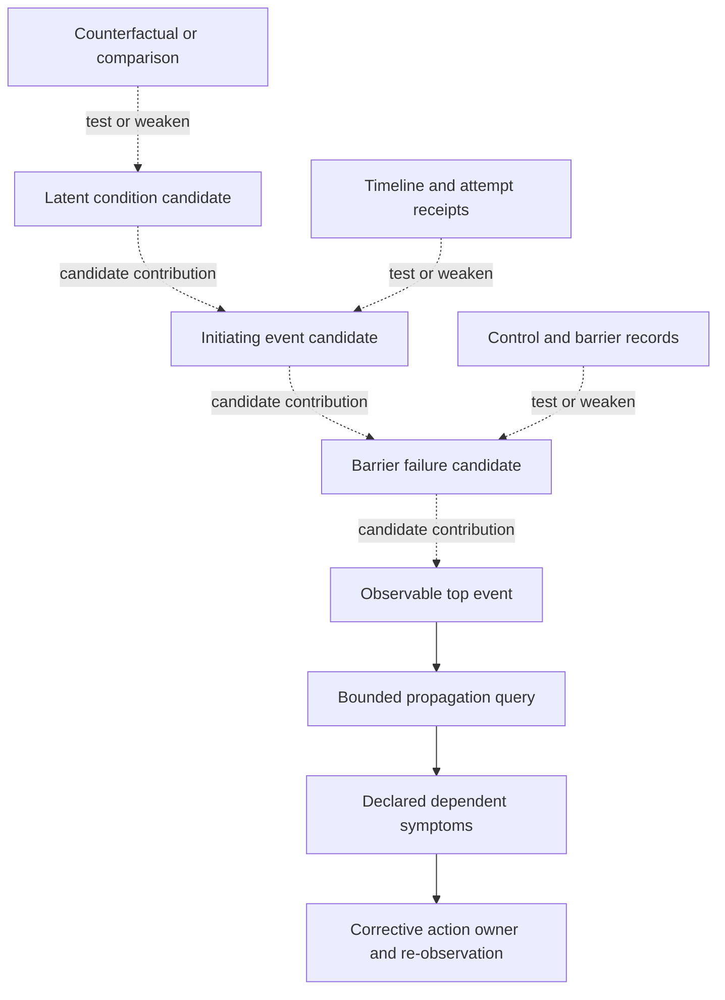

# Failure investigation: events, hypotheses, barriers, and safe action

This is a structured investigation, not a classifier. Keep observed events,
causal hypotheses, supporting evidence, counterevidence, and action authority as
separate records. An event earlier in wall-clock order is not automatically the
cause; a dependency path makes propagation possible but does not prove it
occurred.

## 1. Frame the incident before explaining it

Freeze the graph/execution revision, incident window, relevant system boundary,
and available evidence sources. Write one observable top event, such as
“report output `R` was not produced by run `r9` before its declared deadline.”
Avoid explanation inside the event statement (for example, “the report failed
because the API timed out”).

Build a timeline that retains source timestamp, clock source, uncertainty,
producer/attempt ID, evidence pointer, and whether the record is direct or
inferred. Keep separate fields for:

- initiating event candidate;
- latent condition or context;
- contributing condition;
- barrier/control intended to prevent, detect, or contain the event;
- propagation along declared dependencies;
- observed downstream symptom;
- unknown or conflicting observations.

A latent condition can exist without causing the event. A failed barrier can be
one contributor among several; it is not automatically the initiating event.
Causal links are hypotheses until tested against evidence and alternatives.

## 2. Maintain an explicit hypothesis table

Create one row per plausible mechanism. Keep the question and falsifier specific:

| Candidate mechanism | Supporting observations | Counterevidence / missing source | Discriminating check | Status |
|---|---|---|---|---|
| queue saturation delayed node C | long queue wait in C/1; unaffected worker ran | no queue-depth record for shard 4 | compare same window, same shard, unaffected worker | open |
| upstream service throttled C | target returned throttling code for C/1 | target log may be stale; retry header absent | query target receipt/request ID and rate-limit record | open |
| recent config change caused deadline regression | config digest changed before run | change affects only one path so far | compare same artifact/config on unaffected path or controlled replay | open |

Record evidence that would weaken each hypothesis. Do not assign a numerical
confidence unless the team has a defined, calibrated method for this event
population; narrative probability does not replace a discriminating test. A
hypothesis may remain unresolved if the evidence is missing.

DAG reachability identifies nodes that depend on a failed prerequisite under a
particular graph revision. It does not establish a temporal neighbor's cause.
Compare execution attempt IDs, input digests, node contract, and receipt evidence
to distinguish declared propagation from an independent failure in the same
window.

## 3. Distinguish causal diagrams from event chronology

The diagram below uses dashed arrows labeled **candidate contribution**. They
are hypotheses to test, not assertions that every latent condition causes the
top event. Evidence pointers connect to a check on an individual claim; the
timeline itself is not the causal graph. Change an arrow's status to supported,
weakened, or unresolved only when the named test and evidence are recorded.

If a fault-tree `AND` or `OR` gate is used, define the event and logical
conditions it represents. Do not use the shape of a tree as evidence of
probabilities, independence, completeness, or a validated causal model. The NASA
Fault Tree Handbook supplies a formal aerospace method; its gate calculations
need defensible event definitions, probability data, dependence assumptions,
and competent domain review.

## 4. Worked incident A: timeout cascade

**Constructed observation set.** `check-security/1` reports a 30-second timeout
at 10:34:30; `aggregate/1`, `report/1`, and `notify/1` then report prerequisite
failure within the next minute. Seven other nodes were active, and a security
service request log is incomplete. These values illustrate a case; they are not
thresholds or empirical rates.

1. State the top event: security check did not produce an accepted result by its
   run deadline. Preserve the timeout record and each downstream node's
   dependency/attempt IDs.
2. Separate possibility from evidence: the earliest observed timestamp is the
   first event in this log, but clock sources and missing events may change the
   ordering. Downstream failures may be propagation, while another active node
   can fail independently.
3. Keep at least three candidate mechanisms open: target throttling, local queue
   saturation, and configuration/deadline regression. Query target request ID,
   queue wait/capacity on the relevant worker, and the configuration digest plus
   a matched unaffected run. Each query should be capable of weakening a
   candidate.
4. Contain downstream consumption if the security result is a required gate.
   Do not publish a report as complete with a failed prerequisite. If a retry is
   considered, confirm target effect state, retry authority, budget, and a
   same-operation idempotency/deduplication contract; otherwise keep it held.
5. Corrective action is conditional on evidence: e.g. adjust a local queue
   policy only if queue evidence supports saturation, or coordinate target retry
   handling only if target evidence supports throttling. Assign an owner and
   reobserve the same declared metrics/contract on a later run.

**Negative check:** “timeout” plus concurrency does not prove load balancing or
resource exhaustion. The action remains `unknown` until a discriminator is
observed.

## 5. Worked incident B: resource/input-limit failure

**Constructed observation set.** `analyze-complexity/1` fails with an input-limit
message. A local counter reports 9,500 of a configured 10,000-unit budget, and
an input manifest lists 500 files. These are fixture values, not portable
limits. Candidate explanations include actual input size, a smaller effective
budget after prompt/context assembly, a changed model/config, or an incorrect
counter.

- Preserve the exact configuration, input manifest digest, provider response,
  and counter provenance. A counter from the caller is not necessarily the
  provider's authoritative accounting.
- Compare a matched successful run or a controlled reduced input using the same
  configuration. Check whether a particular subset changes the result; do not
  infer “500 files is too many” from one failure.
- If partitioning is proposed, preserve stable partition IDs and a deterministic
  merge contract, validate each partition's coverage, and test the merged output
  against the original task objective. Partitioning is a corrective hypothesis,
  not proof of completeness.
- Before retry, confirm whether the failed attempt could have emitted external
  effects. Apply a scoped retry budget and use a new attempt identity. Do not
  retry when output/effect state is unknown unless a validated idempotency rule
  covers the exact operation/context.

**Positive evidence example:** the provider receipt attributes the failure to
input budget and a matched lower-size case succeeds under the same config. That
supports a budget/input-size mechanism for this case; it does not establish a
universal file-count rule. **Negative:** a high local counter alone does not
identify which limit or component rejected the task.

## 6. Worked incident C: permission denial

**Constructed observation set.** `write-results/1` receives “permission denied”
for a protected destination; `generate-summary/1` reports a failed prerequisite.
Treat the denial as an observed policy boundary, not as a transient outage.

1. Preserve the denied operation, principal, requested target, scope/policy
   revision, and any approval evidence. Do not repeat the write just because the
   caller can retry.
2. Verify the intended destination and responsible authority through an
   approved source. Check whether the run used the expected principal and
   whether its requested scope exceeded the approved scope.
3. Escalate to the declared owner with the exact attempted operation and
   downstream impact. If a different destination is proposed, require its own
   scope, retention, and approval checks; do not silently redirect data.
4. After an owner-authorized policy or destination change, make a new attempt
   under the new policy revision, preserve the denial and approval lineage, and
   verify the outcome with a receipt. The authorization is specific to that
   target/action and does not generalize to other writes.

**Negative:** “permission denied” is not evidence of a bad password, service
outage, or a need for broader permissions. No automatic retry or blanket scope
increase follows from the event.

## 7. Select a corrective action and close the loop

Choose among contain, retry, compensate, roll forward/back, escalate, or no
change. For each action record its preconditions, authority, budget, affected
node/effect scope, owner, and a falsifiable re-observation predicate. If the
root cause is unresolved, say so and retain the uncertainty; a safe containment
step can still be appropriate.

A retry after an uncertain external operation requires an authoritative
terminal-absence receipt bound to the exact operation and a fence/epoch that
excludes a late first commit, or a validated idempotency/deduplication contract
covering the same operation and context. If compensation is proposed, establish the observed effect and
confirm that compensation applies to it, has the required authority, and has a
verified postcondition; then separately authorize any retry. Mere permission to
compensate does not make blind repetition safe. Permission/policy denial is not
transient by default.

## Method-source boundary

NASA's [Fault Tree Handbook, version 1.1](https://extapps.ksc.nasa.gov/reliability/Documents/Fault_Tree_Handbook_with_Aerospace_Applications_August_2002.pdf)
provides fault-tree method and aerospace safety-analysis context. NASA's
[RCAT catalog entry](https://software.nasa.gov/software/LEW-19737-1) and
[mishap-investigation overview](https://sma.nasa.gov/sma-disciplines/mishap-investigation)
describe structured investigation/training contexts. These materials inform
timelines, causal-factor/barrier analysis, and disciplined alternatives. They
do not validate the illustrative incidents, regex classifiers, automated root
cause, a universal confidence score, or Port Daddy/runtime behavior.
