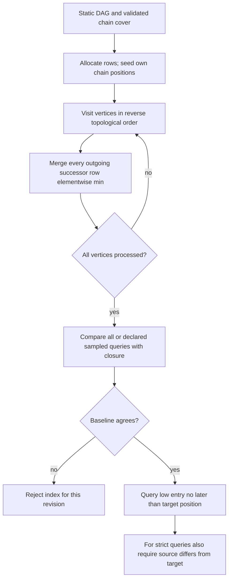
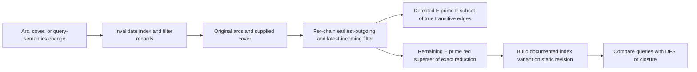

# Fast DAG decomposition and reachability

Use for repeated reachability queries over one named static DAG revision. It does not produce a processor schedule, prove a transitive reduction, update a changing graph in O(1), or transfer experiment ratios to an application graph.

## Source-labelled procedures

### Initial decomposition and concatenation: arXiv v1 (2022)

Kritikakis–Tollis [arXiv:2212.03945v1](https://arxiv.org/html/2212.03945v1) §2 calls Algorithm 1 **Chain-Order (CO)**: scan unused vertices in ascending topological order, start a path at each unused vertex, and repeatedly append an unused immediate successor until none exists. It calls Algorithm 2 **Node-Order (NO)**: scan vertices in ascending topological order and append a vertex to an existing path when it is an immediate successor of that path’s last vertex; otherwise start a singleton. Neither printed pseudocode specifies a tie rule when several paths/successors qualify.

Its Algorithm 3 concatenates a supplied vertex-disjoint path decomposition. For a path whose first member is `f`, run reversed DFS from `f` to find a last vertex of another current chain. A lookup returns witness path `P` and exhausted explored vertices `R` outside that path. If `P` is nonempty, join the endpoint chain before the chain beginning at `f`; `P` proves comparability, but its interior vertices stay in their existing chains. After either successful or failed lookup, remove/mark all `R` as a no-go region in the search graph before the next lookup. On failure `P` is empty and `R` contains every explored vertex. Preserve the original DAG for validation and indexing. The source’s amortized bound is `O(|E| + (kp-kc)ℓ)`, with realized successful-witness term `Σ|P|`; add selected initial-decomposition cost separately. It is not uniformly linear.

Algorithm 4 is **H3**, a Node-Order variation choosing among immediate-predecessor path endpoints the one with lowest out-degree; Algorithm 5 is integrated **H3 conc.**, which performs the reversed lookup when no such endpoint exists. Ties are unspecified. The printed forced-successor condition is inconsistent: nearby prose says current vertex out-degree 1, while Algorithms 4–5 say successor in-degree 1. This bundle preserves that ambiguity rather than silently selecting a rule.

### Filter and index: SEA 2023

The published [SEA 2023 paper](https://drops.dagstuhl.de/opus/volltexte/2023/18352/pdf/LIPIcs-SEA-2023-2.pdf) §3 filter begins from a supplied decomposition. For each source and target chain, retain only its outgoing arc to that chain’s earliest target; other such arcs are found transitive. Symmetrically, for each target and source chain, retain only its incoming arc from that chain’s latest source. The union is a detected subset `E'_tr ⊆ E_tr`; remaining `E'_red = E−E'_tr` retains closure but is only a superset of exact-reduction edges. It is neither exact reduction nor the index build.

### Index construction: preserve the representation invariant

**Source discrepancy found by a finite counterexample.** SEA §4 Algorithm 1 seeds each own-chain slot before conditionally merging successors. On `a→b→c` with supplied cover `[a,b],[c]`, that literal combination skips `a→b`, losing `a`'s reachability to `c`. The author repository uses a different, strict-successor representation with no early self seed. Do not mix its query inequality with the PDF representation. [The counterexample and version-pinned code comparison](references/printed-index-and-implementation-gap.md) give the complete trace and scope; this is not a claim that the authors' implementation fails.

For a clear reference implementation, retain the PDF's reflexive representation but **merge every outgoing successor row** in reverse topological order. Record chain IDs/positions, initialize `kc` slots per vertex to infinity and seed its own position, then merge each complete successor row elementwise-min. After all vertices are processed, query `low[u,chain(v)] ≤ position(v)`. Self-reachability is true; strict DAG reachability adds `u != v`. This straightforward local baseline uses `O(kc(|V|+|E|))` work including dense initialization. Its reverse-topological recurrence is proved in the reference; it is not the paper's claimed reduced-edge optimization.

### Cost and validation boundary

SEA Theorem 5 reports `O(|E_tr| + kc|E_red|)` construction and `O(kc|V|)` space, with sorted adjacency. That reported optimized bound does not certify the literal printed procedure contradicted above, and it is not the bound of the all-successor baseline. A concrete dense representation initializes `Θ(kc|V|)` cells before edge propagation. An edgeless graph exposes the separate cost: edge work is zero while `|V|²` cells exist if `kc=|V|`. Include decomposition, topological order and adjacency ordering as separate preprocessing. The paper's reverse-traversal stack method can order adjacency in `O(|V|+|E|)`; do not silently assume arbitrary comparison sorting is linear.

The author-source read and translated finite checks support a representation comparison, not certification of the Java implementation, every graph, or the paper's performance measurements. Optimize only with a maintained invariant, exact version, and independent query oracle. A sampled check provides sample coverage, not an exhaustive correctness proof.

Validate direct and strict query results against an exhaustive closure or declared sample. Record graph revision, decomposition, chain positions, sorted-adjacency check, memory, build time, query distribution, and baseline agreement. A query index proves graph reachability only; it does not prove code-review approval, sensor data quality, deployment authorization, worker count, or schedule feasibility.

## Constructed application checks

### Deployment dependency query

For `build→scan→deploy→verify` plus direct `build→deploy`, the filter may identify the direct `build→deploy` edge as transitive under the supplied chain position order. The strict query `build↝verify` can be true; `deploy↝deploy` is true for the reflexive reference index and false only after applying `u!=v`. None of this establishes scan success or deploy authority.

### Code-review dependency query

For `parse→typecheck→review` and `parse→review`, an index may answer whether parse reaches review. A “review accepted” property is not an edge and must remain separate evidence. The fixture gives the index rows and a negative semantic case where a JSON-shaped “approved” output is rejected for lacking an approval artifact.

### Sensor dependency query

For `ingest→calibrate→aggregate` and direct `ingest→aggregate`, the same query/filter procedure may identify the direct arc as transitive. It does not prove calibration accuracy, freshness, or suitability of the aggregate. Rebuilding is required when the graph revision or chosen cover changes.

Read [index and differential fixtures](references/index-and-differential-fixtures.md), [source method boundaries](references/source-method-boundaries.md), and [partial-filter fixture](references/transitive-structure-as-compression-opportunity.md).
