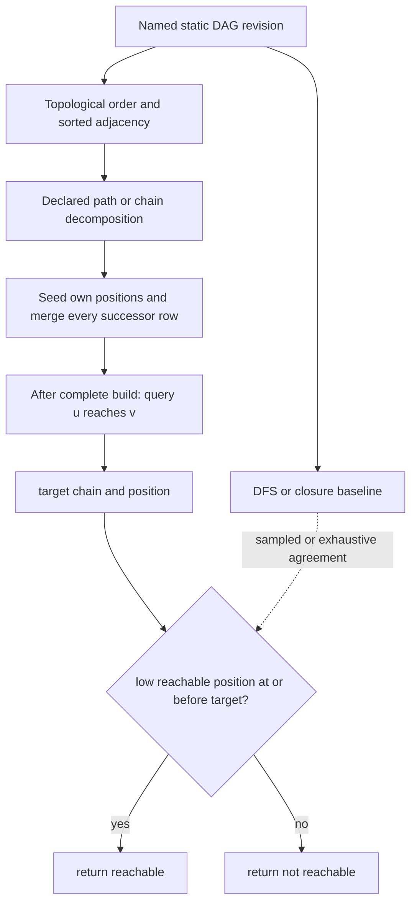

# Static index build and validated query

```mermaid
flowchart TD
  G[Named static DAG revision] --> S[Topological order and sorted adjacency]
  S --> D[Declared path or chain decomposition]
  D --> A[Seed own positions and merge every successor row]
  A --> Q[After complete build: query u reaches v]
  Q --> P[target chain and position]
  P --> C{low reachable position at or before target?}
  C -->|yes| Y[return reachable]
  C -->|no| N[return not reachable]
  G --> B[DFS or closure baseline]
  B -. sampled or exhaustive agreement .-> C
```

This depicts the reflexive all-successor reference construction, not the discrepant early-self-seeded conditional optimization printed in SEA Algorithm 1.
