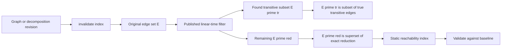

# Partial filter boundary and index invalidation

```mermaid
flowchart LR
  E[Original edge set E] --> F[Published linear-time filter]
  F --> T[Found transitive subset E prime tr]
  F --> R[Remaining E prime red]
  T --> S[E prime tr is subset of true transitive edges]
  R --> U[E prime red is superset of exact reduction]
  U --> I[Static reachability index]
  CH[Graph or decomposition revision] --> INV[invalidate index]
  INV --> E
  I --> V[Validate against baseline]
```

The filter preserves reachability for the constructed index; it does not claim an exact reduction or dynamic update.
