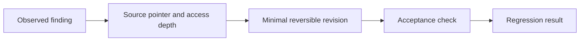
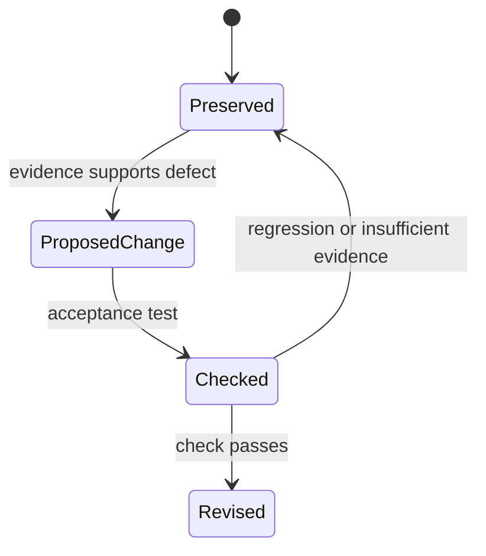
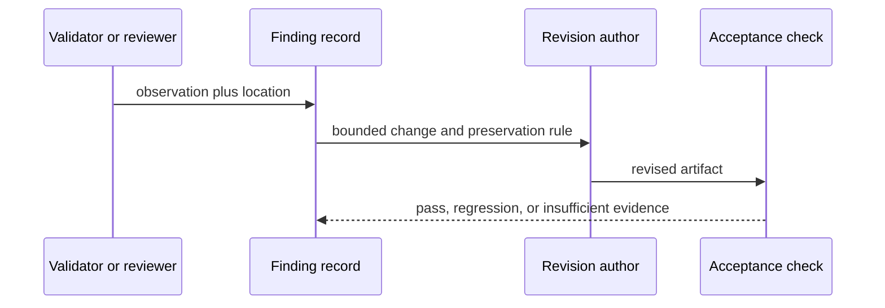

# Finding Traceability

[W3C PROV-O](https://www.w3.org/TR/prov-o/) supplies vocabulary for entities,
activities, and agents. **Access depth:** the official vocabulary was opened for
those terms. It does not prove a finding, authorize a change, or establish that
an acceptance check was executed.

Group findings only when they share a demonstrated root cause. Priorities and
cutoffs are configurable policy, not universal evidence.

## Minimal record

Record `findingId`, observed artifact and location, source pointer, access
depth, claim or requirement, evidence status, proposed reversible change,
preserved material, acceptance check, regression check, and disposition. A
missing source is a missing source; do not replace it with a numeric certainty.

