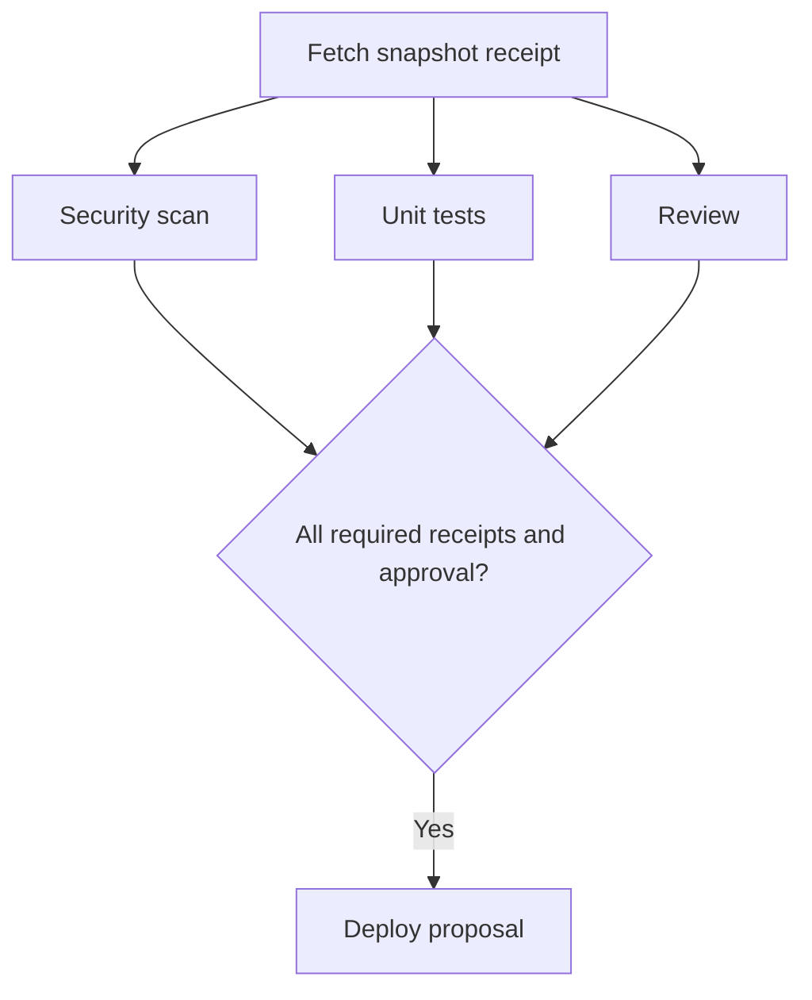
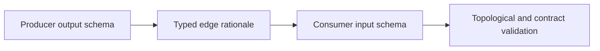
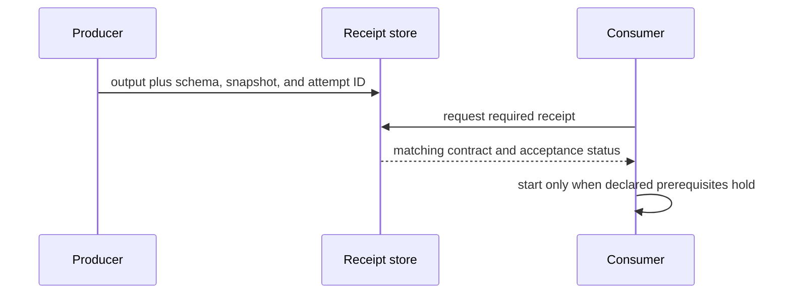

# Typed Graph Contracts

Candidate edges come from data, authority, or acceptance prerequisites, not words
such as “then” or “and.” [JSON Schema 2020-12 Core](https://json-schema.org/draft/2020-12/json-schema-core)
is an official structural-contract specification. **Access depth:** the official
specification was opened as a schema-contract reference. A schema pass proves
structural conformance only; it does not prove that a producer ran, an approval
was authorized, or an output is true.

The diagrams are planning artifacts, not execution proof.

## Edge record

For every edge, record the graph revision; producer node and output schema;
consumer node and input schema; all applicable rationale types (`data`, `authority`, and/or
`acceptance`); immutable source/snapshot identifier; effect and idempotency
policy; and the check that may satisfy the edge. A condition is a gate with a
declared evaluator, not a magic dependency.

