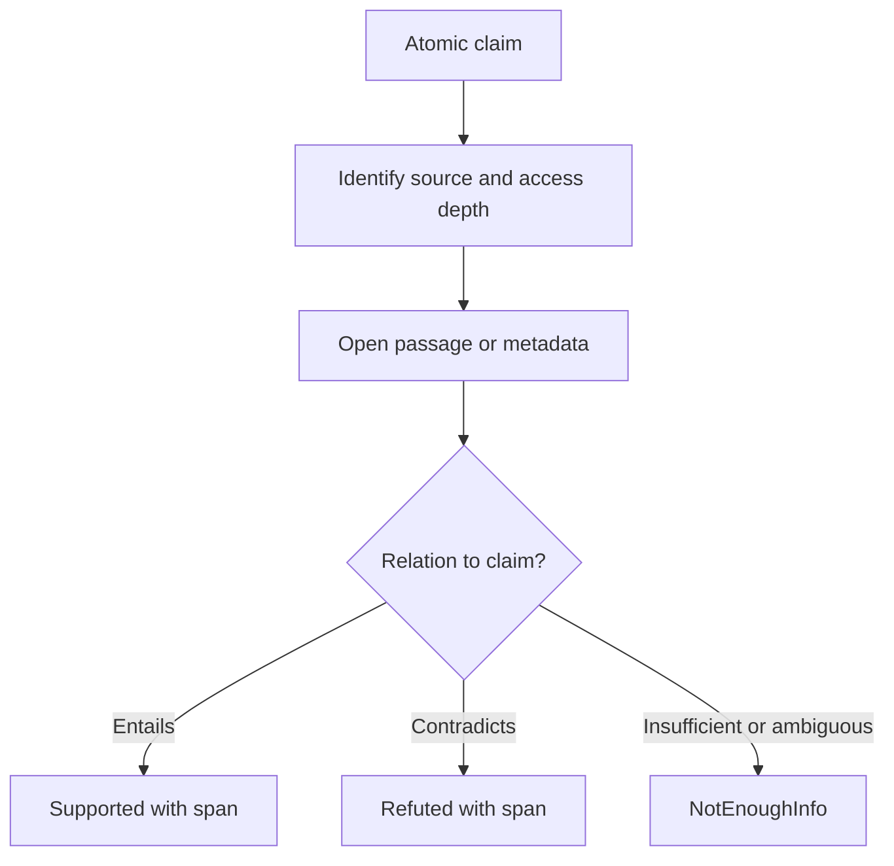
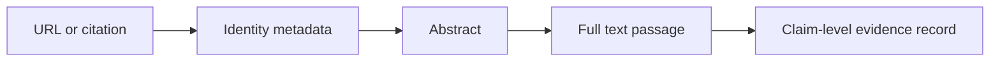
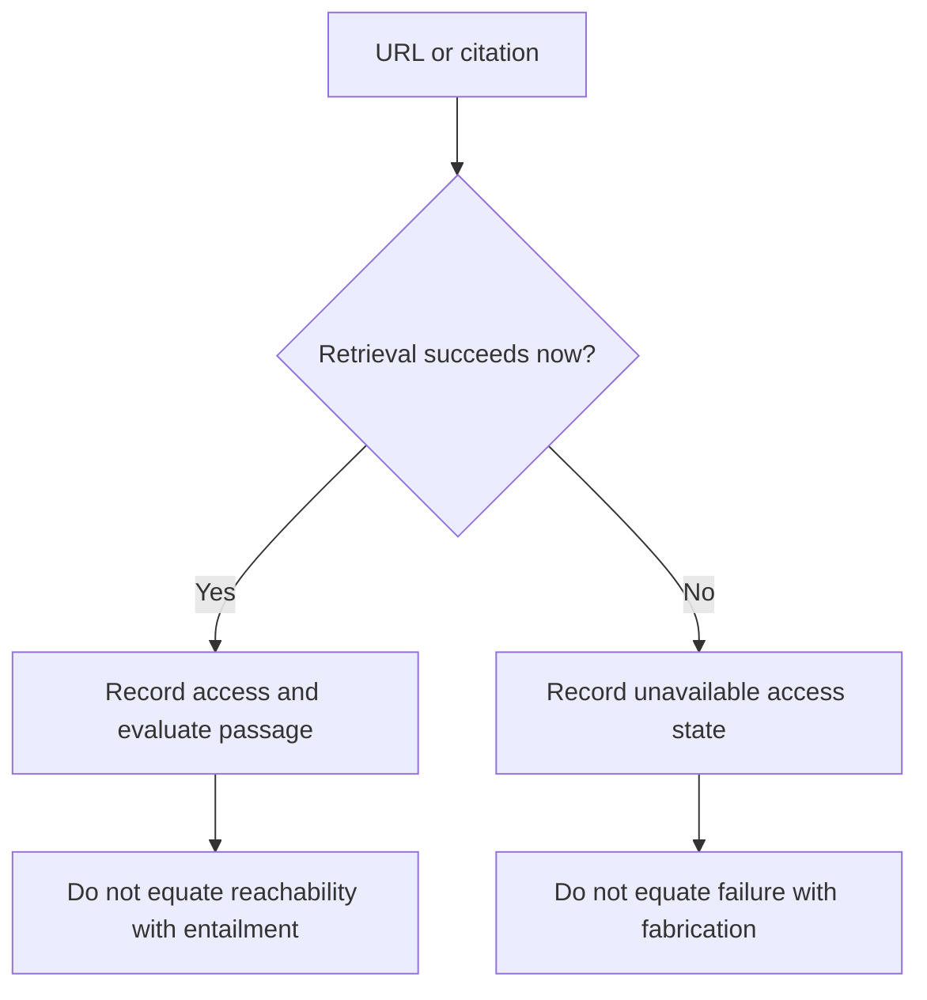

# Claim Evidence Verification

[FEVER: a Large-scale Dataset for Fact Extraction and VERification](https://aclanthology.org/N18-1074/)
uses `Supported`, `Refuted`, and `NotEnoughInfo` labels and requires evidence
for supported or refuted claims. **Access depth:** the ACL Anthology paper record
and abstract were inspected. This is a useful claim/evidence protocol, not a
guarantee that its Wikipedia benchmark or baseline applies to arbitrary web,
private, or changing sources.

HTTP success proves neither claim entailment nor source authority. A 404 may be
moved, private, or transient; record an unavailable access state rather than false.

## Claim record

For each atomic claim, preserve the artifact location; proposition; source
identity and publisher; publication/version date; retrieval time; quoted or
hashed passage; access depth (`metadata`, `abstract`, `full text`, or a bounded
source slice); evidence-set members; entailment/contradiction rationale;
alternative interpretation; and result. For multi-hop claims, record why each
source is necessary.

A result of `NotEnoughInfo` is not a weak synonym for false. It is the correct
outcome when retrieved evidence cannot establish either relation, even if the
claim sounds implausible or a citation is inaccessible.
