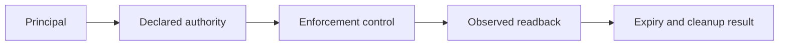
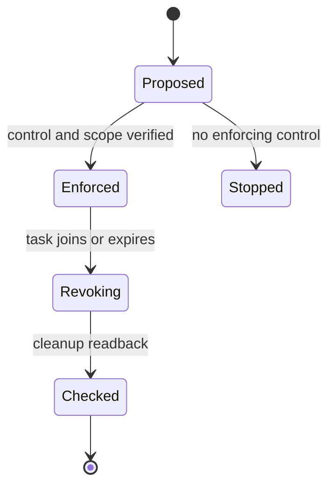

# Isolation Boundary and Evidence Contract

[Linux Landlock documentation](https://docs.kernel.org/userspace-api/landlock.html)
was opened at its rules, enforcement, ABI, threading, and pre-opened-descriptor
sections. **Access depth:** documentation only; no local Landlock runtime was
configured or tested. The documented rules restrict an enforcing thread and
future children subject to ABI and threading details, can only be made more
restrictive after enforcement, and do not by themselves turn pre-opened file
descriptors into a complete application policy.

[Bubblewrap's maintained README](https://github.com/containers/bubblewrap)
was opened at its sandbox-security and usage sections. **Access depth:**
documentation only; no Bubblewrap configuration was run. Bubblewrap constructs
an environment, but its maintainers require callers to specify an appropriate
security policy; a changed filesystem view alone is not a security claim.

These sources describe control constraints, not evidence that a particular
named profile enforced a security property. This reference supplies an explicit
design and test contract and distinguishes documentation from local readback.

[W3C PROV-O](https://www.w3.org/TR/prov-o/) was opened as an official vocabulary
for entity, activity, and agent relations. **Access depth:** vocabulary terms
only. Provenance records help identify what was configured and observed; they do
not prove that a sandbox prevented an escape.

For each boundary, record the asset class, principal, allow/deny policy,
enforcement layer, inherited credentials, egress rule, resource cap, expiry,
and a negative test. Mark a worktree as logical file separation unless a
separate OS control is actually demonstrated.
