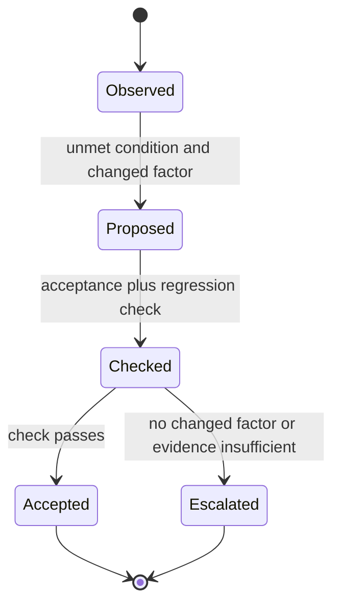
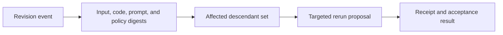

# Evidence-Gated Iteration Decisions

The supplied research reviewed the original skill but did not inspect a primary
stopping-rule study or runtime implementation. Its iteration guidance is thus a
bounded decision contract, not a universal convergence algorithm.

[W3C PROV-O](https://www.w3.org/TR/prov-o/) was opened for entity, activity, and
agent vocabulary. **Access depth:** official vocabulary terms only. It supports
recording revisions and checks; it does not establish that a future retry will
improve an output.

Record the event that justified a rerun, the changed factor, the prior and new
revision IDs, acceptance criterion, resource estimate, and disposition of prior
outputs. Preserve unaffected artifacts only when their declared inputs and
assumptions remain valid.
