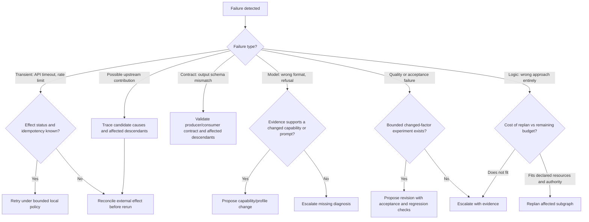
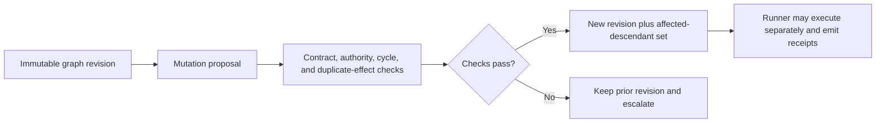

# DAG Mutation Strategist

Decides HOW to mutate a DAG when things go wrong. Given a failure diagnosis from `dag-quality` or `dag-ops`, selects a bounded recovery proposal. Use [Revisioned Mutation and Invalidation](references/revisioned-mutation-and-invalidation.md): a proposed graph mutation is not execution, and it must preserve the old graph revision, affected descendants, and effect disposition.

---

## When to Use

✅ **Use for**:
- Choosing a mutation strategy after a node fails
- Deciding between retry, replan, fork, or escalate
- Adapting to mid-execution discoveries that change the plan
- Cost-aware recovery using task-specific measured or declared estimates

❌ **NOT for**:
- Detecting failures (use `dag-quality`)
- Executing the mutation (use `dag-planner` to rewire, `dag-runtime` to execute)
- General error handling in code

---

## Strategy Selection

## Strategy Catalog

| Strategy | Preconditions | Required record |
|----------|---------------|-----------------|
| **Retry** | Effect status, idempotency, and local retry policy are known | Attempt lineage and reconciliation result |
| **Prompt or capability change** | Evidence identifies an unmet contract or capability gap | Exact changed factor and acceptance check |
| **Contract repair** | Producer/consumer mismatch and affected descendants are known | Schema/semantic contract revision |
| **Fork or replan** | Authority, resource, merge, and duplicate-effect policy exist | New graph revision and join rule |
| **Insert validator** | A declared acceptance gap needs independent evidence | Evaluator identity and result provenance |
| **Escalate** | No bounded safe experiment remains | Evidence, unknowns, and decision requested |

## Decision Principles

1. **Evidence before ranking**: choose a recovery only after classifying the failure and affected effect boundary.
2. **Cost is task-local**: compare measured or declared resource estimates, acceptance value, and authority; do not use fixed model prices.
3. **Do not repeat an unchanged hypothesis**: escalate when no discriminating experiment remains.
4. **Repair supported causes, not just symptoms**: when evidence shows Node A produced invalid input consumed by Node C, invalidate and repair the affected path from Node A while checking for additional causes.

---

## Anti-Patterns

### Retry Everything
**Wrong**: Retrying every failure with the same prompt and model despite unchanged evidence and hypothesis.
**Right**: Retry only after effect reconciliation and an idempotency-safe local policy; change strategy when the next attempt would not test a different condition.

### Expensive Recovery for Cheap Failures
**Wrong**: Selecting a recovery from provider/model labels or remembered prices.
**Right**: Compare measured task-specific cost, capability evidence, and acceptance risk before proposing a change.

### Ignoring Cascade Failures
**Wrong**: Assuming Node A is the sole root cause because Node C consumed its output.
**Right**: Trace dependency, shared-cause, and independent-failure hypotheses; invalidate and repair only the descendants supported by the evidence, while preserving unresolved alternatives.
