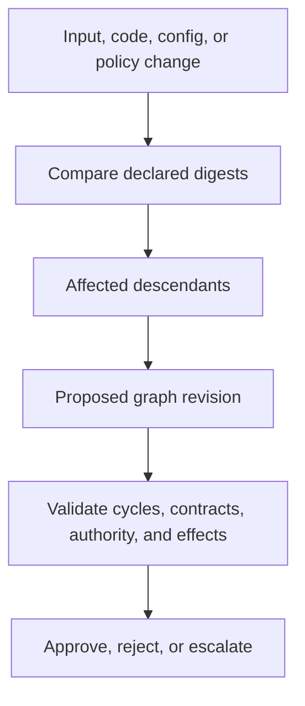
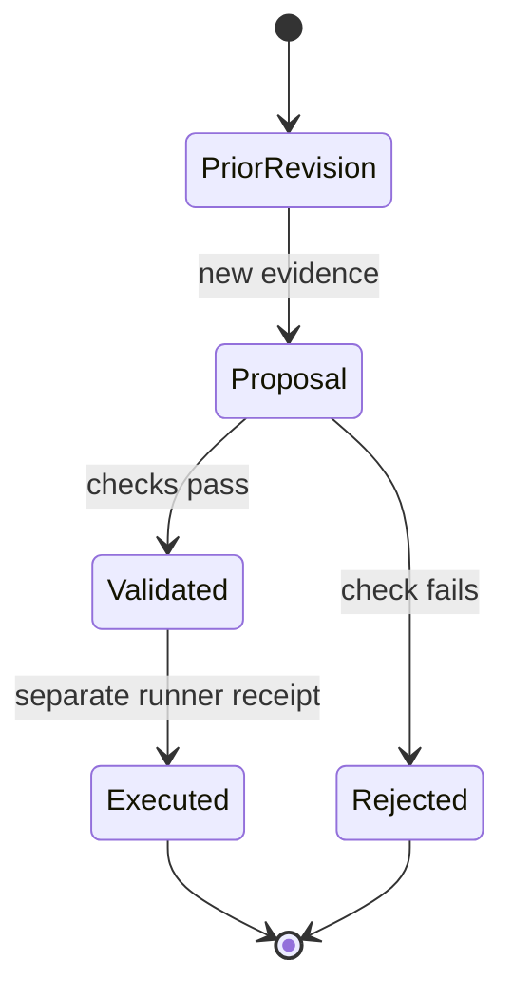

# Revisioned Mutation and Invalidation

The supplied research did not inspect a primary graph-mutation implementation.
This reference defines a conservative planning contract: graph revisions are
immutable proposals until a separate executor validates and runs them.

Record the prior revision, mutation rationale, changed digests, affected nodes,
old-output disposition, effect/idempotency policy, acceptance check, and merge
rule. Source access limitation: no primary runtime source was inspected in the
supplied research, so this is not evidence of any executor’s behavior.
