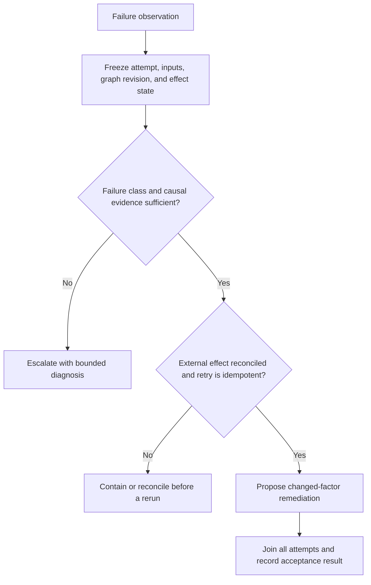
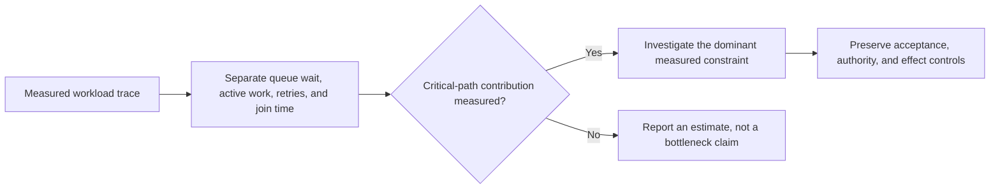
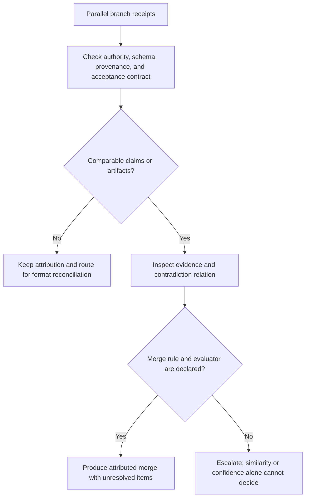
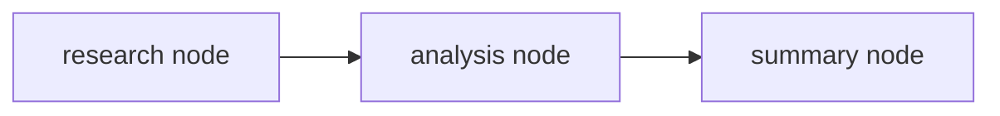

# DAG Ops

Operations, debugging, and optimization for DAG workflows. Handles failure analysis, performance profiling, result aggregation, and pattern learning. Use [Operational Receipts and Effect Reconciliation](references/operational-receipts-and-effect-reconciliation.md): issuing an action does not prove its effect, and cancellation does not prove an external side effect was rolled back.

## Decision Points

### Failure Response Strategy


### Performance Optimization Routing


### Result Aggregation Strategy


## Failure Modes

### Symptom Chasing
**Detection:** Multiple downstream failures after single upstream error, with separate remediation attempts for each failure.
**Diagnosis:** Treating symptoms as independent without testing dependency, shared-cause, and unrelated-cause hypotheses.
**Fix:** Trace candidate causes through the dependency graph, preserve the evidence for each hypothesis, and report what remains unobserved. A first deviation is a lead, not causal proof.

### Auto-Fix Overconfidence
**Detection:** Automatic remediation is proposed without causal evidence, effect reconciliation, or a stated acceptance check.
**Diagnosis:** An uncalibrated confidence score is being treated as authorization to act.
**Fix:** Require a declared local policy, evidence record, and bounded changed-factor experiment; otherwise escalate.

### Context Drop
**Detection:** Downstream nodes failing due to missing context that was available in earlier waves.
**Diagnosis:** Not bridging context across non-adjacent nodes in the DAG.
**Fix:** Maintain context registry with node dependencies, propagate relevant context forward.

### Aggregation Blindness
**Detection:** Parallel branch results merged without conflict detection, producing incoherent output.
**Diagnosis:** Assuming parallel results are always compatible without validation.
**Fix:** Compare source/evidence relation and declared merge contract before merging; similarity analysis is only a candidate-generation signal.

### Performance Tunnel Vision
**Detection:** Optimizing individual node performance while ignoring overall DAG efficiency.
**Diagnosis:** Focusing on local metrics without considering critical path and resource allocation.
**Fix:** Analyze critical path first, then optimize bottlenecks that actually impact total execution time.

## Worked Examples

### Example 1: Cascade Failure with Remediation Choice


```
Failure: summary-node returns "Error: Cannot summarize incoherent analysis"

Step 1: Trace backward
- Check analysis-node output: "The data is unclear and contradictory..."
- Check research-node output: Mix of valid research + API error responses

Step 2: Classify failure
- Candidate cause: research-node partly failed (it includes API-error responses); shared or additional causes remain to be checked
- Symptom: analysis-node tried to work with corrupted data
- Downstream: summary-node failed on corrupted analysis

Step 3: Establish remediation evidence
- Research-node receipt records retryable API timeout and no completed external effect
- Remediation policy permits a bounded retry with backoff
- Acceptance check requires complete research receipts before downstream release

Step 4: Proposed remediation
- Under the stated policy, retry research-node with backoff and read back its receipt
- Re-execute analysis-node and summary-node only after their invalidated inputs and effect states are reconciled
- Record whether the acceptance check passes; otherwise escalate with the competing causal hypotheses
```

### Example 2: Aggregation Conflict Resolution
```
Scenario: Parallel code review branches (security-review + performance-review)

Security output: "Function validate_input() needs input sanitization"
Performance output: "Function validate_input() should be removed for speed"

Step 1: Detect conflict
- Both claims identify the same function and propose incompatible actions
- Inspect the cited code, security requirement, and performance evidence before any merge

Step 2: Conflict resolution routing
- No confidence scores in outputs
- Conflicting recommendations on same code element
- Route: Escalate for human resolution with structured conflict summary

Step 3: Structure escalation
- Conflict: Function validate_input() handling
- Security perspective: Add input sanitization
- Performance perspective: Remove for speed optimization
- Human decision needed: Security vs performance tradeoff
```

## Quality Gates

- [ ] Root-cause evidence, effect state, and the local authority policy are documented
- [ ] Candidate causal relationships, shared causes, independent failures, and remaining unknowns are recorded with supporting evidence
- [ ] Remediation or escalation strategy identifies the evidence, authority, changed factor, and effect-reconciliation condition
- [ ] Performance bottlenecks identified on critical path (if profiling requested)
- [ ] Parallel branch conflicts detected and resolution strategy applied
- [ ] Context dependencies mapped across all node waves
- [ ] Pattern learning insights extracted and formatted for upstream consumption
- [ ] Cost, queue/wait, active time, retry, resource, and acceptance metrics are scoped to the measured workload
- [ ] Escalation package complete with actionable diagnosis (if human intervention needed)
- [ ] All auto-fix attempts logged with success/failure outcomes

## NOT-FOR Boundaries

**What this skill should NOT handle:**
- Initial DAG structure planning → Use `dag-planner` instead
- Real-time DAG execution → Use `dag-runtime` instead  
- Individual node output validation → Use `dag-quality` instead
- Business logic decisions within nodes → Let individual agents handle
- Cross-DAG orchestration → Use higher-level orchestrator
- User interface or presentation → Use presentation-focused skills

**Delegation rules:**
- For DAG restructuring needs → Pass insights to `dag-planner` with optimization recommendations
- For execution environment issues → Pass to `dag-runtime` with resource requirement updates
- For persistent quality issues → Pass to `dag-quality` with failure pattern analysis
- For cost/performance alerting → Pass measured workload evidence and the applicable local policy to monitoring
