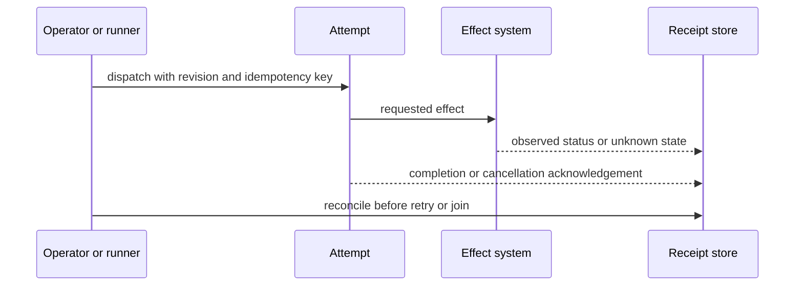
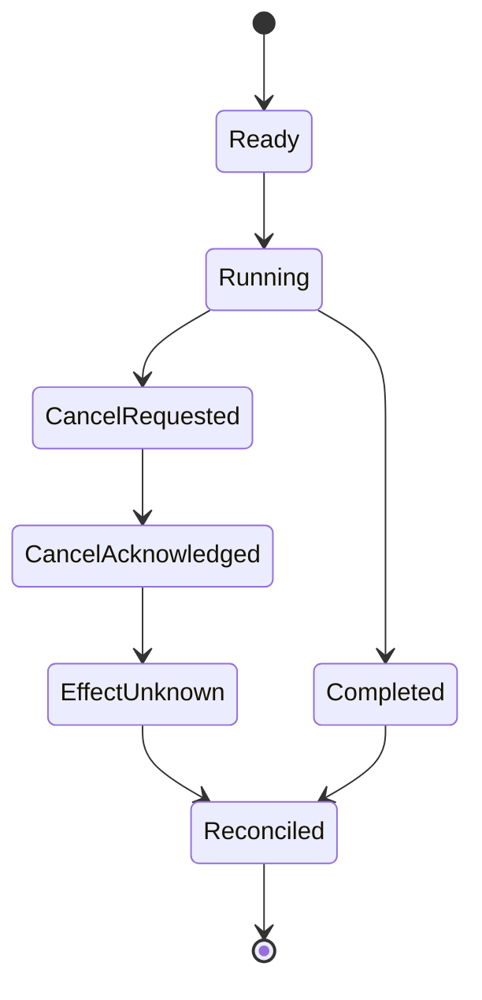

# Operational Receipts and Effect Reconciliation

[OpenTelemetry semantic conventions](https://opentelemetry.io/docs/specs/semconv/)
were opened for telemetry naming. **Access depth:** official convention pages.
Conventions standardize labels; they do not prove coverage, causality, or that
every external effect was observed.

Record attempt identity, graph revision, inputs, authority, queue/wait and active
duration, retry cause, cancellation acknowledgement, external effect status,
and acceptance result. A cancelled worker can still leave an effect requiring
reconciliation.
