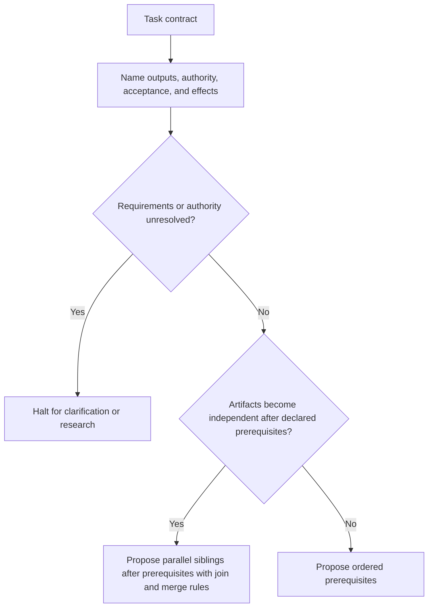
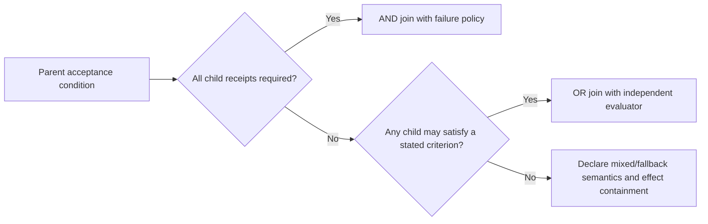
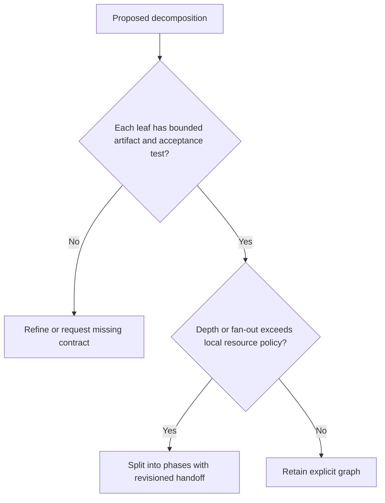
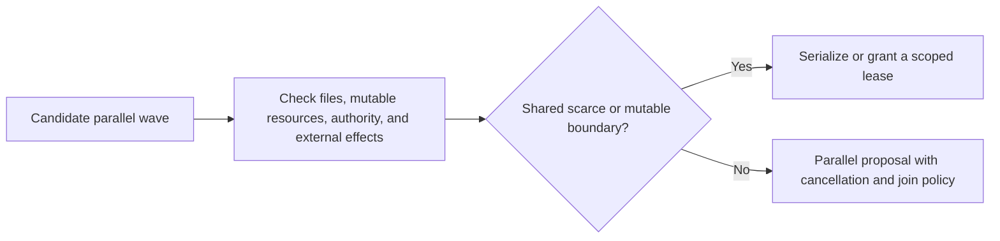
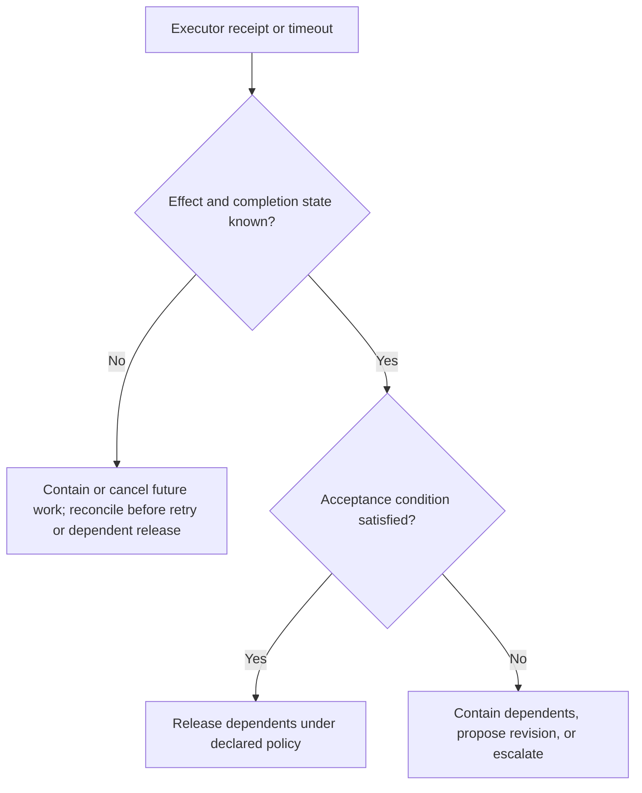
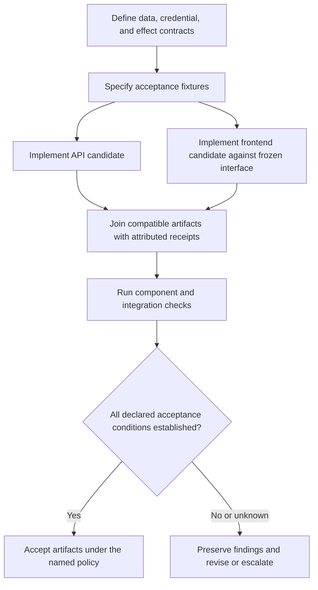

# DAG Orchestrator

Transforms natural-language tasks into proposed agent graphs and execution contracts. Use [Orchestration Authority and Lifecycle](references/orchestration-authority-and-lifecycle.md): a graph is not a running system, and a controller must not claim dispatch, cancellation, join, or effect semantics without receipts from its executor.

## Decision Points

### 1. Initial Decomposition Strategy


### 2. AND vs OR Composition Logic


### 3. Max Depth Calibration


### 4. Parallelization Safety Check


### 5. Failure Recovery Strategy


## Failure Modes

### Schema Bloat
**Symptoms**: DAG scope prevents clear ownership, contracts, or join semantics under its declared resource policy
**Detection**: A graph cannot state bounded artifacts, contracts, ownership, or join rules under its local resource policy
**Fix**: Split into revisioned phases or reduce scope; node count and estimates are planning inputs, not universal limits.

### Circular Dependencies  
**Symptoms**: Topological sort fails, "cyclic dependency" error in wave computation
**Detection**: Compare the processed-node count from Kahn's algorithm with the total node count, or retain a DFS back-edge witness; an acyclic prefix can exist before a cycle.
**Fix**: Preserve the cycle witness and ask the contract owner to revise the dependency or decompose an explicit intermediate artifact. Never delete an edge merely to make a sort succeed.

### Premature Parallelization
**Symptoms**: File conflicts, race conditions, inconsistent final state  
**Detection**: `if conflictingFiles.length > 0 || inconsistentOutputs`
**Fix**: Add explicit dependencies, use sequential waves for conflicting operations

### Infinite Decomposition
**Symptoms**: Depth keeps increasing, same task fails repeatedly at leaf level
**Detection**: A decomposition repeats the same unresolved obligation without a changed contract or evidence
**Fix**: Halt and request a new requirement, capability, or human decision rather than expanding depth by rule.

### Context Loss Cascade
**Symptoms**: Later waves fail due to missing information from earlier waves
**Detection**: `if waveN.inputs.missing.length > 0`
**Fix**: Ensure explicit context passing between waves, add context aggregation nodes

## Worked Examples

### Example: "Build authentication system for web app"

**Initial Assessment**: This is an illustrative authentication contract. Propose a revisioned graph only after naming its acceptance tests, credential/effect policy, and diagnosed component complexity.

**Wave 0 Decomposition**:
```typescript
// Initial breakdown
subtasks = [
  "Design user data schema",               // skill: database-architect
  "Specify authentication acceptance tests", // skill: test-engineer
  "Create login/signup API candidate",     // skill: api-architect
  "Build frontend auth candidate",         // skill: react-developer
  "Propose credential-policy candidate"     // skill: security-engineer
]
```

**Dependency Analysis**:
- The illustrative data, credential and effect contracts are prerequisites for the acceptance fixtures.
- The acceptance-test specification is a prerequisite for implementation candidates; executed evidence is evaluated before artifacts are accepted.
- API and frontend candidates may run after the frozen interface and fixtures only when their shared resources and effects have a valid coordination policy; their combined artifact is checked before acceptance.

**Illustrative dependency and acceptance graph**:


**Execution with Failure**:
```typescript
// An observed failure alone does not establish that decomposition is appropriate.
if (failureDiagnosis.complexityEvidence && effectStatus === "reconciled") {
  // Propose a revision after the task owner confirms the diagnosed complexity,
  // revised graph, authority, and acceptance checks.
  const apiSubtasks = [
    "Define authentication routes",
    "Implement password hashing", 
    "Add session management",
    "Create user CRUD operations"
  ];
  // A separate runner may execute the approved revision and emit receipts.
}
```

**Expert vs Novice**: 
- Novice: Assumes a familiar component order proves safe execution.
- Expert: Names the local contract, verifies prerequisites and effects, evaluates acceptance evidence before release, and revises only from a diagnosed condition.

## Quality Gates

- [ ] All subtasks have identified skill matches or fallback strategy
- [ ] Dependency graph has no cycles (topological sort succeeds)
- [ ] Shared file, semantic, authority, resource and effect requirements have explicit coordination policies; file overlap prediction alone is not sufficient
- [ ] Decomposition depth and wave size comply with a declared local resource policy
- [ ] Critical-path claims distinguish measurements from planning assumptions
- [ ] Executor results include receipt evidence or are explicitly unknown
- [ ] Context passing between waves explicitly defined
- [ ] Failure handling strategy defined for each critical node
- [ ] Resource constraints (memory, tokens, API calls) within limits
- [ ] Cancellation, join, duplicate-dispatch, and external-effect policies are declared

## NOT-FOR Boundaries

**Don't use DAG Orchestrator for**:
- Single-skill tasks → Use direct skill invocation
- Simple workflows whose artifacts, authority, and acceptance can be stated directly → use sequential task calls
- Real-time interactive tasks → Use conversational agents instead
- Tasks requiring human creativity/judgment → Use human-in-loop workflows
- Debugging/troubleshooting → Use diagnostic-specialist skill
- Data analysis/visualization → Use data-analyst skill

**Delegate instead**:
- Code reviews → Use code-reviewer skill
- Writing/editing → Use copywriter or technical-writer  
- Research synthesis → Use research-synthesizer skill
- UI/UX design → Use ui-ux-designer skill
