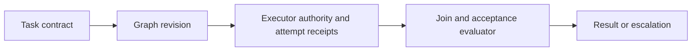
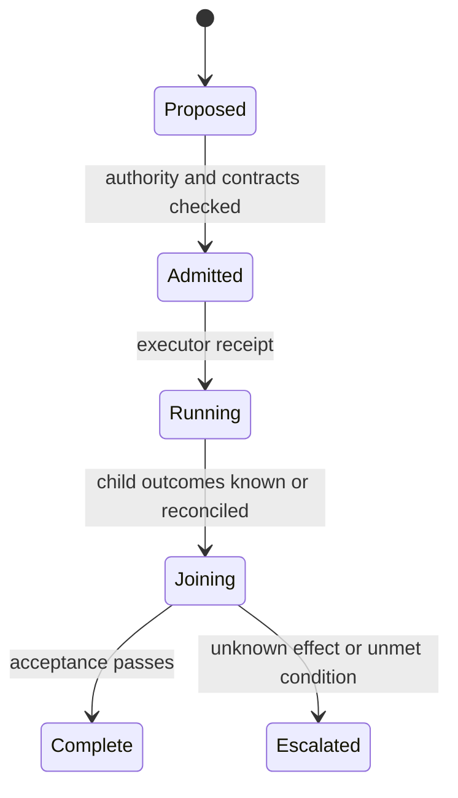

# Orchestration Authority and Lifecycle

The supplied research did not inspect a primary orchestrator runtime or API.
This is a planning and receipt contract, not evidence that a task tool has these
semantics.

[W3C PROV-O](https://www.w3.org/TR/prov-o/) was opened for entity, activity, and
agent vocabulary. **Access depth:** official vocabulary terms only; it does not
establish runtime scheduling, authorization, or effect completion.

Record controller identity, graph revision, admitted authority, attempt IDs,
cancellation request/acknowledgement, effect state, join policy, and acceptance
receipt. A lost connection is not proof that an attempt stopped.
