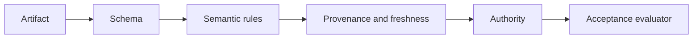
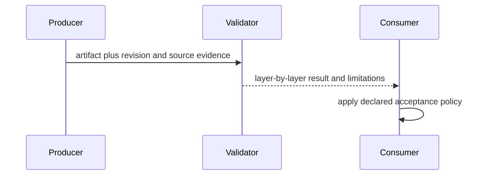

# Layered Validation and Acceptance Evidence

[JSON Schema 2020-12 Core](https://json-schema.org/draft/2020-12/json-schema-core)
was opened as an official structural-contract specification. **Access depth:**
official specification. Schema validity establishes structural conformance, not
semantic truth, source freshness, authorization, execution, or acceptance.

[JSON Schema's object reference](https://json-schema.org/understanding-json-schema/reference/object)
and [null reference](https://json-schema.org/understanding-json-schema/reference/null)
were also opened. **Access depth:** documentation examples for object properties,
`required`, and `null`. A property listed under `properties` is not required
unless the schema's `required` keyword names it; absence and the `null` value
are distinct, and `null` is valid only when the declared type permits it. The revised report schema was checked with four offline Ajv2020-12 fixtures covering unknown evidence, unperformed checks and contradictory acceptance summaries. These checks establish report shape, not the truth of its evidence. The worked artifact examples are illustrative and were not executed against a separate validator.

Record validator version, contract version, structural result, semantic rule
result, provenance/freshness evidence, authority decision, evaluator identity,
and final disposition. A warning may be safe only when the consumer’s policy
explicitly permits it.
