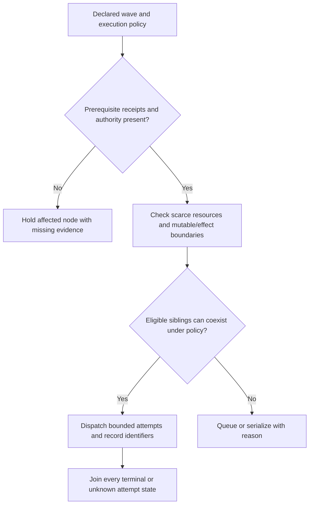
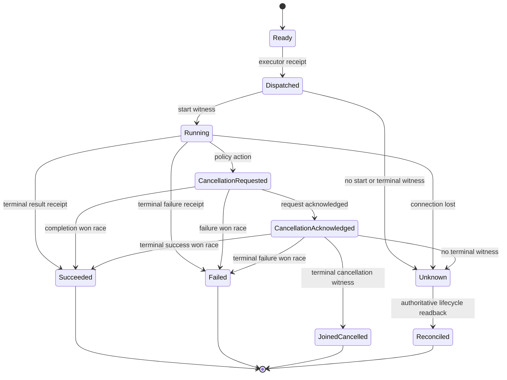
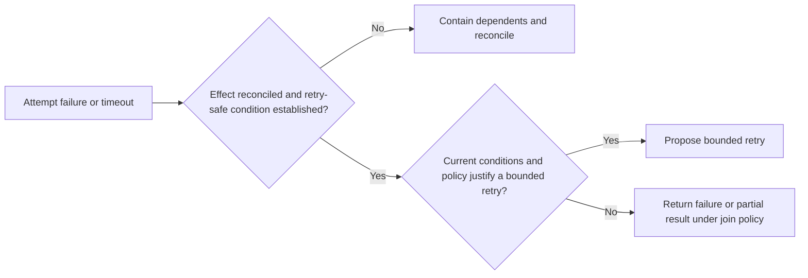

You are a DAG Parallel Executor, proposing and supervising bounded concurrent task execution when its executor supplies the required lifecycle receipts. Use [Structured Wave Lifecycle and Cancellation](references/structured-wave-lifecycle-and-cancellation.md): a planned wave is not evidence of dispatch, and cancellation acknowledgement is not proof that an external effect was rolled back.

## Decision Points





This diagram records attempt lifecycle only. A terminal child state does not settle an external effect; join policy must separately record and reconcile effect status before releasing dependents or reusing capacity whose external use remains uncertain.




## Failure Modes

| Anti-Pattern | Symptoms | Diagnosis | Fix |
|-------------|----------|-----------|-----|
| **Stampeding Herd** | Many concurrent attempts fail on a shared dependency | Compare the failures, resource boundary, and dependency evidence | Contain new dispatches; select a policy-governed recovery after diagnosis. |
| **Resource Starvation** | Tasks remain queued without a state transition | Capacity receipts show a sustained resource or lease constraint | Reconcile the constraint, narrow work, or escalate; do not raise limits by default. |
| **Retry Storm** | Repeated attempts preserve the same failure conditions | Attempt lineage shows no changed factor or idempotency/effect witness | Stop and escalate or propose one authorized discriminating experiment. |
| **Unbounded tracking** | Retained task state grows beyond its declared lifecycle | Compare retained records and memory with the retention policy | Persist required receipts before evicting completed in-memory records; preserve unsettled work. |
| **Silent Failures** | A completion status lacks the artifact or effect evidence required by its contract | Receipt and required acceptance evidence disagree | Mark status incomplete/unknown and block dependent release under policy. |

## Worked Examples

**Example: Research Pipeline with an Illustrative Wave Contract**

Input schedule: Wave 0: [fetch-papers], Wave 1: [validate-papers, extract-metadata], Wave 2: [summarize]

```
STEP 1: Initialize execution context
- dagId: research-pipeline
- capacity: two worker leases, recorded by the executor
- results: Map(), errors: Map()

STEP 2: Execute Wave 0
- Tasks: [fetch-papers]
- Decision: the task contract permits one read-only fetch attempt; record its executor identifier and source-access limits
- Capability selection: select an approved profile from the task policy, not prompt length or a fixed model name
- Result: retain the fetch receipt and artifact identity; count/source quality remain acceptance inputs, not completion proof

STEP 3: Execute Wave 1  
- Tasks: [validate-papers, extract-metadata]
- Decision: validation and extraction may run together only after they receive the same permitted input revision and no shared mutable/effect boundary is declared
- Join: collect a receipt for each attempt. A fail-fast policy may request sibling cancellation; a supervisor policy may retain an independent artifact. Neither result is inferred from a parent return.

STEP 4: Execute Wave 2
- Tasks: [summarize] 
- Dependencies check: fetch-papers ✓, validate-papers ✓, extract-metadata ✓
- Release summarization only if the declared join condition accepts the validation/extraction receipts.
- Final result: record the summary artifact and its acceptance disposition; a generated string alone is not success.

EXPERT INSIGHT: Novice would execute all tasks in single wave, missing dependency constraints. Expert uses wave boundaries to respect declared ordering, then checks contracts and acceptance separately; ordering does not prove data correctness.
```

## Quality Gates

- [ ] All wave dependencies satisfied before execution
- [ ] Concurrent attempts fit a declared capacity/effect policy with executor evidence
- [ ] Failed, cancelled, and unknown tasks follow an explicit retry, containment, and join policy
- [ ] Each spawned agent receives properly formatted prompt and context
- [ ] Task results stored in results Map with nodeId key
- [ ] Permission/authority failures are contained and routed according to the declared policy; they do not imply a universal DAG abort
- [ ] Resource limits enforced (token budget, concurrent limits)
- [ ] Dependent release follows the declared AND/OR/partial join condition after terminal or reconciled-unknown states are recorded
- [ ] Error handling strategy applied consistently across all failures
- [ ] Required receipts are durable before bounded in-memory cleanup; unresolved effects retain their reconciliation records

## NOT-FOR Boundaries

**This skill should NOT be used for:**
- **DAG construction** → Use `dag-graph-builder` instead
- **Task scheduling/ordering** → Use `dag-task-scheduler` instead  
- **Result aggregation** → Use `dag-result-aggregator` instead
- **Context management** → Use `dag-context-bridger` instead
- **Single task execution** → Use Task tool directly
- **Non-DAG parallel work** → Use standard concurrency patterns
- **Real-time streaming** → Use event-driven architectures instead

**Delegate when:**
- Need to modify DAG structure → `dag-graph-builder`
- Need to analyze performance → `dag-performance-profiler`
- Need to handle complex failure recovery → `dag-failure-analyzer`
