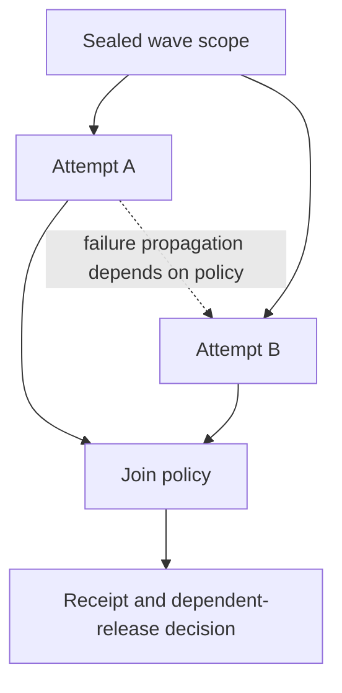
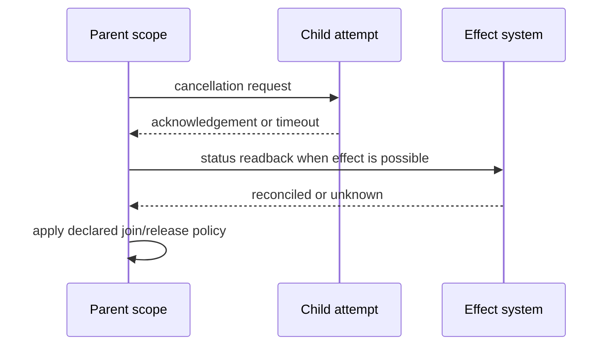

# Structured Wave Lifecycle and Cancellation

Sources accessed 2026-09-24. Kotlin live documentation snapshot; coroutine basics currently illustrates kotlinx.coroutines 1.11.0. This is a source version cue, not a required backend version.

[Kotlin's coroutine basics](https://kotlinlang.org/docs/coroutines-basics.html) and
[exception-handling guide](https://kotlinlang.org/docs/exception-handling.html)
were inspected as official documentation. **Access depth:** lifecycle and
exception-semantics documentation. They describe parent/child structured
concurrency, scope completion, cancellation propagation, and the difference
between regular and supervisor scopes. They do not establish the behavior of a
Task-tool backend or prove external-effect rollback.

Use the documentation as a vocabulary for an explicit local execution contract:
scope ID, child attempt IDs, cancellation request/acknowledgement, join rule,
timeout handling, unknown state, and effect reconciliation. A child marked
cancelled can still require external status readback.

