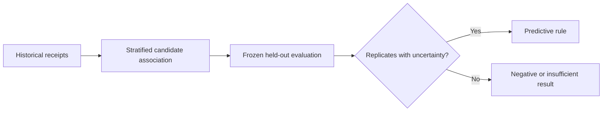
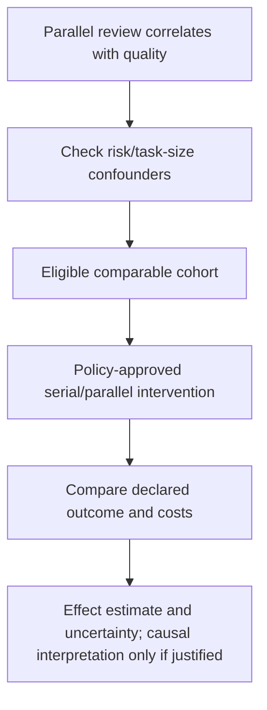

# Held-Out Pattern and Causal Evaluation

Source accessed 2026-09-24. Published article: JRSS Series B 78(5), 947–1012 (2016), DOI 10.1111/rssb.12167; access depth remains as stated below.

[Peters, Bühlmann, and Meinshausen (2016)](https://academic.oup.com/jrsssb/article/78/5/947/7040653),
*Causal Inference by using Invariant Prediction*, was inspected at its publisher
article/abstract and method-description level. **Access depth:** abstract and
method description, not a reimplementation or a study of this DAG system. The
paper tests stability of candidate conditional models across known environments
under structural assumptions. It does not make observational execution logs
causal evidence when task selection, model version, or environment is unobserved.

Label descriptive associations as such. A transferable predictive claim needs frozen held-out evaluation; a causal claim instead needs a designed intervention or explicit, defensible identification assumptions. These evidence requirements are not a universal sequence of prerequisite stages.

