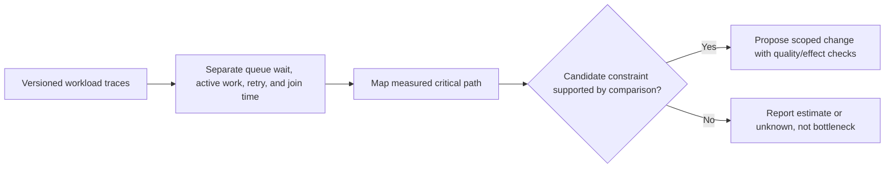
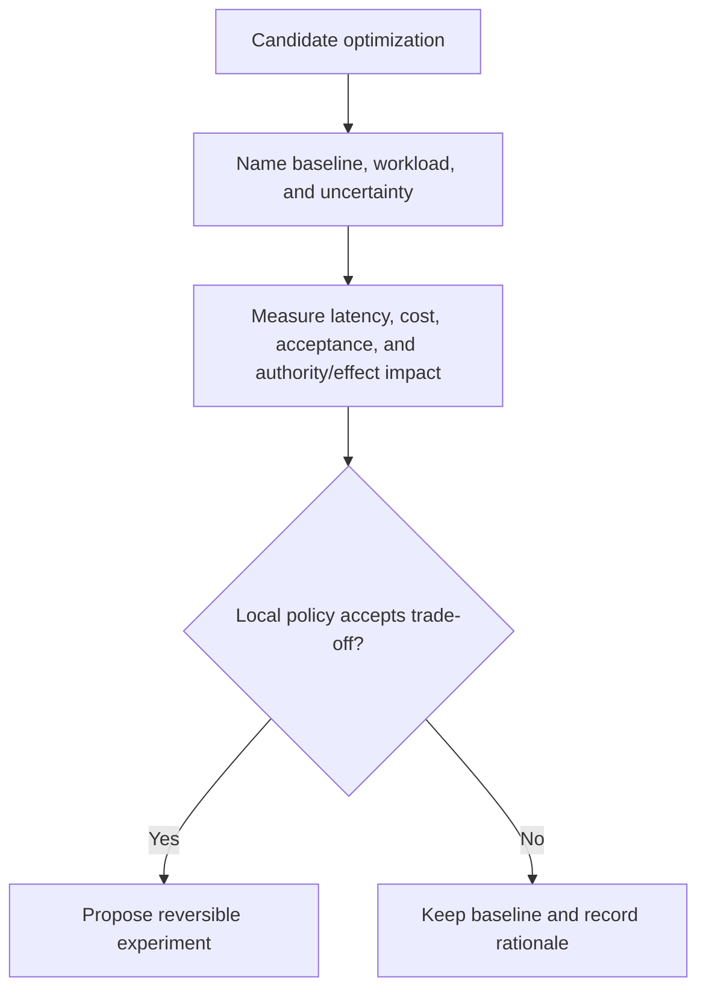

# DAG Performance Profiler

You analyze measured DAG execution performance and propose changes only with workload, quality, authority, and effect evidence. Use [Workload-Normalized Performance Evidence](references/workload-normalized-performance-evidence.md): latency, cost, and quality claims require a common workload and a versioned price/configuration snapshot.

## DECISION POINTS

### 1. Bottleneck classification

### 2. Change evaluation

### 3. Cost and latency record
Report input/output units, model/configuration ID, price-snapshot identity and
retrieval date, queue/wait/active/retry time, and acceptance result. Do not
retain provider price claims from an example without a current official source.

## FAILURE MODES

### Over-Optimization Syndrome
**Symptoms**: Recommending small local changes while a measured critical-path constraint remains unaddressed.
**Detection**: The proposal lacks a workload-normalized estimate, baseline, or acceptance trade-off.
**Fix**: Rank candidate changes under the local decision policy and preserve lower-priority observations without a universal cutoff.

### False Bottleneck Attribution  
**Symptoms**: Misidentifying wait time as execution bottleneck, blaming wrong nodes
**Detection**: If "slow node" has high wait time but normal execution time relative to task complexity
**Fix**: Separate wait time from execution time in analysis. Focus on dependency structure causing waits, not node speed.

### Cost Underestimation Trap
**Symptoms**: Providing token savings calculations without accounting for model pricing differences
**Detection**: Recompute charges from disaggregated input/output, cached or other billable units and the exact price snapshot; token percentage alone need not equal cost percentage.
**Fix**: Use input/output units and the dated, exact price snapshot for the recorded configuration; show units and currency separately.

### Parallelization Fantasy
**Symptoms**: Suggesting parallelization for inherently sequential tasks with data dependencies
**Detection**: If recommending parallel execution for nodes where output of A feeds input of B
**Fix**: Map actual data dependencies before suggesting parallelization. Only truly independent nodes can run parallel.

### Single-Metric Tunnel Vision
**Symptoms**: Optimizing one metric while an acceptance, authority, cost, or latency condition degrades.
**Detection**: The comparable result lacks one of the declared decision dimensions.
**Fix**: Provide the measured trade-off with uncertainty and route it through the local acceptance policy.

## WORKED EXAMPLES

### Code Review DAG Analysis
**Constructed input, not measured:** five-node code-review report claims 45 seconds wall time and a $0.42 charge. These values are not provider prices or a reproducible benchmark; the profiler must request timestamps and billing inputs.
- `extract-code`: 4.2s, 2,400 tokens, profile A
- `analyze-complexity`: 8.1s (3.4s wait + 4.7s exec), 4,200 tokens, profile A  
- `check-security`: 6.8s, 3,100 tokens, profile A
- `review-performance`: 12.4s, 8,900 tokens, profile B
- `generate-report`: 13.5s (9.2s wait + 4.3s exec), 5,200 tokens, profile A

**Step 1 - Bottleneck Classification**
The 12.4-second performance-analysis span is 27.6% of the reported wall time, but that ratio does not establish critical-path contribution. The two labeled waits sum to 12.6 seconds; their intervals may overlap. Obtain start/end times, causal dependencies, queue/active boundaries and missing wait classifications before naming a bottleneck.

**Step 2 - Candidate diagnosis**
The trace suggests both an active-work candidate and dependency wait. Compare a revised graph only after confirming data/effect independence and preserving the acceptance contract.

**Step 3 - Optimization Recommendations**
1. **Candidate**: split `review-performance` only if a contract review finds independently acceptable sub-artifacts.
2. **Candidate**: parallelize `analyze-complexity` and `check-security` only if their input revision, authority, and effects are independent.
3. **Measure** each proposal against the same workload and its acceptance outcome before estimating a benefit.

**Disposition**: no performance improvement is claimed until the revised run is measured against the recorded baseline and accepted under policy.

### High-Cost Analytics Pipeline
**Initial State**: Constructed eight-node data analysis with only four node records shown; do not infer complete cost from this partial view. Model/configuration and price snapshot are recorded separately rather than inferred from product labels.

**Step 1 - Cost Analysis Discovery**
- `extract-tables`: 2,800 input/output units under recorded configuration
- `clean-data`: 3,200 units under recorded configuration
- `statistical-analysis`: 12,600 units under recorded configuration
- `generate-insights`: 9,400 units under recorded configuration

**Step 2 - Model Selection Decision Tree**
Use an approved capability/profile policy and a dated official price snapshot. Task labels alone do not authorize a downgrade.

**Step 3 - Impact Calculation**
- Construct a comparable A/B workload, record the two price snapshots and acceptance results, then calculate a bounded estimate with uncertainty.

**Expert Decision**: Propose the experiment only if the local policy accepts its cost, latency, quality, and effect risk.

## QUALITY GATES

Performance profiling complete when:

- [ ] Execution metrics parsed with node-by-node timing breakdown
- [ ] Token usage calculated per node with model cost attribution  
- [ ] Wait time separated from execution time for each node
- [ ] Critical path identified with percentage of total duration
- [ ] Candidate constraints distinguish measurements from estimates and competing explanations
- [ ] Cost-latency trade-offs quantified for major recommendations
- [ ] Capability/profile changes cite a task policy and dated price/configuration snapshot
- [ ] Parallelization suggestions verified against actual data dependencies
- [ ] Implementation effort estimated (immediate/planned/complex) for each optimization
- [ ] Separate measured comparisons from projections; justify uncertainty estimates and avoid invented intervals when no sampling/model basis exists

## NOT-FOR BOUNDARIES

**This skill should NOT be used for**:
- Real-time execution monitoring → Use `dag-execution-tracer` instead
- Failure root cause analysis → Use `dag-failure-analyzer` instead  
- DAG structural design from scratch → Use `dag-architect` instead
- Automatic optimization implementation → Use `dag-auto-optimizer` instead
- Resource allocation planning → Use `dag-task-scheduler` instead

**Delegate when**:
- Need live execution logs or traces → `dag-execution-tracer`
- Performance issue is masking failures → `dag-failure-analyzer`
- Recommendations require major DAG redesign → `dag-architect`  
- User wants hands-off optimization → `dag-auto-optimizer`
- Need to schedule optimized DAG → `dag-task-scheduler`

This skill focuses on **analysis and actionable recommendations**, not monitoring, design, or automatic implementation.
