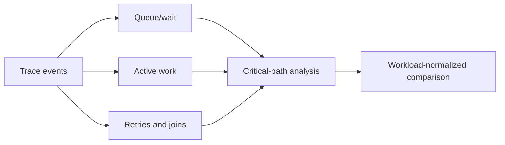
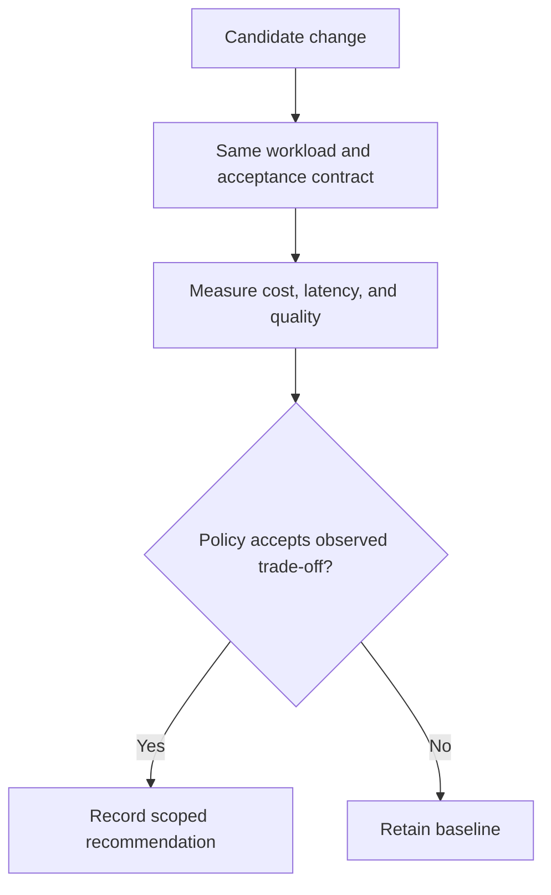

# Workload-Normalized Performance Evidence

Source accessed 2026-09-24. OpenTelemetry Semantic Conventions 1.44.0 overview; individual conventions carry their own stability status.

[OpenTelemetry semantic conventions](https://opentelemetry.io/docs/specs/semconv/)
were inspected as official telemetry naming documentation. **Access depth:**
documentation only. They provide common attributes and event vocabulary; they do
not guarantee that all side effects, waits, retries, or costs were observed.

Treat a profile as a measurement record: workload/input revision, graph and
configuration version, queue/wait/active/retry/join timings, resource units,
price-snapshot identity and retrieval date, acceptance result, and uncertainty.
An optimization is an experiment until comparable before/after records support a
claim.

