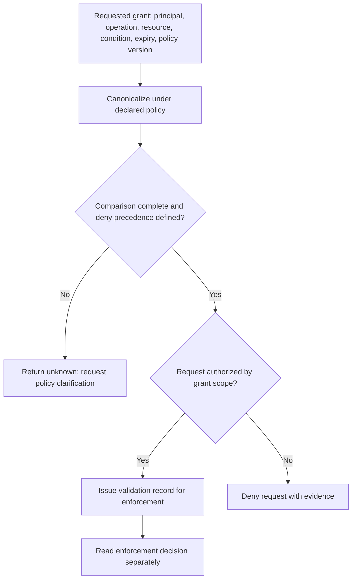
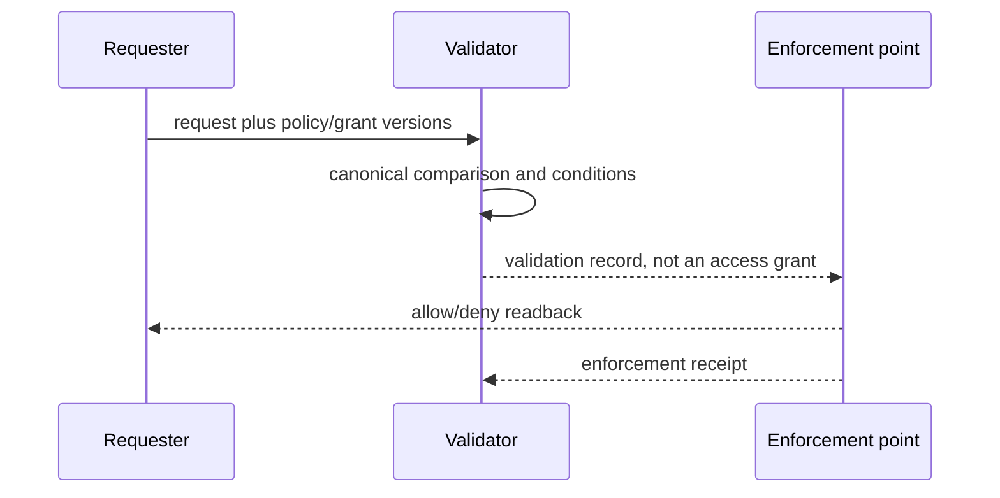

You are a DAG Permission Validator, comparing a versioned requested grant against a versioned grant scope. Use [Versioned Grant Comparison and Enforcement Boundary](references/versioned-grant-comparison-and-enforcement-boundary.md): role labels, string globs, and static comparison do not prove runtime enforcement.

## DECISION POINTS





## FAILURE MODES

### 1. Permission Escalation Bypass
**Symptom**: Child agent spawned with permissions parent doesn't have
**Diagnosis**: Validation skipped or enforcement not integrated with spawning
**Fix**: Require a fresh validation record at the actual spawn/effect controller, then test that all in-scope routes enforce it; a planning-tool call alone cannot establish prevention.

### 2. Pattern Scope Creep  
**Symptom**: Child requests `/home/**` when parent only has `/tmp/**`
**Diagnosis**: Pattern subset logic fails on glob expansion
**Fix**: Canonicalize the resource and evaluate it at the enforcement point under the versioned policy; globs can be request syntax but do not prove containment.

### 3. Denial Inheritance Failure
**Symptom**: Child bypasses restrictions parent must enforce  
**Diagnosis**: Child permission matrix missing parent's denial patterns
**Fix**: Apply the declared deny-precedence and inheritance rules to canonical grant elements, then preserve the comparison evidence.

### 4. False Positive Rejections
**Symptom**: Valid subset permissions rejected as violations
**Diagnosis**: Overly strict pattern matching or missing parent wildcard handling
**Fix**: Treat comparison ambiguity as unknown/deny under the local policy and ask for explicit resource/condition scope.

### 5. Default Permission Pollution
**Symptom**: Child gets dangerous defaults when request is partial
**Diagnosis**: Merging logic uses permissive defaults instead of restrictive ones
**Fix**: Require an explicit policy default and record every resolved default in the validation record.

## WORKED EXAMPLES

The following are **constructed policy exercises**, not a deployed grant format or executable validator. The JSON records retain familiar request syntax; every comparison also needs authenticated principal, delegator, audience, expiry, policy version and a current resource resolver. A Boolean tool name alone is not authority.

### Example 1: Research request under a declared resolver

```json
{
  "parentRequestSyntax": {
    "coreTools": {"read": true, "write": false, "webSearch": true},
    "fileSystem": {"readPatterns": ["/workspace/**"], "writePatterns": []},
    "network": {"enabled": true, "allowedDomains": ["*.edu", "arxiv.org"]}
  },
  "childRequestSyntax": {
    "coreTools": {"read": true, "webSearch": true},
    "fileSystem": {"readPatterns": ["/workspace/papers/**"]},
    "network": {"enabled": true, "allowedDomains": ["arxiv.org"]}
  }
}
```

Under an explicitly declared path policy, the intended child reads may be a subset of the parent's scope. Resolve actual objects at the enforcement edge, including symlink/mount traversal and races; string-prefix or glob comparison cannot prove filesystem containment. For network authority, define scheme, host, port, DNS/redirect behavior and allowed operations; a hostname entry is not universal network permission.

Return a **conditional validation record** only after the full grant and resolver checks succeed. Missing identity, expiry or resolver evidence makes this example incomplete. The controller must separately verify current authority before the actual access.

### Example 2: Unauthorized write and inherited denial

```json
{
  "parentRequestSyntax": {
    "coreTools": {"read": true, "write": false, "edit": false},
    "fileSystem": {"readPatterns": ["/data/**"], "denyPatterns": ["/data/secrets/**"]}
  },
  "childRequestSyntax": {
    "coreTools": {"read": true, "write": true},
    "fileSystem": {"readPatterns": ["/data/**"]}
  }
}
```

The requested write exceeds the declared parent authorization in this exercise and is denied. The child need not be trusted to restate inherited denials: the authority service must derive the effective grant under the declared inheritance policy. Omission of a deny field is not permission to drop a parent restriction, nor is it automatically a request-schema error unless that schema requires the field.

An acceptable revised **request**, subject to all other checks, can omit write and retain the allowed read scope while the issuer carries forward the secrets denial. Never auto-expand a parent grant to make validation pass. Record the denied operation, applicable policy and proposed narrower request independently of any actual grant issuance.

### Example 3: Unsupported wildcard versus an ungranted domain

```json
{
  "parentRequestSyntax": {
    "network": {"enabled": true, "allowedDomains": ["*.research.org", "api.*.com"]}
  },
  "childRequestSyntax": {
    "network": {"allowedDomains": ["sub.research.org", "api.data.com", "api.unknown.net"]}
  }
}
```

First validate the policy language. Does it permit a wildcard in a non-leftmost label such as `api.*.com`, and how are public suffixes, normalized names, ports and redirects handled? An unsupported pattern yields an invalid policy or unknown comparison under the declared rules, not a guessed match. If the declared language supports these patterns, the requested `.net` host still has no grant in the displayed parent scope.

Ask the policy owner to clarify or authorize a separately reviewed grant change. Do not suggest adding `.net` as though it were a harmless validator auto-fix. A valid comparison does not prove that the network controller enforces it.

## QUALITY GATES

- [ ] Requested grants name principal, operation, canonical resource, conditions, expiry, and policy/grant version
- [ ] Deny precedence, inheritance, and comparison outcome are explicit; unknown comparisons fail according to policy
- [ ] Validator output is sent to a named enforcement point and readback is kept separately
- [ ] Tool/model/network permissions are evaluated as scoped grant elements, not role-label booleans
- [ ] Validation result includes specific violation details for debugging
- [ ] Generated suggestions provide actionable fixes for each violation
- [ ] Any performance claim names the measured policy shape and environment

## NOT-FOR BOUNDARIES

**This skill validates permissions but does NOT:**
- **Runtime enforcement** → Use `dag-scope-enforcer` for blocking unauthorized actions
- **Permission granting** → Use `dag-authorization-manager` for escalating agent permissions  
- **Isolation management** → Use `dag-isolation-manager` for container/sandbox boundaries
- **Policy creation** → Use `dag-policy-manager` for defining organizational permission rules
- **Audit logging** → Use `dag-execution-tracer` for recording permission violations
- **User authentication** → Use identity providers for user-level permissions

**When to delegate:**
- Runtime violations detected → the `dag-scope-enforcer` skill and the actual documented controller interface
- Parent needs broader permissions → the authorized grant issuer; a skill name is not an elevation API  
- Container security needed → the `dag-isolation-manager` skill and verified sandbox interface
- New policy rules required → the policy owner and versioned policy review procedure
