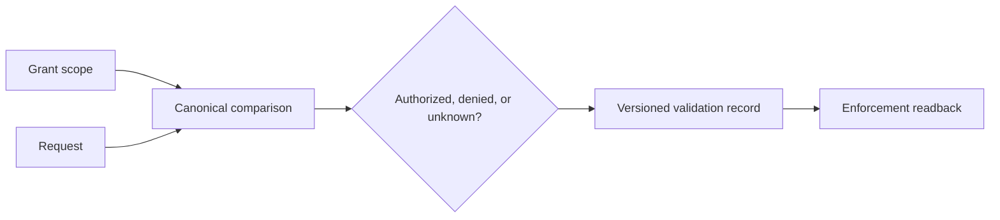
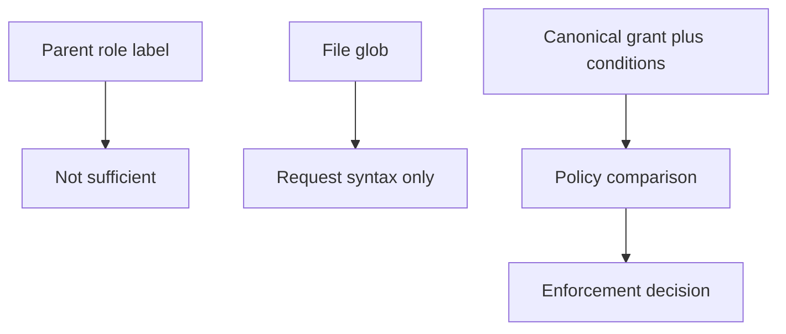

# Versioned Grant Comparison and Enforcement Boundary

Source accessed 2026-09-24. W3C PROV-O Recommendation, 30 April 2013; vocabulary access only.

[W3C PROV-O](https://www.w3.org/TR/prov-o/) was inspected as official provenance
vocabulary. **Access depth:** vocabulary terms only. It supports recording the
relation among a request, validation activity, policy version, and enforcement
receipt; it does not itself enforce a grant or establish that a resource pattern
is contained.

Represent a request as a versioned tuple: principal, operation, canonical
resource identity, conditions, expiry, policy/grant versions, and requested
effect. Define deny precedence and inheritance in that policy. Return `unknown`
when a static comparison cannot establish the required relation; only the
enforcement point can provide an observed allow/deny readback.

