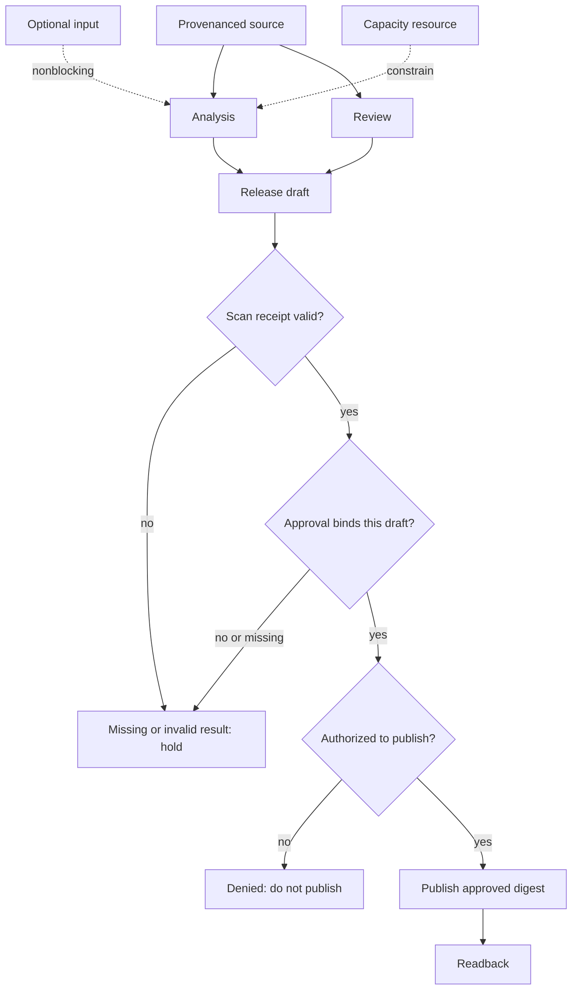
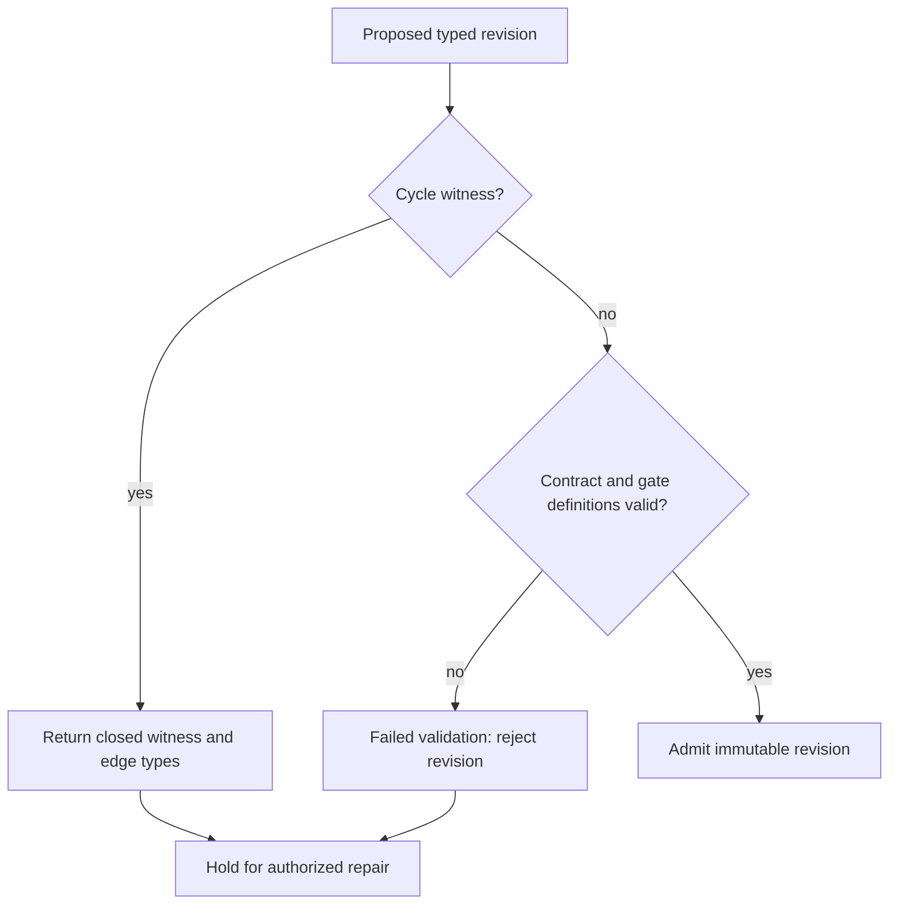

# DAG Planner
Use for multi-output work with stated predecessors, gates, and artifacts. It plans; it does not execute, authorize effects, or guarantee schedules.
## Procedure
1. State every output contract, producer evidence, consumer, and type: data, control, evidence, authority, resource, preference, or optional information.
2. Add a hard edge only when its consumer cannot proceed. Capacity contention is a resource constraint, not automatically precedence; optional input does not block; approval/authority gates protected effects.
3. Permit multiple roots. Validate hard predecessors topologically; return a closed cycle witness with typed edges, never auto-delete an edge.
4. Split/merge by ownership, review boundary, invariant, and failure isolation. Vague work needs a refinement question and stop condition.
5. Freeze graph revision before a run; a change is Vn+1. Reuse an artifact only when contract/provenance remains valid.

## Diagnostics and examples
Schema equality is not provenance, freshness, scope, or meaning. A missing producer blocks consumers unless a replacement satisfies that contract. A collect→analyze→recommendation pipeline is a valid linear case; independent research may converge with a human gate; failed quality can propose an alternate path only with common comparison evidence. A local draft may proceed while approval is pending only when separated from the gated effect.
## Constructed eight-task check
A2→B3,C2; B,C→D1; D→E2; C,E→G1; G→F1; F→V1. G is a **human gate** with constructed one-tick delay, not a compute slot; two identical non-preemptive compute slots schedule A[0,2), B[2,5), C[2,4), D[5,6), E[6,8), G[8,9), F[9,10), V[10,11). Makespan 11 is a feasible constructed plan only if the human approval arrives in the assumed interval, binds the required artifacts, and publication authority remains valid. Otherwise the effect stays blocked; elapsed time is not approval.
## Sources
[Python graphlib](https://docs.python.org/3/library/graphlib.html) supports predecessor readiness/cycle behavior; [Kahn 1962](https://doi.org/10.1145/368996.369025) is historical-only here. Immutable revisions/typed contracts are local policy.

## Decision methods

**Decompose** when outputs have separate ownership, evidence, failure isolation, or independently ready paths; keep a single coherent step or linear pipeline otherwise. **Choose a node** as agent work, bounded vague refinement, human gate, or restricted external request; vague work is not ready until its question and stop condition are recorded. **Set granularity** by output/review/invariant/failure boundary: split an opaque multi-output unit; merge only work with one owner and one recoverable contract. **Classify dependencies** as hard data/control/evidence/authority, optional input, resource constraint, or preference. **Modify** only through a new revision after repeated failure, quality/coverage evidence, unnecessary path evidence, or an evidenced alternative.

## Five diagnostic procedures

**Schema drift:** capture producer digest, schema, freshness, scope and meaning; add an adapter only if it restores the consumer contract. **Cycle:** return the closed witness with every edge type; retain graph until authorized repair. **Granularity explosion:** measure handoff/review cost and merge adjacent work only when contracts remain observable. **Ghost dependency:** audit shared files, locks, APIs, and hidden reads; model resource/evidence directly rather than serialize all work. **Wave starvation:** inspect the eligible frontier and resource fit; an idle slot is not proof of malformed structure.

## Three corrected worked examples

**Simple analysis.** `collect_feedback` outputs `{items, provenance}`; `analyze_sentiment` requires that evidence and outputs `{themes, scores}`; `recommendations` consumes those analysis outputs with their source lineage. If collection lacks provenance, analysis stays blocked; no empty recommendation is fabricated.

**Complex research.** `market_research` and `competitor_analysis` produce separate immutable artifacts, converge at `strategy_synthesis`, then `human_review` emits approval evidence. `presentation_draft` may use synthesis, but `publish_presentation` requires review evidence and authority; no approval is assumed.

**Quality replan.** V1 is `review -> quality_check`. A failed check with recorded criteria proposes V2 adding `alternative_review -> compare` and `compare -> synthesis`; compare consumes both candidate digests and the same criteria. If either result is absent, synthesis reports unresolved rather than “best.”

## Quality and boundary checks

Every node must name purpose, input/output contract, owner, failure outcome, and readiness evidence. Validate references, typed hard edges, multi-root topology/cycle witness, resources, vague-node refinement, approval evidence, and version identity. Planning is not execution, output validation, skill selection, ETL, or UI orchestration; a schedule remains a plan until independently observed.

See [typed dependency contracts and source scope](references/methods-and-sources.md) and the [worked planning fixtures](references/worked-planning-fixtures.md) for full inputs, outputs, and failure branches.

## Bundle navigation

[references index](references/INDEX.md).
