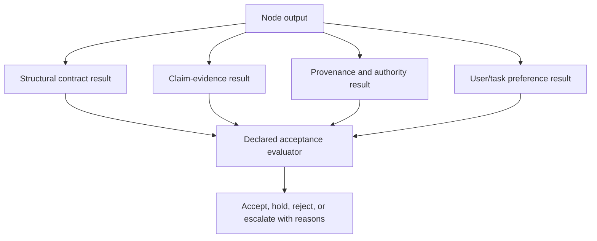
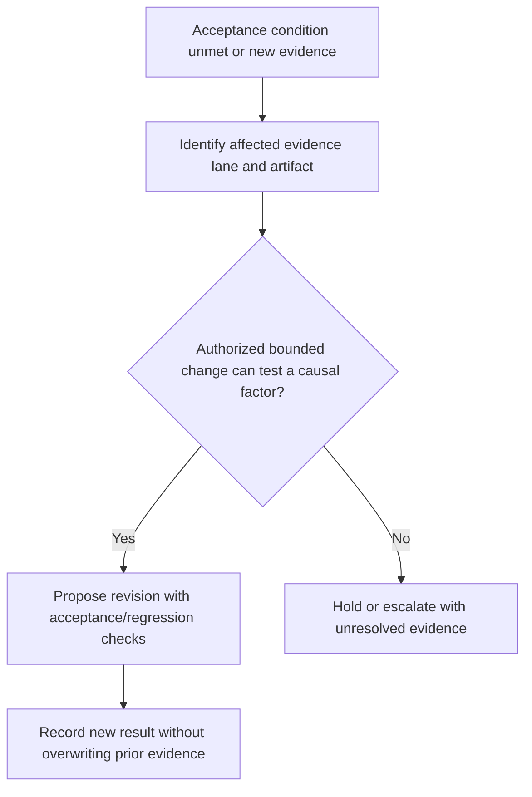

# DAG Quality

Coordinates separate quality evidence lanes between DAG nodes. Use [Multidimensional Quality and Evidence Status](references/multidimensional-quality-and-evidence-status.md): schema conformance, claim evidence, provenance, uncertainty, acceptance, and user preference are not interchangeable scores.

---

## When to Use

✅ **Use for**:
- Validating node output against declared schema
- Evaluating a defined confidence forecast with an outcome oracle and calibration evidence
- Detecting fabricated content, false citations, unverifiable claims
- Deciding whether to iterate (re-execute a node or loop)
- Generating structured improvement feedback for re-execution
- Monitoring quality trends across iterations

❌ **NOT for**:
- Executing nodes (use `dag-runtime`)
- Planning DAG structure (use `dag-planner`)
- Grading skills themselves (use `skill-grader`)

---

## Quality Pipeline



### Schema Validation

Structural check: does the output match the node's declared output contract?
- Required fields present
- Types correct (string, number, array, object)
- Constraints met (min/max length, ranges, enums)
- Nested structures valid

### Content Validation

Semantic check: is the content reasonable?
- Non-empty meaningful content (not just filler)
- Length within expected range for the task
- Internal consistency (no contradictions)
- References exist (cited files, URLs, identifiers)

### Confidence Scoring

Record confidence only as a forecast of a defined event with a resolution source and calibrated cohort. Do not combine self, peer, downstream, or human observations into a universal score; an aggregate requires a declared decision loss and validation.

### Hallucination Detection

Claim-evidence checks:
- **Citation verification**: Is the source identity, passage, date, and entailment/contradiction relation inspectable?
- **Internal consistency**: Does the output contradict itself or the input?
- **Uncertainty**: Missing or inaccessible evidence is insufficient evidence, not falsity.
- **Entity verification**: Do named entities (people, tools, APIs) actually exist?

### Iteration Decision



### Feedback Synthesis

When iterating, produce structured improvement guidance:
```json
{
  "acceptance_status": "needs_revision",
  "contract": "illustrative-five-recommendation-contract",
  "specific_issues": [
    {"field": "recommendations", "issue": "Only 2 of 5 required recommendations provided", "fix": "Add 3 more recommendations addressing scalability, testing, and deployment"},
    {"field": "citations", "issue": "Source [3] was not retrievable at review time", "fix": "Record insufficient evidence and verify source identity/claim entailment before retaining the claim"}
  ],
  "strengths_to_preserve": ["Clear structure", "Good code examples"],
  "iteration_guidance": "Focus on completeness (missing recommendations) and citation accuracy. Do not rewrite the well-structured sections."
}
```

---

## Convergence Monitoring

Track declared acceptance conditions and comparable evidence across revisions:
- **Improving**: a comparable acceptance measure improves; continue only if a bounded useful revision and remaining authority/resources justify it
- **Plateauing**: the same acceptance condition is unmet and no changed-factor experiment remains → hold or escalate
- **Degrading**: a revision fails its declared regression check → retain the prior artifact and investigate
- **Oscillating**: evaluators disagree → preserve their evidence and route by the declared conflict policy

---

## Related specialisms

This coordinating skill routes to these narrower skills; their existence is not a claim that a runtime implementation has been replaced: `dag-output-validator`, `dag-confidence-scorer`, `dag-hallucination-detector`, `dag-convergence-monitor`, `dag-iteration-detector`, `dag-feedback-synthesizer`
