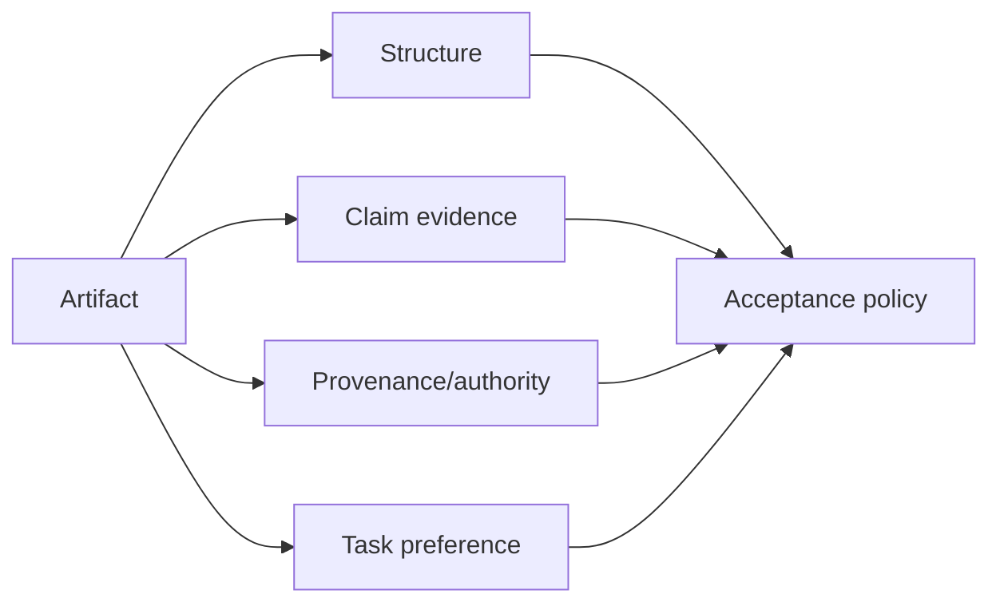
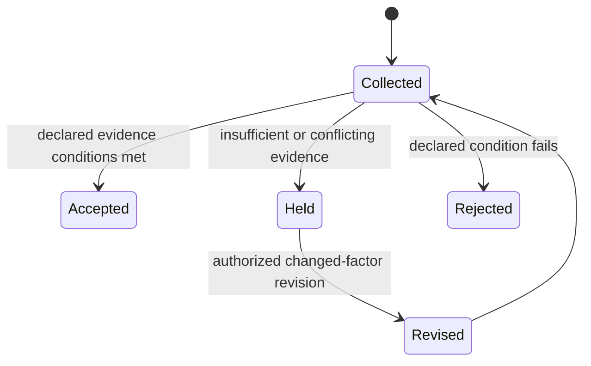

# Multidimensional Quality and Evidence Status

Sources accessed 2026-09-24. JSON Schema Core draft 2020-12 and W3C PROV-O Recommendation, 30 April 2013.

[JSON Schema 2020-12 Core](https://json-schema.org/draft/2020-12/json-schema-core)
and [W3C PROV-O](https://www.w3.org/TR/prov-o/) were inspected as official
structural-contract and provenance-vocabulary sources. **Access depth:**
specification/vocabulary only. Schema validation establishes structural
conformance; provenance assertions record claimed lineage. Neither establishes
semantic truth, authority, or a business acceptance decision.

Keep result lanes explicit: structural status, claim-evidence status
(supported/contradicted/insufficient evidence), provenance/freshness, authority,
forecast uncertainty, and user/task preference. A local acceptance policy may
combine them only after it defines the event, loss, owner, and escalation path.

