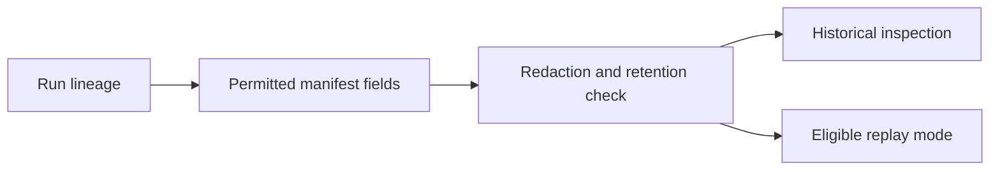
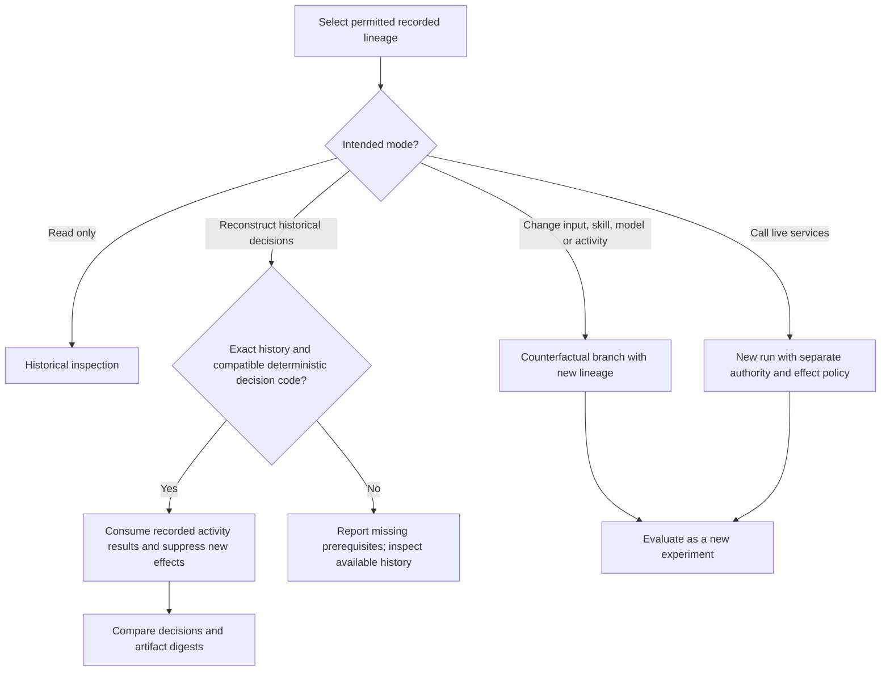
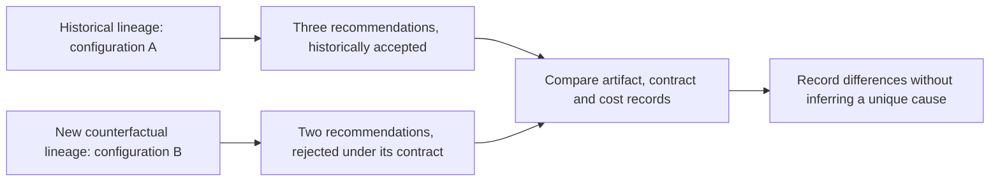
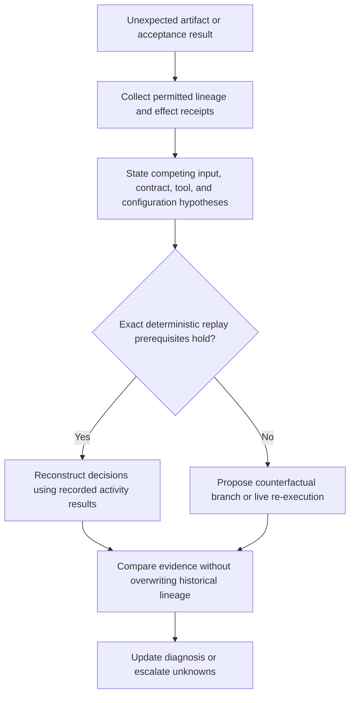

# DAG Replay Debugger

Debug recorded DAG lineage without claiming time travel or unrestricted access to private model reasoning. Use [Replay Manifest and Content-Addressed Artifacts](references/replay-manifest-and-content-addressed-artifacts.md): deterministic reconstruction, counterfactual testing, and live re-execution have different evidence and effect boundaries.

---

## When to Use

✅ **Use for**:
- Post-mortem analysis of failed or low-quality DAG executions
- Inspecting exactly what a node received and produced
- Replaying from a checkpoint with modified inputs or skills
- Comparing two execution traces to find where they diverged
- Forming and testing diagnosis hypotheses from recorded decision evidence

❌ **NOT for**:
- Live monitoring of running DAGs (use `websocket-streaming`)
- Automated failure recovery (use `dag-mutation-strategist`)
- Profiling cost/performance (use `dag-ops`)

---

## Core Capabilities

### 1. State Inspection

Inspect only retention/authority-permitted records: run and graph revision,
ordered event IDs, allowed input/output artifact digests, model/tool/config IDs,
effect receipts, redaction status, and evaluator/acceptance evidence. A missing
record remains missing; do not substitute chain-of-thought or hidden context.

### 2. Replay from Checkpoint

Choose one mode explicitly:
- **Historical inspection** reads recorded evidence only.
- **Deterministic decision replay** uses the exact history, compatible code/configuration, and recorded activity/tool results; it must suppress new effects and consume the recorded results. A substitute mock requires an explicitly justified equivalence claim; arbitrary mock responses create a different experiment.
- **Counterfactual branch** changes an input, skill, or model and gets a new lineage ID; it is not the historical replay.
- **Live re-execution** calls a live model/tool and is nondeterministic unless its backend proves otherwise; effects require separate authority.

### 3. Execution Diff

Compare two traces side-by-side:

| Field | Historical lineage | Counterfactual lineage |
| --- | --- | --- |
| Node | `analyze-codebase` | `analyze-codebase` |
| Model configuration | recorded configuration A | changed configuration B |
| Output artifact | three recorded recommendations | two recorded recommendations |
| Acceptance receipt | accepted under its historical contract | rejected under the counterfactual contract |
| Cost record | `$0.028` (illustrative) | `$0.001` (illustrative) |

This is a constructed comparison. It can show a documented output difference, but it does not establish why the difference occurred or that one routing decision is universally correct.

### 4. Decision evidence

Use visible prompts, tool calls, outputs, policy/configuration IDs, and
evaluator receipts that the retention policy permits. These records support
diagnosis hypotheses; they do not expose private reasoning or prove a unique
cause of an output.

---

## Debugging Workflow

---

## Anti-Patterns

### Debugging Without Traces
**Wrong**: Trying to figure out what went wrong without execution traces.
**Right**: Retain the minimum authorized manifest fields, redaction state, artifact digests, configuration IDs, and effect receipts. Debug from permitted evidence, not guesses.

### Replaying the Whole DAG
**Wrong**: Re-running an unbounded graph and calling the result the original replay.
**Right**: Use a checkpoint only when its lineage, inputs, compatibility, and effects are valid; otherwise make a new counterfactual/re-execution lineage.

### Claiming hidden reasoning access
**Wrong**: Treating private reasoning as required debug data or as proof of why an output occurred.
**Right**: Use retention-permitted observable evidence and label causal conclusions as hypotheses unless a controlled test supports them.
