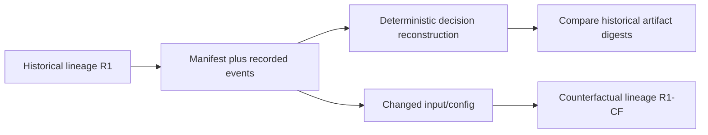
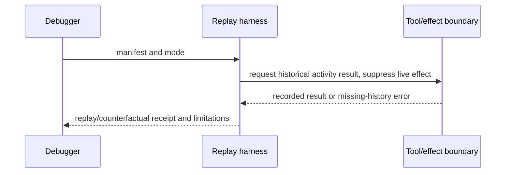

# Replay Manifest and Content-Addressed Artifacts

Sources accessed 2026-09-24. Temporal TypeScript and IPFS live documentation snapshots; these URLs do not pin installed SDK/runtime versions.

[Temporal's TypeScript workflow versioning guide](https://docs.temporal.io/develop/typescript/workflows/versioning)
and [IPFS content-addressing](https://docs.ipfs.tech/concepts/content-addressing/)
plus [Merkle DAG documentation](https://docs.ipfs.tech/concepts/merkle-dag/)
were inspected. **Access depth:** official implementation/concept documentation.
Temporal explains compatibility of deterministic workflow histories across code
changes; IPFS explains content identifiers and linked content blocks. Neither
source proves that an arbitrary model/tool run is deterministic, complete,
truthful, available, or secret.

For deterministic decision replay, freeze run ID, graph revision, compatible
code/config IDs, ordered event history, recorded activity/tool outputs, and
artifact digests. Historical decision replay suppresses new effects and consumes recorded activity results. A substitute mock needs a separate equivalence justification. Changing an input, model,
skill, tool, or live response creates a counterfactual/new execution lineage.

