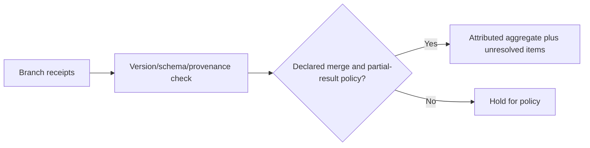
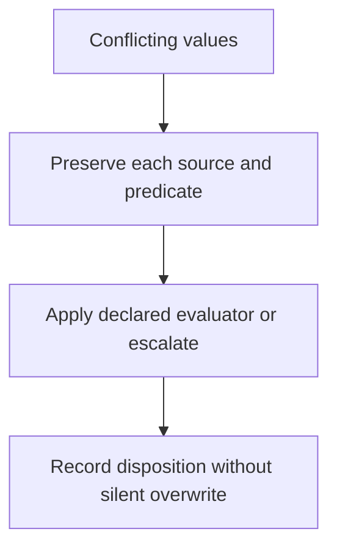

# Attributed aggregation

[W3C PROV-O Recommendation (30 April 2013)](https://www.w3.org/TR/prov-o/) was inspected as official provenance vocabulary. **Accessed:** 2026-09-24. **Access depth:** vocabulary only. Preserve source identity, scope, timestamp, missingness, conflict, and merge rule; a merge does not make competing claims compatible.

