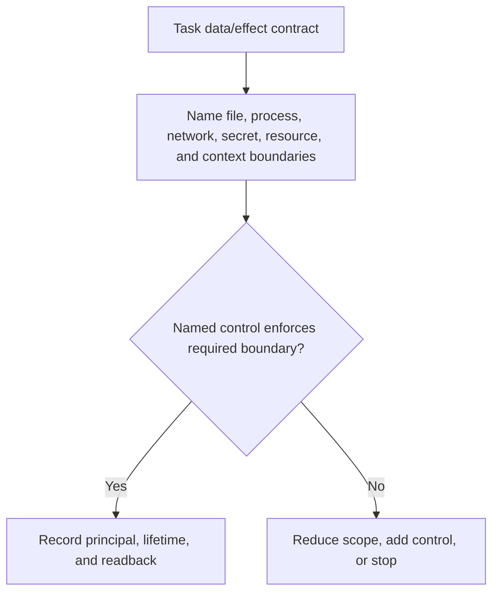
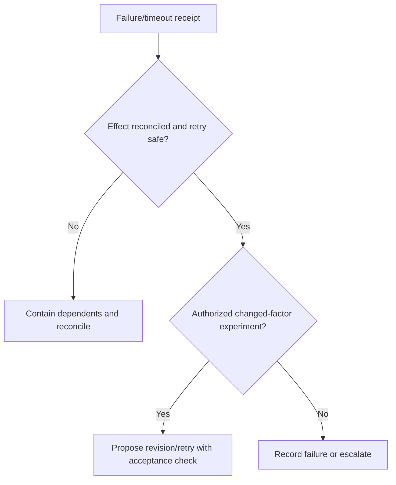
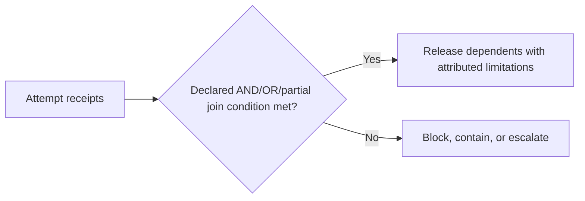
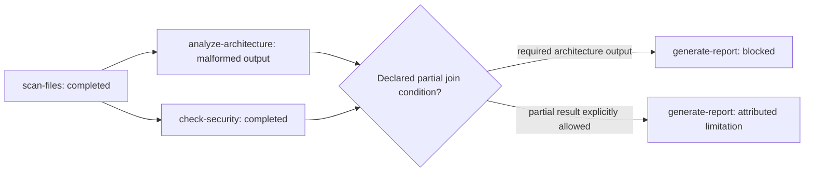

# DAG Runtime

Specifies bounded DAG execution contracts and evaluates executor receipts. A plan does not establish that dispatch, isolation, cancellation, join, or external effects occurred.

Use [Runtime lifecycle limits](references/runtime-lifecycle-limits.md). Planned topology does not establish dispatch, cancellation, join, or effect behavior.

## Decision Points

### Boundary selection


### Failure disposition


### Join and release


## Failure Modes

### **Permission Creep**
- **Symptoms**: Child nodes have more permissions than parent
- **Detection**: Compare delegated grants by principal, operation, canonical resource, conditions, expiry and policy version. Tool-name subsets alone do not establish attenuation. 
- **Fix**: Have the named policy evaluator derive an attenuated grant; deny or hold unresolved comparisons before dispatch.

### **Context Pollution**
- **Symptoms**: Node sees conversation history from unrelated nodes
- **Detection**: Compare supplied context identities and disclosure scopes with declared input grants; a permitted dependency reference is not leakage.
- **Fix**: Enforce context isolation, only pass declared inputs

### **Zombie Wave**
- **Symptoms**: Wave never completes, some nodes stuck in "running" state
- **Detection**: The named executor has no terminal/cancellation receipt by its declared deadline or heartbeat policy.
- **Fix**: Contain dependents and use the executor's authorized cancellation/reconciliation path; do not assert a kill occurred without its receipt.

### **Resource Exhaustion**
- **Symptoms**: New agents fail to spawn, memory/CPU limits hit
- **Detection**: Agent spawn returns resource error
- **Fix**: Reconcile resource receipts, bound admission and queue eligible nodes; changing isolation alone does not create capacity.

### **Cost Spiral**
- **Symptoms**: Nodes repeatedly retry expensive operations
- **Detection**: Compare attributed usage with the node and run budgets under their declared units and accounting source.
- **Fix**: Follow the declared hold/escalation policy; budget data does not itself grant continuation authority.

## Worked Examples

### Multi-Wave DAG with Failure Recovery

**Scenario**: 3-wave codebase analysis DAG where Wave 2 node fails



**Decision Navigation**:
1. **Failure occurs**: `analyze-architecture` returns malformed JSON
2. **Reconciliation check**: Determine whether an effect was attempted, its idempotency/effect key, and the executor receipt.
3. **Retry guard**: Retry only if the policy authorizes a changed-factor attempt, the effect state is reconciled, and its acceptance check is recorded; otherwise contain and escalate.
4. **Wave completion check**: One node failed, one succeeded
   - `check-security` succeeded, output available
   - `analyze-architecture` has an unavailable/unknown attempt result; do not encode that as JSON `null`.
5. **Dependency check**: `generate-report` requires both outputs
   - **Decision**: Can proceed with partial data? Check node config
   - If `required: false` → advance with warning
   - If `required: true` → halt execution

**Expert catches**: Checking dependency requirements before advancing wave
**Novice misses**: Would either block forever or advance with missing critical data

### Isolation Trade-offs

**Scenario**: Code execution node needs filesystem access but has security concerns

```yaml
node: code-formatter
skills: [python-formatter]
inputs: {source_files: [...]}
permissions: {tools: [Read, Write, Bash], paths: ["/workspace/src"]}
```

**Decision Navigation**:
1. **Threat assessment**: Bash tool + external code = high risk
2. **Isolation decision**: select a named control only after its boundary, principal, mount, and readback are evaluated. A container alone does not determine host-write authority.
3. **Trade-off resolution**:
   - Constructed local configuration: a writable mount maps `/workspace/src` to `/container/workspace`; the mount grant, not the container label, authorizes that path.
   - Use a named enforceable command/process policy; the phrase "safe commands" does not constrain subprocesses, filesystem access, or network effects.
   - Constructed local limits are selected from the task workload and threat model, then recorded with the executor receipt.

**Expert catches**: Need to balance security with functionality
**Novice misses**: Would either over-isolate (breaking functionality) or under-isolate (security risk)

## Quality Gates

- [ ] Each node starts only after its required dependency and authority conditions are satisfied.
- [ ] Each node has valid isolation level for its threat profile
- [ ] Delegation attenuation is evaluated over complete grants; unresolved resource/condition comparisons block dispatch.
- [ ] All required trace fields populated (node_id, model, tokens, cost, duration)
- [ ] Deadlines, cancellation semantics, and readback source are declared; no default timeout is assumed.
- [ ] Cost budgets defined and monitored per node
- [ ] Retry is conditioned on idempotency/effect state, changed-factor rationale, budget, and acceptance check.
- [ ] Context isolation prevents cross-node conversation leakage
- [ ] Failed, unavailable, absent, and unknown output states remain distinguishable.
- [ ] Resume eligibility preserves input/version identity, attempt receipts, and validated artifact state.

## Evidence and Book candidate

The reference inspected Kotlin coroutine lifecycle documentation, not an agent-runtime implementation. **Book candidate, not Book prose:** planned topology, dispatch receipt, and external-effect reconciliation are distinct claims. Compare with the Book-review files before asserting novelty or placement.

## NOT-FOR Boundaries

**Don't use dag-runtime for**:
- **DAG structure planning** → Use `dag-planner` instead
- **Output quality validation** → Use `dag-quality` instead  
- **Skill-to-task matching** → Use `dag-skills-matcher` instead
- **Real-time interactive workflows** → Use direct agent calls
- **Single-step tasks** → Use individual skills directly

**Delegate to other skills when**:
- Output doesn't meet quality standards → `dag-quality`
- Need to modify DAG structure mid-execution → `dag-planner`
- Agent needs different skill for retry → `dag-skills-matcher`
