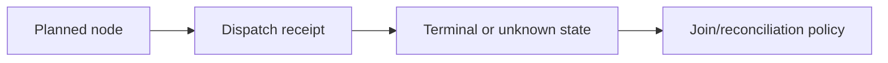
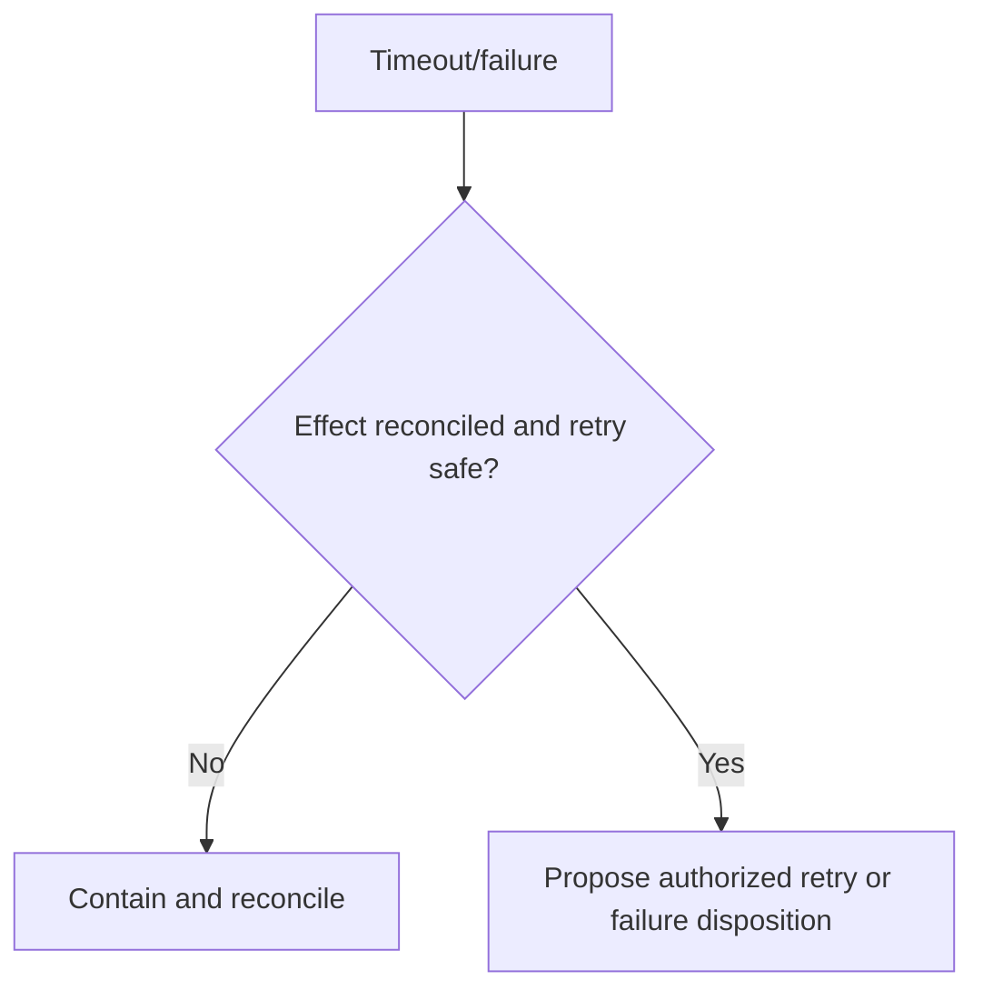

# Runtime lifecycle limits

[Kotlin coroutines basics documentation](https://kotlinlang.org/docs/coroutines-basics.html) was inspected as structured-concurrency documentation. **Accessed:** 2026-09-24; the page is unversioned. **Access depth:** lifecycle documentation, not a Task-agent runtime test. Dispatch, cancellation, join, and external-effect state require executor receipts.

