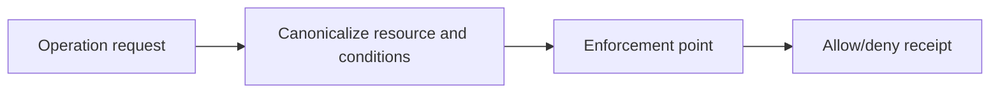
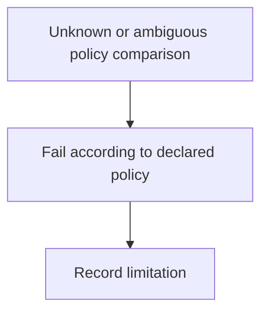

# Enforcement and readback boundary

[Linux kernel Landlock userspace API documentation](https://docs.kernel.org/userspace-api/landlock.html) was inspected at ABI/rules/enforcement sections. **Accessed:** 2026-09-24; living documentation, no fixed edition claimed. **Access depth:** documentation only, no local sandbox test. Canonical resource identity and an enforcement-point readback are distinct from a raw path/glob comparison.

