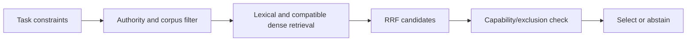
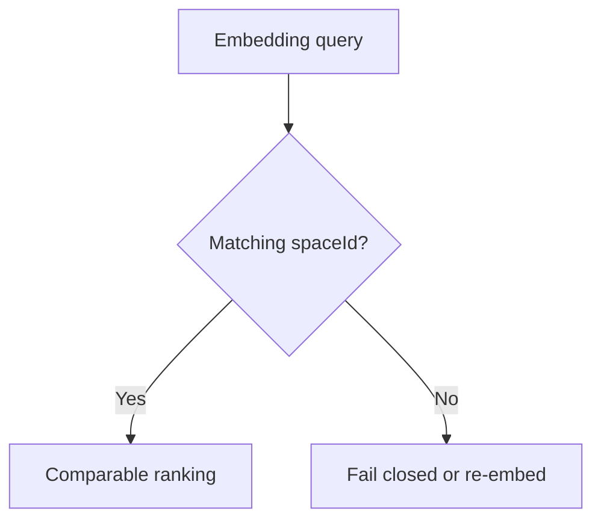

# Authority-filtered hybrid matching

[Cormack, Clarke and Büttcher, SIGIR 2009, author PDF](https://cormack.uwaterloo.ca/cormacksigir09-rrf.pdf) was opened on 2026-09-24; access depth: two-page paper, especially §1. RRF scores an item by `sum_r 1 / (k + rank_r(item))`. The paper selected `k=60` in a pilot and fixed it for validation; that value is not a universal optimum. Its retrieval experiments do not establish skill-selection accuracy or authorization. The earlier Google publication entry was bibliographic-only and is not the formula source.

For a bounded application, record rank origin, candidate limit, tie/missing-item treatment, fusion configuration, and held-out selection evaluation. Dense query/corpus vector identity is separate from lexical retrieval configuration. Hard authority and disclosure filters remain prerequisites to both retrievers.

