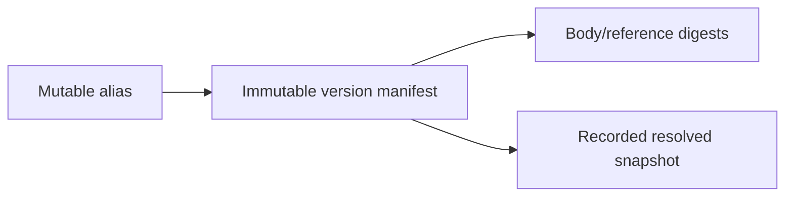
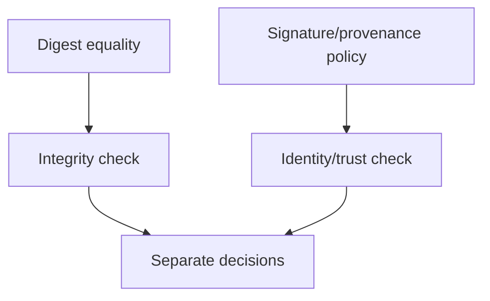

# Content-addressed registry

[IPFS content addressing](https://docs.ipfs.tech/concepts/content-addressing/) and [Merkle DAG documentation](https://docs.ipfs.tech/concepts/merkle-dag/) were inspected. **Accessed:** 2026-09-24; living concept documentation, no fixed edition claimed. **Access depth:** official concept documentation. A digest detects changes to chosen bytes; it does not prove author identity, trust, quality, licensing, or safe execution.

