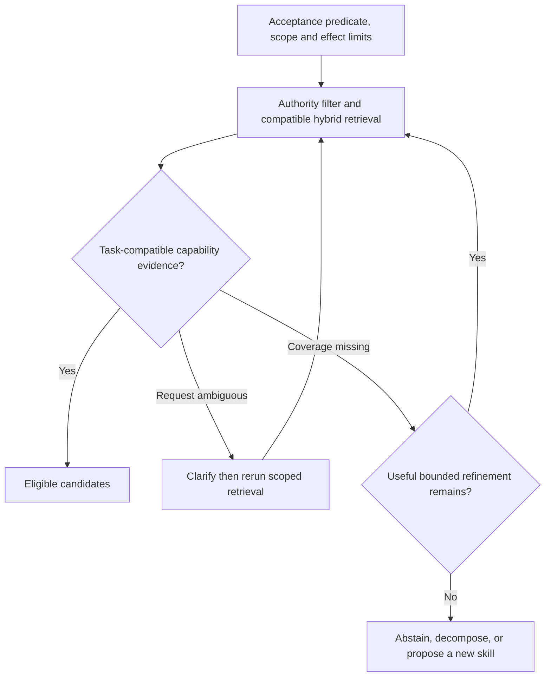
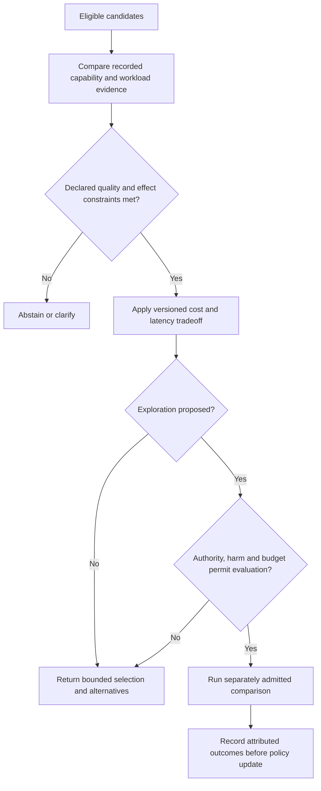

# DAG Skills Matcher

Use [Constraint-first skill matching](references/constraint-first-skill-matching.md). Ranking is candidate retrieval, not authorization or a capability guarantee.

Matches tasks to skills, ranks candidates, and maintains the skill catalog.

## Decision procedure

Bind the node to an acceptance predicate, required and prohibited capabilities, schemas, repository/corpus boundary, effect class, budget, and catalog snapshot. Exclude candidates that violate a hard constraint before retrieval or cost comparison. Rank the eligible remainder with recorded lexical/dense evidence and compatible profile identity. Return coverage, missing requirements, rejected candidates, and either a bounded selection, clarification, decomposition, new-skill proposal, or abstention. Ranking weights, exploration mechanisms, score cutoffs, and cost tradeoffs are versioned local policy unless an evaluation names workload, labels, date, and uncertainty. Selection is never authorization to execute.

### Search, retry and coverage routes

This replaces the term-count and fit-threshold trees. A small task still requires the declared retrieval and authority contract.

### Ranking and cost routes

Candidate count never authorizes exploration or supplies universal score weights. Outcome comparisons need a shared workload and measurement units.

## Failure Modes

### Schema Drift
**Symptoms**: Repeated abstention or capability gaps on a declared task cohort.
**Detection**: A versioned evaluation shows repeated abstention for a defined task slice.
**Fix**: Inspect catalog coverage and constraints before proposing a new skill.

### Thompson Exploitation Lock-in
**Symptoms**: Same 2-3 skills always selected, no skill performance comparison data
**Detection**: Attributed outcomes show narrow selection on a known workload.
**Fix**: Evaluate a local exploration policy under authority/harm limits; no fixed sampler adjustment is implied.

### NOT-Clause Bypass
**Symptoms**: Skills assigned to incompatible tasks, high downstream failure rates
**Detection**: A validator records constraint-breaching assignments.
**Fix**: Strengthen hard checks before hybrid retrieval; do not replace them with lexical rules.

### Semantic Similarity False Positives
**Symptoms**: Skills matched on superficial word similarity, not actual capability
**Detection**: High-ranked candidates fail the stated acceptance contract in a held-out cohort; report denominators, versions and uncertainty.
**Fix**: Keep authority filtering and compatible lexical+dense retrieval; investigate the profile and corpus rather than silently privileging keywords.

### Cost Optimization Trap
**Symptoms**: Always selecting cheapest skills, degrading output quality
**Detection**: A comparable workload shows a cost/quality trade-off outside the declared acceptance policy.
**Fix**: Enforce required capabilities and acceptance constraints before cost ranking; evaluate any numeric selection rule on a named cohort.

## Worked Examples

### Example 1: Python ML Classification Task
**Task**: "Build a scikit-learn classifier for customer churn prediction with hyperparameter tuning"

**Process**:
1. Define the classification, scikit-learn and tuning requirements, acceptance checks, and permitted repository/effect scope.
2. Filter authority and disclosure boundaries before either retriever; reject incompatible capabilities and NOT-FOR conditions before selection ranking.
3. Constructed eligible candidates: `sklearn-tuner` (fit=0.85, elo=1750), `automl-skill` (fit=0.72, elo=1820), `python-ml-basic` (fit=0.65, elo=1680). These labels and numbers illustrate a record; they are not benchmark results or a portable scoring formula.
4. Check documented task-compatible evidence under the versioned policy. A general ML description does not prove tuning capability.
5. **Decision**: select `sklearn-tuner` only if that evidence satisfies the contract; otherwise clarify, decompose, or abstain. Selection grants no execution authority.

**Novice miss**: Would pick automl-skill due to higher Elo, missing that sklearn-tuner is more specifically matched
**Expert catch**: Requires documented tuning capability and task-compatible evidence; a keyword or Elo from another cohort does not prove fit.

### Example 2: Ambiguous Code Review Request
**Task**: "Review this code for issues"

**Process**:
1. Extract intent: code review (but no language specified)
2. Language, change scope and acceptance requirements are unresolved; raw fit scores cannot fill those gaps.
3. Ask which language, scope, and acceptance predicate are required.
4. Offer `code-review-general` only as a constrained fallback when it satisfies the clarified effect boundary.
5. Abstain or decompose if clarification leaves a capability gap; propose a new skill only after coverage evidence.

**Expert insight**: Clarify the missing requirement before inferring a gap in the skill catalog.

## Quality Gates

- [ ] Hard authority, disclosure, required capability and NOT-FOR checks precede ranking.
- [ ] Query and stored dense vectors have the exact compatible `spaceId`; lexical and dense ranks are fused under a recorded policy.
- [ ] Lexical-only degradation requires explicit corpus permission and is labeled; a semantic requirement never silently downgrades.
- [ ] Catalog snapshot, profile, selected policy, candidate evidence and rejected alternatives are recorded.
- [ ] Unresolved constraints lead to clarification or abstention; an empty result is valid evidence of insufficient coverage.
- [ ] Any exploration or numeric rule is evaluated on a named workload and permitted by the task's effect and budget authority.
- [ ] Cost, latency and outcome claims include measurement units, denominators, environment and uncertainty.
- [ ] Selection explains what evidence supports the candidate and confers no execution authority.

## NOT-FOR Boundaries

**This skill should NOT be used for**:
- Creating new skills → use `skill-architect` instead
- Grading skill quality or performance → use `skill-grader` instead
- Actually executing the matched skill → use `dag-runtime` instead
- Modifying skill parameters or configs → use `skill-configurator` instead
- Handling skill versioning or deployment → use `skill-lifecycle-manager` instead

**Domain boundaries**:
- For skill marketplace operations → use `skill-marketplace` instead
- For skill analytics and reporting → use `skill-analytics` instead
- For cross-agent skill sharing → use `skill-federation` instead
