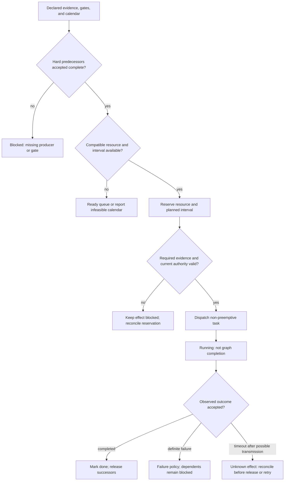
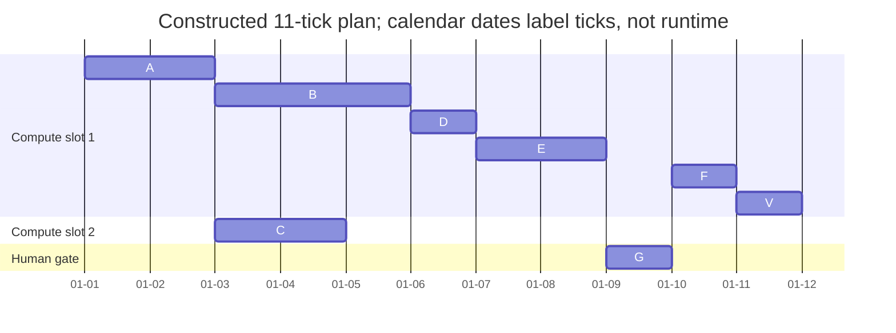

# DAG Task Scheduler

Use to construct a feasible plan from declared work. State the objective, task IDs, hard edges, durations, resource classes/capacities, calendars, gates, and selection policy. It does not execute tasks, infer completion, grant authority, or claim an optimal schedule.

A forecast simulates predecessor finishes using stated durations and gate assumptions. It may schedule a future conditional start; it does not assert that the corresponding evidence already exists. At execution admission, replace those assumptions with accepted observed evidence and current resource/authority checks.

## Scheduling procedure

1. Account for every required task, hard predecessor, duration, gate, resource class, capacity, and calendar interval. A task is **ready** only after its hard predecessors have accepted completion evidence; dispatch is not completion. In a `graphlib.TopologicalSorter`-style model, call `done()` only after accepted completion, not when work starts.
2. Form the ready frontier. A work-conserving ready queue can start a compatible ready task while unrelated work continues. A fixed-level barrier waits for its batch and should be used only when that synchronization is actually required.
3. Admit a ready task only when its resource reservation and calendar interval fit. Once started, treat it as non-preemptive unless that task has a separately declared safe pause/resume contract.
4. Record planned start/end, assigned resource, inputs, and gate evidence. On observed accepted completion, release its successors. On definite failure, block dependents unless their contracts permit absence or an independently validated replacement exists. On timeout after possible transmission, mark the effect unknown and reconcile before release, retry, or replan.
5. Recompute only from observed state and stated policy. A changed graph, contract, or capacity assumption belongs to a versioned replanning proposal; a schedule update cannot repair invalid data or manufacture authorization.

## Four decision procedures

### 1. Resource contention resolution

Declare each request’s resource class, units, capacity, compatibility, duration, and calendar. Reserve feasible work; defer it when capacity/calendar cannot admit it. Priority may choose among ready compatible work, but cannot override a predecessor, approval, authority, hard budget, or calendar blackout. Do not preempt a running task merely because it is off the critical path; preemption requires a task-specific safe resume contract.

### 2. Wave overflow handling

When more tasks are ready than capacity allows, retain every required task in the queue and select according to a declared policy, such as deadline order, a critical-chain concern, fairness, or resource fit. “Wave” is a presentation choice, not evidence that all ready work must wait. Split into batches only because capacity or a required barrier demands it; never discard work solely because the frontier is large.

### 3. Priority conflicts

Compare deadlines, declared objective, resource fit, and the predecessor chain. A high-priority task blocked by a lower-priority predecessor is priority inversion evidence, not authorization to violate the edge. Document the policy used to select ready tasks and its starvation/fairness consequence. Width bounds the size of a concurrently eligible task set under the precedence model; it does not report the current ready frontier, and it does not prove makespan optimality when durations, resources, or gates differ.

### 4. Runtime adaptation triggers

Early accepted completion may expose eligible successors immediately. Late completion changes a forecast but does not prove a graph defect. Definite failure blocks required consumers until an allowed absence or validated replacement is established. A timeout after possible transmission is unknown: keep consumers blocked and reconcile provider/readback evidence before retrying. Replan only when graph, contract, resources, or policy must change.

## Five diagnostic procedures

**Wave overflow.** Compare every ready request with declared capacity and resource compatibility. Queue the overflow, identify the policy selection, and report infeasibility if required work cannot fit the available calendar; no fixed multiplier proves failure.

**Resource starvation.** Inspect the ready frontier, availability windows, and resource fit before calling an idle slot waste. An idle CPU can be correct while the only ready work needs a human gate or a different resource class.

**Priority inversion.** Trace the blocking predecessor chain and its resource reservation. Adjust the ready-queue policy, reservation, or deadline expectation only without breaking hard edges or gates.

**Deadline miss.** Recalculate from all declared durations, predecessor chains, capacity, calendars, and gates. A critical chain can explain a miss, but it does not authorize preemption, added capacity, or skipped work unless their contracts permit them.

**Thrashing schedule.** Record each change, its observed trigger, and the policy revision. Repeated replanning in a chosen observation window can show instability; it does not have a universal numeric threshold. Freeze stable assignments only when the trade-off between responsiveness and disruption is declared.

## Worked scheduling fixtures

### Example 1: complete eight-task release plan

This constructed fixture has two identical non-preemptive compute slots and a separate one-tick human gate. One tick is one calendar day in the Gantt; it is not observed runtime.

| ID | Output/task | Duration | Hard predecessors | Resource class | Planned interval |
| --- | --- | ---: | --- | --- | --- |
| A | source bundle with provenance | 2 ticks | — | compute | [0,2) |
| B | analysis | 3 ticks | A | compute | [2,5) |
| C | policy review artifact | 2 ticks | A | compute | [2,4) |
| D | release draft | 1 tick | B, C | compute | [5,6) |
| E | security receipt bound to D digest | 2 ticks | D | compute | [6,8) |
| G | approval bound to C and E | 1 tick | C, E | human gate | [8,9) |
| F | publish exactly approved D digest | 1 tick | G | compute plus authority | [9,10) |
| V | readback verification | 1 tick | F | compute | [10,11) |

Edges are `A→B`, `A→C`, `B→D`, `C→D`, `D→E`, `C→G`, `E→G`, `G→F`, and `F→V`. The compute schedule is A on slot 1; B on slot 1 and C on slot 2; D, E, F, V on slot 1. G consumes the human-gate interval, not a compute slot. The chain `A-B-D-E-G-F-V` totals 11 ticks, so the displayed 11-tick plan is feasible and has that fixture’s critical chain. The 11-tick result is conditional on the human actually approving in that assumed interval and current action authority remaining valid. Otherwise F stays blocked. It does not prove a general optimum; elapsed time is not approval.

### Example 2: ready queue versus fixed-level barrier

After predecessor A completes at tick 0, independent B has duration 3 and C has duration 1; D has sole predecessor C and duration 1. Two compatible compute slots exist. A ready queue starts B and C at tick 0, then starts D at tick 1 while B continues through tick 3; all work completes at tick 3. A fixed-level barrier that insists on waiting for the B/C batch starts D at tick 3 and finishes at tick 4. This proves the one-tick barrier cost for this uneven-duration fixture, not a general scheduling advantage. The D output is available at tick 2 only under the ready queue.

### Example 3: calendar reservation and unknown effect policy

`review@r1` is ready at day 4, needs one human reviewer, and requires a one-day interval. The reviewer calendar is unavailable on days 4–5 and available on day 6, so the earliest feasible reservation is [6,7), even if a compute slot is idle. `publish@p1` requires accepted `r1`, approval evidence, action authority, and a provider request. If the provider request times out after possible transmission, mark `p1` outcome unknown; do not mark it done or release the ordinary success-dependent `verify@v1`. A separately authorized reconciliation/readback check may still run to resolve the unknown outcome. Reconcile provider/readback evidence: observed success records a receipt, documented definite absence plus a safe retry contract permits the same operation identity to retry, and ambiguity holds the verification consumer pending authorized resolution.

Full tables, arithmetic, and hand checks appear in [worked scheduling fixtures](references/worked-scheduling-fixtures.md).

## Quality gates and boundaries

Before publishing a schedule, verify complete task/edge/duration accounting; hard predecessor and gate evidence; declared objective/policy; resource capacities, compatibility, and calendars; valid non-preemptive assumption; planned versus observed-state labeling; critical-chain calculation; deadline feasibility; outcome branches; and reschedule history. Report any infeasible capacity or deadline rather than filtering tasks or claiming optimality.

Do not use this skill to build or alter the DAG, execute work, monitor runtime, process results, diagnose root cause, or autonomously retry/compensate effects. Scheduler output is a plan. Runtime/replanning surfaces may provide observed evidence or perform separately authorized actions.

See [scheduling methods and source scope](references/scheduling-methods-and-sources.md) and the existing [source ledger](references/sources.md).
