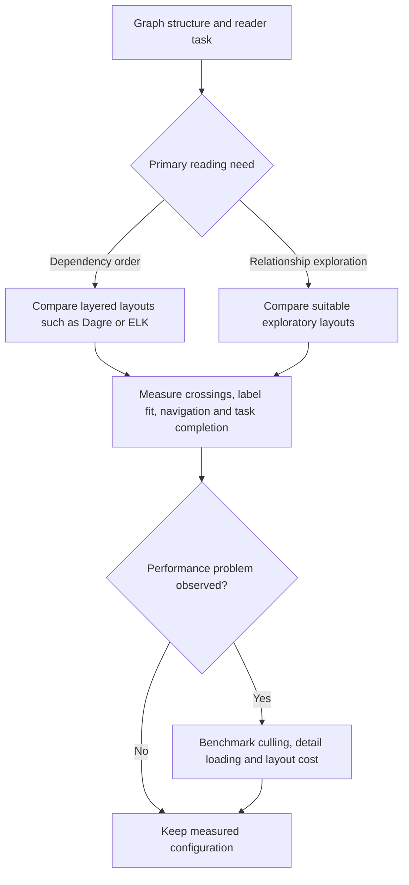
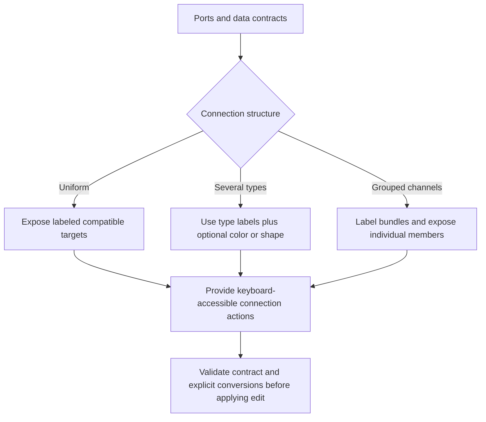
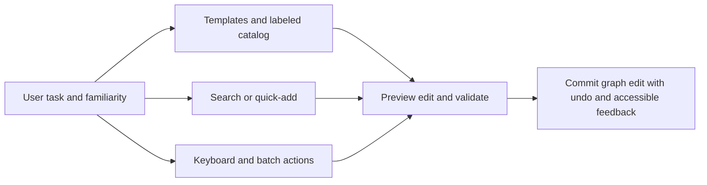

# DAG Visual Editor Design

Design modern, intuitive DAG and workflow visual editors following the LEGO philosophy: snap blocks together simply rather than wire complex ports.

Use [Accessible graph-editor evidence](references/accessible-graph-editor-evidence.md). Fixed layout and interaction thresholds are hypotheses until evaluated with declared users and accessibility requirements.

## Design procedure

Use the graph's directionality, density, port contracts, and expected editing tasks to make several layout candidates, then evaluate them with representative users and accessibility technologies. Force-directed, layered, and orthogonal routing have different tradeoffs; no node-count threshold selects a universally correct engine. Record the graph corpus, viewport, layout configuration, success task, and failure observations with any choice.

Expose connection compatibility through a programmatic name, visible label, focusable interaction, and reversible preview. Color may reinforce a state but cannot be its only encoding. Offer canvas, command, and keyboard paths according to task evidence rather than assumed user level, and make all paths converge on the same inspectable graph delta and undo/redo history. The linked reference diagrams show data-to-evaluation and edit-to-preview/undo relations.

### Layout route

The original numeric tree is replaced by task and evidence gates. React Flow supplies a rendering surface; the chosen layout algorithm and parameters must be explicit.



### Connection route

No branch relies solely on color or hover. A uniform data format does not remove the need to expose compatible operations.



### Interaction route

These are complementary entry points, not exclusive access levels. Keyboard operation, error recovery and text alternatives remain available to every user.



## FAILURE MODES

### Spaghetti Graph Syndrome
**Symptoms:** Edges crossing everywhere, impossible to follow data flow, users getting lost
**Detection:** Observe representative path-tracing tasks and report graph shape, viewport, participant needs, and error evidence; fixed crossing or time figures are local acceptance targets only.
**Fix:** 
- Compare layered candidates such as Dagre/ELK with alternatives on the actual graph corpus; preserve semantically meaningful positions.
- Add intermediate junction nodes to break long connections
- Implement edge bundling for parallel data flows

### Zoom Desert Problem
**Symptoms:** Pan/zoom feels broken, users can't find their content, minimap unhelpful
**Detection:** Observe recovery/navigation tasks against a declared user group and graph corpus.
**Fix:**
- Implement fit-to-view on double-click background
- Add breadcrumb navigation for nested groups
- Select zoom bounds and label behavior from observed task needs and accessible representation.

### Handle Ambiguity Confusion
**Symptoms:** Users connecting wrong ports, type errors, unexpected data flow
**Detection:** Observe failed connections and undo behavior with declared tasks.
**Fix:**
- Show named compatibility and reasons on pointer hover and keyboard focus; color may reinforce the text/icon but cannot be its only encoding.
- Add connection preview with data type labels
- Evaluate optional snapping against pointer, keyboard, and touch interaction evidence.

### Performance Cliff Rendering
**Symptoms:** The rendered graph fails a declared interaction-performance target.
**Detection:** Measure frame and render behavior on a stated graph corpus and device class.
**Fix:**
- Measure React Flow `onlyRenderVisibleElements` against a baseline: official documentation notes that culling can help large graphs but itself adds overhead.
- Virtualize node lists in sidebar
- Tune recomputation scheduling from the measured workload rather than a fixed delay.
- Cache node measurements between renders

### No-Feedback Execution Black Box
**Symptoms:** Users don't know if workflow is running, what failed, or why it stopped
**Detection:** Users asking "is it working?" or clicking run button multiple times
**Fix:**
- Offer optional execution animation with reduced-motion support; derive state from named executor receipts.
- Add textual node states for planned, queued, observed running, terminal and unknown outcomes.
- Show execution time and data throughput
- Highlight current execution path

## WORKED EXAMPLES

### Example: Data Processing Pipeline Editor

**Scenario:** Design editor for CSV → Transform → Database pipeline

**Step 1: Choose Layout**
- Constructed five-node linear example: evaluate a layered left-to-right candidate alongside alternatives; record selected spacing from the test viewport.

**Step 2: Design Node Structure**
```tsx
const TransformNode = ({ data }) => (
  <div className="w-64 border-2 border-gray-200 rounded-lg bg-white">
    <div className="bg-blue-50 px-3 py-2 border-b">
      <h3>🔄 Transform Data</h3>
    </div>
    <div className="p-3">
      <div className="text-sm">Filter: {data.filter}</div>
      <div className="text-sm">Sort: {data.sort}</div>
    </div>
    <Handle type="target" position={Position.Left} />
    <Handle type="source" position={Position.Right} />
  </div>
);
```

**Step 3: Connection Logic**
- Single data type (tabular) → One handle per side
- Show a bounded, disclosure-permitted row preview on hover and keyboard focus; three rows is a constructed display choice.
- Offer optional reduced-motion-compatible flow feedback from executor receipts, retaining textual state.

**Novice Miss:** Would add separate handles for each column
**Expert Catch:** Keeps single connection, shows column mapping in node detail

## QUALITY GATES

- [ ] The selected layout has recorded graph corpus, task, viewport, and tradeoffs.
- [ ] Keyboard, pointer, zoom, screen-reader representation, and focus order are tested against declared requirements.
- [ ] Connection preview exposes contract and cycle-policy result before commit.
- [ ] Execution feedback: Status visible during all async operations
- [ ] Touch target policy names WCAG level: 24 CSS px is SC 2.5.8 AA; 44 CSS px is the stricter SC 2.5.5 AAA target when deliberately adopted.
- [ ] Graph edits support tested undo/redo. Undoing a graph edit does not undo external effects; effect reversal requires its own authority and evidence.
- [ ] Measured responsiveness or serialization claims include hardware, graph corpus, configuration, and measurement method.
- [ ] Error clarity: Failed connections show specific reason (type mismatch, circular reference)

## Evidence and Book candidate

[W3C WCAG 2.2](https://www.w3.org/TR/WCAG22/) is cited in the reference as the accessibility recommendation; the recommendation text was read on 2026-09-24, but the editor has not undergone a compliance test. **Book candidate, not Book prose:** graph editing can make authority, preview, and undo visible before an effect. Compare first with the Book-review files; novelty and placement are unverified.

## NOT-FOR Boundaries

**Don't use DAG editors for:**
- **Text-heavy content** → Use document editors instead
- **Real-time collaboration** → Use [collaborative-editing] skill for conflict resolution
- **Complex mathematical expressions** → Use formula builders instead
- **Timeline-based workflows** → Use [gantt-chart-design] for scheduling
- **State machines with loops** → Use dedicated state diagram tools

**Delegate to other skills:**
- **Performance optimization** → Use [react-performance-optimization] when measured graph workloads need it
- **Accessibility compliance** → Use [web-accessibility] for screen reader support
- **Animation design** → Use [micro-interactions] for execution visualizations
