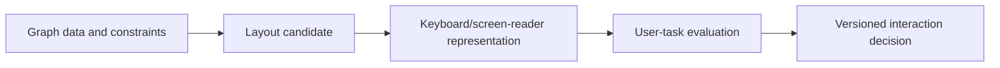
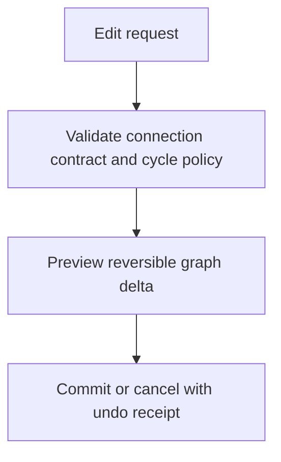

# Accessible graph-editor evidence

[W3C WCAG 2.2 Recommendation (12 December 2024)](https://www.w3.org/TR/WCAG22/) was inspected. **Accessed:** 2026-09-24. **Access depth:** recommendation text, not a local compliance test. SC 2.5.8 specifies a 24 by 24 CSS-pixel target size at AA; 44 by 44 is SC 2.5.5 AAA, each with exceptions. Treat layout choice, zoom, keyboard access, focus order, and screen-reader alternatives as user-tested requirements rather than fixed node-count thresholds.

[React Flow component API](https://reactflow.dev/api-reference/react-flow#onlyrendervisibleelements), live documentation accessed 2026-09-24, documents `onlyRenderVisibleElements` as an optional optimization that can improve large-graph performance while adding overhead. Measure its effect on the target graph and device; this source does not justify enabling it universally.

