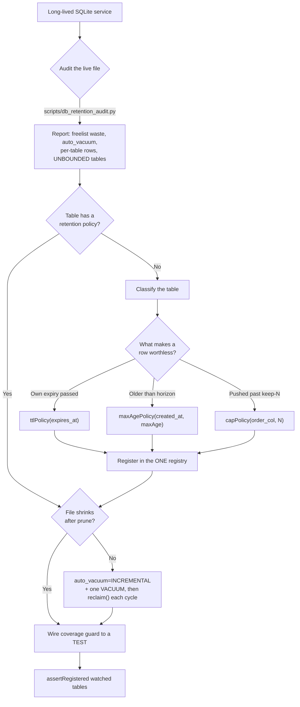

# DB Retention & Compaction

Keep an embedded SQLite datastore in a long-lived service from growing forever — by declaring **one
retention policy per table in a single registry**, guarding coverage so a new unbounded table trips a
**test not prod**, and compacting the file so pruning actually returns bytes to the OS.

## When to Use

✅ **Use for**:
- A SQLite DB file that grows without bound (the "231 MB DB that never shrank" shape)
- A table with a reaper **index** but **no `DELETE`** ever written (`harbor_issued_tokens`: 101K rows)
- A pruned DB whose **file never shrinks** on disk (missing `auto_vacuum`/`VACUUM`)
- Metrics kept as **raw events forever** instead of pre-aggregated buckets
- Adding a **new table** and wanting it bounded from day one (TTL, absolute-age, or row-count cap)
- **Opt-in permanence** (NULL expiry) that still needs an absolute ceiling
- WAL/checkpoint tuning; **multi-tenant** per-tenant quotas and ceilings

❌ **NOT for**:
- Postgres/MySQL/server-DB retention, partitioning, or `pg_cron` TTL (different mechanisms)
- Log-line volume control — rate-limiting, sampling, governed logging (that's a logging concern)
- Backup, replication, or point-in-time recovery
- Schema migrations, or indexing for **query** performance (this is indexing for *deletion*)

---

## Core Process



### Step 1: Audit the live file (measure before you cut)

Run the bundled read-only auditor against the actual DB — it opens `immutable=1`, so it is safe on a
live service file:

```bash
python3 scripts/db_retention_audit.py /path/to/app.db \
  --registered $(comma-separated tables your registry covers) --reclaim-warn-mb 20
```

It reports file-vs-logical size, **freelist waste in bytes** (space trapped by past deletes),
`auto_vacuum` mode, per-table row counts/footprint, and every base table with **no policy**
(`UNBOUNDED`). Exit code is `1` when there are findings — usable as a CI gate.

### Step 2: Classify each unbounded table → pick a policy shape

Ask *"what makes a row worthless?"* and pick exactly one shape (or combine — see permanence below).
Full code + SQL in `references/policy-patterns.md`.

| A row is worthless when... | Policy | Needs |
|----------------------------|--------|-------|
| its own expiry passed | **TTL** `WHERE expires IS NOT NULL AND expires < now` | nullable `expires_at` |
| it's older than a fixed horizon | **absolute-age** `WHERE created < now - maxAge` | `created_at` |
| a newer row pushed it past keep-N | **row-count cap** keep newest N | any order column |

### Step 3: Register in the ONE registry (not a bespoke DELETE per module)

Every policy lives in a single `RetentionRegistry`; `sweepAll(now)` runs them all, **isolates
per-policy failures** (one broken sweep can't starve the others), and emits one governed summary line.
Adding a table is one line. This replaces "each module hand-rolls its own DELETE (or forgets to)."

```ts
const registry = new RetentionRegistry(db, log).registerAll([
  ttlPolicy(db, "sessions", "expires_at"),
  ttlPolicy(db, "harbor_issued_tokens", "expires_at"),
  maxAgePolicy(db, "harbor_issued_tokens", "issued_at", DAYS(7)),  // absolute backstop
  maxAgePolicy(db, "activity_log", "created_at", DAYS(30)),
  capPolicy(db, "recent_errors", "id", 1000),
]);
// on the maintenance timer:
registry.sweepAll(Date.now());
registry.reclaim();   // return freed pages to the OS — see Step 5
```

### Step 4: Make coverage a fail-loud test

The registry is worthless if a new table escapes it. Derive the watched set from the live schema so it
can't be gamed, and assert coverage in a **unit test** — omission goes RED in CI, not to 231 MB in
prod:

```ts
registry.assertRegistered(liveTables.filter(t => !EXEMPT.has(t)));
```

`EXEMPT` is the explicit, reviewed escape hatch for genuinely-bounded config/lookup tables.

### Step 5: Compact — pruning does NOT shrink the file by itself

`DELETE` only moves pages to the freelist; the file stays the same size until you compact. This is the
single most-missed step. Requires `auto_vacuum=INCREMENTAL` (set at DB creation, or via one `VACUUM` on
an existing NONE database — the pragma alone does nothing on a populated file). Then `reclaim()` calls
`incremental_vacuum` when the freelist grows past a threshold. Deep dive + WAL/checkpoint knobs in
`references/compaction-and-wal.md`.

### Step 6: Pre-aggregate high-rate metrics

The cheapest row is the one you never store. Bucket raw events into (metric, dims, minute) counters and
prune the buckets, instead of keeping one row per event forever. Bucketing shrinks the row *rate*; it
still needs an age/cap policy on the bucket table.

---

## Anti-Patterns

### Anti-Pattern: The reaper index with no reaper

**Novice**: "I added `CREATE INDEX idx_hit_expires ON tokens(expires_at)` — the table is bounded now."
**Expert**: An index makes a `DELETE` *fast*; it does not *perform* one. The index sat on
`harbor_issued_tokens` while the DELETE was never written, and the table grew to **101K rows**. An
index without a scheduled sweep is a loaded gun no one fires. Register a policy in Step 3; the coverage
guard in Step 4 catches the gap.
**Detection**: `grep -r "idx.*expir" ` finds reaper indexes; cross-check each target table against the
registry's `registered()` list. `db_retention_audit.py --registered ...` flags it as UNBOUNDED.

### Anti-Pattern: "I pruned millions of rows but the file is still 231 MB"

**Novice**: "`DELETE` frees the space, so the file shrinks."
**Expert**: SQLite marks deleted pages **free** (freelist) and **reuses** them — it never returns them
to the OS on its own. The retention sweep was working perfectly for months; the file just never gave a
byte back because `auto_vacuum` was `NONE` and nothing ever `VACUUM`ed. You must run
`incremental_vacuum` (needs `auto_vacuum=INCREMENTAL`) or a full `VACUUM`.
**Timeline**: Default forever is `auto_vacuum=NONE`. → Set `INCREMENTAL` **at DB creation** (free), or
on a legacy file `PRAGMA auto_vacuum=INCREMENTAL; VACUUM;` once (the pragma alone is a no-op on a
populated DB). → Then `reclaim()` each maintenance cycle.
**Detection**: `db_retention_audit.py` prints `auto_vacuum` and freelist waste in bytes; NONE with
nonzero freelist is the smoking gun.

### Anti-Pattern: Opt-in permanence with no ceiling

**Novice**: "Let callers keep a row forever with `expires_at = NULL` — clean and flexible."
**Expert**: A NULL-expiry escape hatch with no absolute cap is how `tuples` and `messages` leak tens of
thousands of no-TTL rows that nothing ever reaps. Permanence must mean "years, not infinity": pair the
TTL policy with a `maxAgePolicy` on `created_at` (same table, two named policies) so even "permanent"
rows have a hard ceiling. In multi-tenant, add a per-tenant absolute cap so a tenant can't mint
unbounded storage by setting NULL.
**Detection**: any table with a nullable `expires_at` but no second age/cap policy covering it.

### Anti-Pattern: Each module hand-rolls its own cleanup

**Novice**: "Cleanup belongs next to the feature that owns the table."
**Expert**: Scattered DELETEs mean some modules forget entirely (`semantic_resolution_events`: no prune
at all), some half-build it (reaper index, no DELETE), and there is **no single list** of what gets
cleaned — so a new unbounded table is invisible until the DB is huge. One registry + one `sweepAll()` +
one coverage guard turns "did everyone remember?" into a mechanical, tested invariant.
**Detection**: `grep -rn "DELETE FROM" ` scattered across feature modules instead of concentrated in a
retention module.

---

## Bundle Contents

| Path | What it is |
|------|-----------|
| `scripts/db_retention_audit.py` | Stdlib, read-only auditor. Reports freelist waste, `auto_vacuum`, per-table footprint, and UNBOUNDED (uncovered) tables. Exit 1 on findings → CI gate. |
| `references/policy-patterns.md` | The 3 policy shapes, unified registry, coverage guard, opt-in permanence + ceiling, multi-tenant per-tenant quota. Consult when authoring a policy or wiring the registry. |
| `references/compaction-and-wal.md` | Why DELETE doesn't shrink the file, `auto_vacuum` modes + the "pragma is a no-op on a populated DB" gotcha, `incremental_vacuum`/`VACUUM`, WAL/checkpoint tuning, pre-aggregation, symptom→cause table. Consult when the file won't shrink or tuning WAL. |

---

## Validation Checklist

```
□ Ran db_retention_audit.py against the live file; captured findings before changing anything
□ Every UNBOUNDED table now has exactly one classified policy (TTL / age / cap)
□ Tables with nullable expiry ALSO have an absolute-age or cap ceiling
□ All policies live in ONE registry; sweepAll() isolates per-policy failure
□ assertRegistered(watchedTables) runs in a unit test (omission = RED)
□ auto_vacuum=INCREMENTAL is actually in effect (verified by pragma, not just set)
□ reclaim()/incremental_vacuum runs on the maintenance cycle
□ High-rate metrics are bucketed, not stored as raw events
□ Multi-tenant: per-tenant cap enforced even for NULL-expiry rows
```
