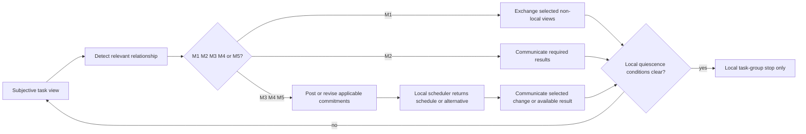
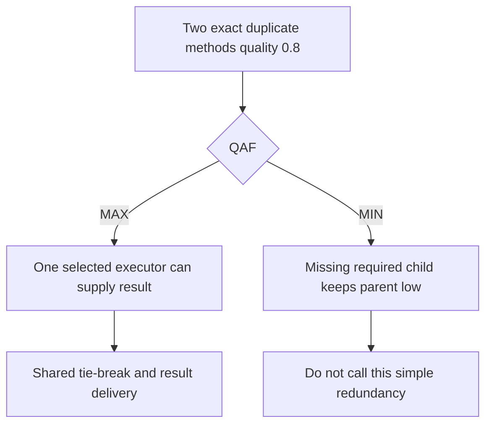

# GPGP/TAEMS: a family of local-scheduling coordination mechanisms

Decker and Lesser’s 25-page UMass Technical Report 94-14, cover dated 1995-08-09, describes an extensible GPGP family over subjective TÆMS task structures. It is distinct from the shorter ICMAS-95 conference version. The coordination module exchanges selected views/results, posts commitments, invokes the existing local scheduler, and communicates revisions; it does not centrally assign actions or prove global completion.

The initial mechanisms are M1 non-local viewpoints, M2 results, M3 exact simple redundancy, M4 hard predecessor relationships, and M5 positive facilitates relationships. M3 depends on stated MAX-QAF and exact-duplicate assumptions; MIN is not an interchangeable redundancy rule. Hinders is not handled by these five.

## Constructed fixtures

- **MAX/MIN:** for two equivalent results 0.8, `MAX(0.8,0.8)=0.8`; a missing MIN-required child remains a gap.
- **Hard predecessor:** A estimates quality 40 by local time 7 and, under an explicitly assumed one-unit communication delay, sends `C(DL(p,40,8))` to B. A later violation requires a communicated alternative or NIL.
- **Local quiescence:** an idle A with an outstanding commitment or expected B result is not locally quiescent. Local quiescence does not prove global termination.

## Navigation

- [Task hierarchy, QAF, and relationship mechanisms](references/task-decomposition-through-relationship-types.md)
- [Commitment lifecycle and revision](references/commitments-as-social-contracts.md)
- [Local scheduler boundary](references/coordination-as-constraint-posting-not-control.md)
- [M1 views and M2 results](references/subjective-views-and-partial-information.md)
- [Overhead categories and bounded evaluation](references/overhead-as-first-class-design-concern.md)
- [Local quiescence limit](references/termination-and-quiescence-in-distributed-coordination.md)
- [Family selection and experiment scope](references/no-universal-coordination-mechanism.md)

## Evidence boundary

Primary source: Decker & Lesser, *Designing a Family of Coordination Algorithms*, UMass CS TR 94-14, §§1–5 targeted-read via the official institutional PDF on 2026-09-24. Table 2 symbolic coefficients and some equations were not visually recovered, so this skill does not repeat them. Report simulations use generated abstract episodes, not production services or a global-optimality guarantee.

See [substrate choice and fixture limits](references/substrate-choice-and-fixture-boundary.md) before implementing schedule selection; a strict no-violation filter is a different policy.

## Bundle navigation

[examples index](examples/INDEX.md).
