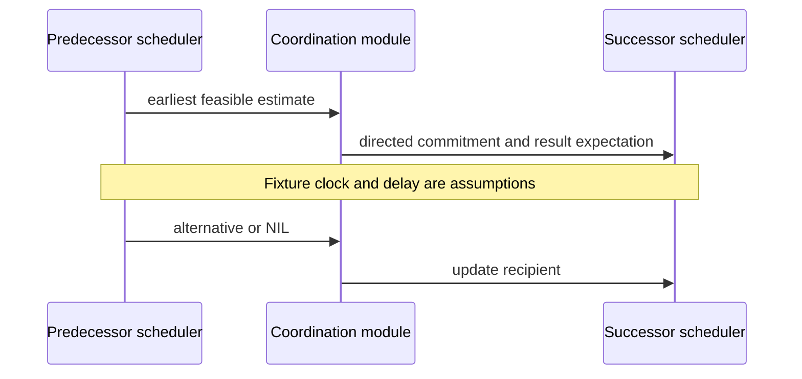

# Directed commitments constrain local schedules

## Technical-report source boundary

This reference cites Decker and Lesser, [*Designing a Family of Coordination Algorithms*](https://web.cs.umass.edu/publication/docs/1994/UM-CS-1994-014.pdf), UMass CS Technical Report 94-14, cover dated 1995-08-09. The body access used here covers §§2.1–2.2 and §§3.1, 3.4–3.6; citations name those report sections rather than the shorter ICMAS-95 pagination. The report models cooperative agents and a local scheduling substrate. It does not establish a service-level agreement, accountability regime, enforceable promise, or delivery guarantee.

## Commitment forms and recipients

The report distinguishes a directed quality commitment `C(Do(T,q))` from a directed deadline form `C(DL(T,q,tdl))`. Sending either also entails communicating its resulting task information to the recipient (§2.2). The recipient and current schedule view matter: this is a social scheduling constraint, not an executable command, authorization token, or assurance that the result will occur.

## M3 is not M4

**M3, simple redundancy** (§3.4) applies when agents hold the same executable method that produces the same result under a stated MAX quality-accumulation structure. Candidate commitments are compared; a shared deterministic tie break keeps one executor and other agents retract. This does not load-balance arbitrary tasks or cover MIN/required-child composition.

**M4, hard predecessor** (§3.5) is different: a predecessor investigates an early local schedule and offers a low-negotiability estimated quality/deadline commitment to an interested successor. Duplicate predecessor commitments use the report’s ordered preference (earlier, then higher quality, then shared tie break). Estimates remain estimates.

**M5, soft positive predecessor** (§3.6) uses an analogous but initially high-negotiability intermediate commitment so a successor can exploit a modeled facilitation. The report does not supply a hinders mechanism.

## Revision is a local heuristic path

The scheduler consumes subjective task structure, local commitments, and non-local commitments; it returns schedules, estimates, violations, and alternatives (§§2.1–2.2). The substrate compares the highest-local-utility and best-committed schedules using commitment-associated utility changes, including non-local updates, rather than simply maximizing whole-schedule local utility. Equal comparisons use negotiability, shorter duration, then random choice. Selected commitment revisions must be communicated (§3.1); this is not a global optimum or silent permission to violate a directed commitment. See [the detailed substrate boundary](coordination-as-constraint-posting-not-control.md).

## Constructed hard-predecessor fixture

A has a predecessor that its local scheduler estimates can produce quality 40 by local time 7. B’s successor needs it first. Under a **fixture-only** one-unit delay and compatible clocks, A offers `C(DL(predecessor,40,8))`; B can schedule after 8. If the substrate later selects a schedule that revises this commitment, it must communicate an alternative or `NIL`. This example does not prove reliable delivery, clock synchronization, execution, or recipient acceptance.

See the checked local distinctions in [the example module](../examples/gpgp_local_models.py).
