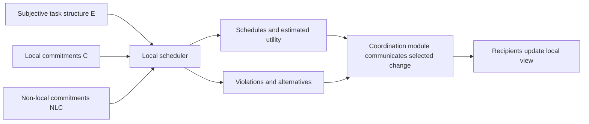

# Coordination posts constraints; the local scheduler chooses schedules

## Source-backed interface

In the TR 94-14 model (§§2.1–2.2), coordination is neither centralized execution nor a global task assignment service. A coordination module passes the agent’s subjective task structure `E`, local commitments `C`, and non-local commitments `NLC` to an existing local scheduler. The scheduler returns schedules with estimated utility, commitment-violation information, and possible alternatives. A scheduler may satisfice and report violations when it does not find an exhaustive solution.

## The local conflict procedure

The report's §3.1 first identifies the highest-local-utility schedule and the best committed schedule. If these are identical it selects that schedule. Otherwise the substrate considers changes in utility attached to commitments, including non-local utility updates, and selects the largest positive total change. It does not simply maximize the scheduler's whole-schedule local utility. Commitment revision is allowed in that model; a blanket rejection of every violating candidate would implement a different policy.

If the compared schedules have equal utility, the report favors negotiability, then shorter duration, then random choice. Negotiability estimates rescheduling difficulty. The text does not make a simple count of negotiable commitments a universal aggregator. After selection, violated commitments are replaced with the indicated alternatives and affected recipients are informed. This is a local coordination procedure, not a proof of optimality, successful delivery, or permission to break independently enforced hard constraints.

## Constructed comparison of policies

Suppose a local scheduler prefers schedule A at utility 12 to committed schedule B at utility 11. That pair of numbers alone cannot select the GPGP result: the substrate also needs the estimated utility changes associated with the commitments, potentially updated by other agents. A commitment supporting another agent's work can make a locally attractive replacement unattractive to the substrate. Preserve those inputs and the alternative/revision messages in any implementation.

The executable `select_under_constructed_no_violation_policy` instead rejects every candidate with a recorded violation and ranks the remainder by local utility, then an explicitly local count. In its fixture, A and B are violation-free at utility 11 with counts 1 and 2; C has utility 12 and a violation. This constructed policy chooses B. It is intentionally a **counterexample to calling that helper GPGP's substrate algorithm**, not an implementation of the report. The helper assumes validated, complete records; it does not validate utility estimates, negotiate, or produce alternatives.

## Boundary

The report’s module can influence the scheduler through task information and commitments, but it does not make other agents act, establish authorization, certify estimates, or ensure delivery. Any deployment that needs those properties must define them separately.
